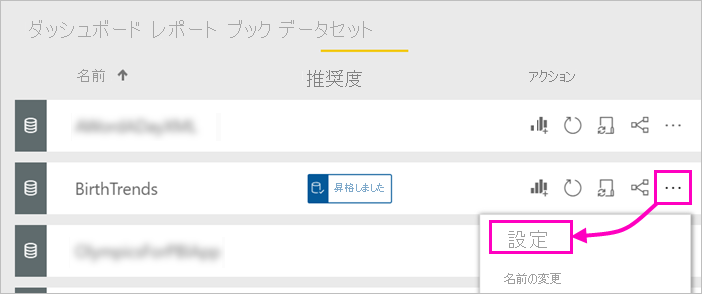

# データセットを昇格する - Power BI

Power BI レポートの作成者が多様なデータセットにアクセスできるようになったため、企業は作成者を信頼性の高い、高品質のデータセットに誘導する必要があります。 Power BI には、データセットを*推奨する*方法が 2 つあります。

- **昇格**: データセットの所有者は、広範囲の使用が可能になったデータセットを昇格することができます。 書き込みアクセス許可を持つ任意のワークスペース メンバーがデータセットを昇格できます。 だれがデータセットを昇格できるかについての制限はありません。 昇格により、組織内のデータセットを共同作業するための拡散が可能になります。 この記事では、データセットの昇格について説明します。
- **認定**: 昇格したデータセットの認定を要求することができます。 **データセットの認定**テナントの設定で定義された選択ユーザーのグループが、認定するデータセットを決定します。 詳細については、[データセットの認定](service-datasets-certify.md)に関する記事を参照してください。

## データセットを昇格する

データセットを昇格する準備ができたら、Power BI サービスの新しいワークスペース エクスペリエンスのワークスペースにデータセットを移す必要があります。

1. ワークスペースのデータセットの一覧に移動します。
 
1. **[その他のオプション]** (...) を選択し、 **[設定]** を選択します。

    

1. **[推奨]** を展開し、 **[昇格しました]** を選択します。

    ![[昇格しました]、[適用] の順に選択する](media/service-datasets-certify-promote/power-bi-dataset-promoted-endorsement.png)

1. **[適用]** を選びます。

## データセットの認定を要求する

組織内でデータセットを認定できるユーザーを、Power BI 管理者が特定しました。 データセットを認定するように要求できます。

1. データセットが存在するワークスペースに認定者メンバーのアクセス許可を付与します。

1. **[設定]** の **[推奨]** セクションの **[認定済み]** は淡色表示されます。

1. **詳細情報**のリンクを選択します。

    Power BI 管理者は、テナントの認定プロセスに関する詳細が含まれる特定の場所に移動する**詳細情報**のリンクを構成できます。   **詳細情報**のリンクをカスタマイズしていない場合は、既定で[データセットの認定](service-datasets-certify.md)に関する記事が示されます。

## 次の手順

* 「[Using datasets across workspaces](service-datasets-across-workspaces.md)」(ワークスペース全体でのデータセットの使用) を参照してください
* わからないことがある場合は、 [Power BI コミュニティで質問してみてください](https://community.powerbi.com/)。
