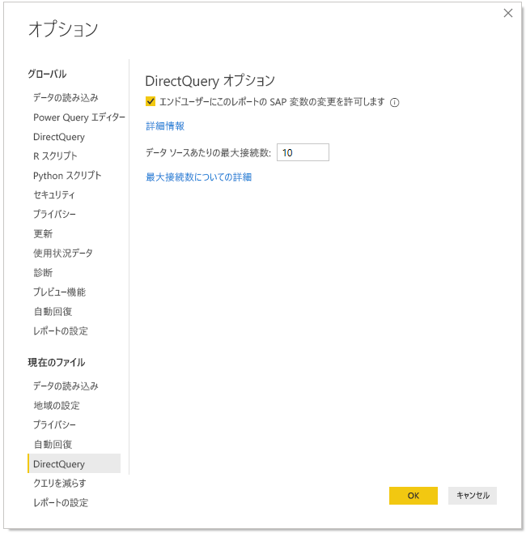

# Power BI サービスで SAP 変数を編集する

SAP Business Warehouse または SAP HANA を DirectQuery と共に使用する場合、レポート作成者は、Premium および共有ワークスペース用に **Power BI サービス**で SAP 変数を編集することをエンド ユーザーに許可できるようになりました。 この機能は、[マイ ワークスペース] の [自分と共有] タブのレポートと、V1 ワークスペースから作成されたアプリでは機能しないことに注意してください。 

![[変数を編集] ダイアログ ボックス](media/service-edit-sap-variables/sap-edit-variables-dialog.png)

このドキュメントでは、Power BI で変数を編集するための要件、この機能を有効にする方法、および Power BI サービスで変数を編集する場所について説明します。

## SAP 変数編集の要件

SAP 変数編集機能を使用するにはいくつかの要件があります。 次の一覧にその要件をまとめています。

**新しいフィルター エクスペリエンスが必須** - レポートに対して[新しいフィルター エクスペリエンス](../create-reports/power-bi-report-filter.md)を有効にする必要があります。 Power BI Desktop では、レポートに対してこれを次のように有効にします。
- Power BI Desktop で、 **[ファイル]** 、 >  **[オプションと設定]** 、 >  **[オプション]** の順に選択します。
- ナビ ペインで、 **[現在のファイル]** の **[レポートの設定]** を選択します。
- **[エクスペリエンスのフィルター処理]** で、 **[Enable the updated filter pane]\(更新されたフィルター ウィンドウを有効にする\)** を選択します。

**DirectQuery 接続が必須** - DirectQuery を使用し、SAP データ ソースに接続している必要があります。 インポート接続はサポートされていません。

**SSO セットアップが必須** - この機能を動作させるには、シングル サインオン (SSO) を構成する必要があります。 詳細については、[シングル サインオン (SSO) の概要](service-gateway-sso-overview.md)ページをご覧ください。

**新しいゲートウェイが必須** - 最新のゲートウェイをダウンロードし、既存のゲートウェイを更新してください。 詳細については、[サービス ゲートウェイ](service-gateway-onprem.md)に関するページを参照してください。

**SAP HANA の場合、多次元のみ** - SAP HANA の場合、SAP 変数編集は多次元モデルとのみ連動し、リレーショナル ソースでは動作しません。

**ソブリン クラウドでは非対応** - 現在のところ、Power Query Online はソブリン クラウドで利用できません。そのため、この機能もソブリン クラウドではサポートされていません。

## 機能を有効にする方法

**SAP 変数編集**機能を有効にするには、Power BI Desktop 内で SAP HANA または SAP BW データソースに接続します。 次に、 **[ファイル]、[オプションと設定]、[オプション]** の順に移動し、左側のウィンドウにある [現在のファイル] セクションで **[DirectQuery]** を選択します。 これを選択すると、次の画像に示されているように、右側のウィンドウに DirectQuery オプションとチェックボックスが表示され、そこで**エンドユーザーにレポートの SAP 変数の変更を許可する**ことができます。

## Power BI Desktop で SAP 変数編集を使用する

Power BI Desktop で SAP 変数編集を使用する場合、リボンの **[クエリを編集]** メニューから [変数を編集] リンクを選択することで変数を編集できます。 そこから、次のダイアログが表示されます。 しばらくの間、この機能が Power BI Desktop で利用可能です。 レポート作成者は、次のダイアログを使用することでレポートの変数を選択できます。

## サービスで SAP 変数編集を使用する

レポートが Power BI サービスに公開されると、新しい [フィルター] ウィンドウに **[変数を編集]** リンクが表示されます。 レポートを初めて公開する場合、[変数を編集] リンクが表示されるまで最大 5 分かかることがあります。 リンクが表示されない場合、データセットを手動で更新する必要があります。
その方法:

1. Power BI サービスでは、ワークスペースのコンテンツ一覧で **[データセット]** タブを選択します。

2. 更新する必要があるデータセットを見つけ、 **[更新]** アイコンを選択します。

    

3. [変数を編集] リンクを選択すると、 **[変数を編集]** ダイアログが表示され、そこで変数をオーバーライドできます。 **[リセット]** ボタンを選択すると、このダイアログを開いたときに表示された元の値に変数がリセットされます。

    ![[変数を編集] ダイアログ ボックス](media/service-edit-sap-variables/sap-edit-variables-dialog.png)

4. Power BI の他の永続性動作と同様に、 **[変数を編集]** ダイアログで行った変更はこのユーザーに対してのみ残ります。 次の画像のように、 **[既定値にリセット]** を選択すると、変数を含め、レポート作成者がレポートを作成したときの元の状態にレポートがリセットされます。

    

SAP HANA または SAP BW を使用する Power BI サービスで公開済みのレポートを操作するとき、 **[変数を編集]** 機能が有効になっている場合、レポート所有者はこれらの既定値を変更できます。 レポートの所有者は編集モードで変数を変更してレポートを保存し、その設定をそのレポートの*新しい既定の設定*にすることができます。 レポートの所有者によるそのような変更の後、そのレポートにアクセスするユーザーには、新しい設定が既定値として表示されます。

## 次の手順

SAP HANA、SAP BW、DirectQuery の詳細については、次の記事をご覧ください。

- [Power BI Desktop で SAP HANA を使用する](desktop-sap-hana.md)
- [DirectQuery と SAP Business Warehouse (BW)](desktop-directquery-sap-bw.md)
- [DirectQuery と SAP HANA](desktop-directquery-sap-hana.md)
- [Power BI で DirectQuery を使用する](desktop-directquery-about.md)
