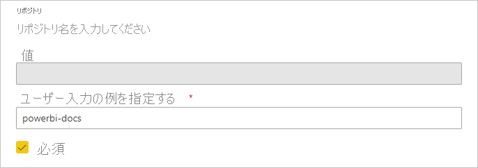
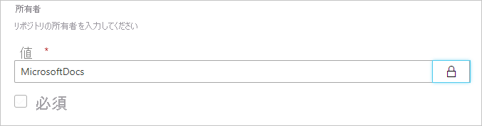
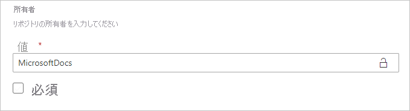
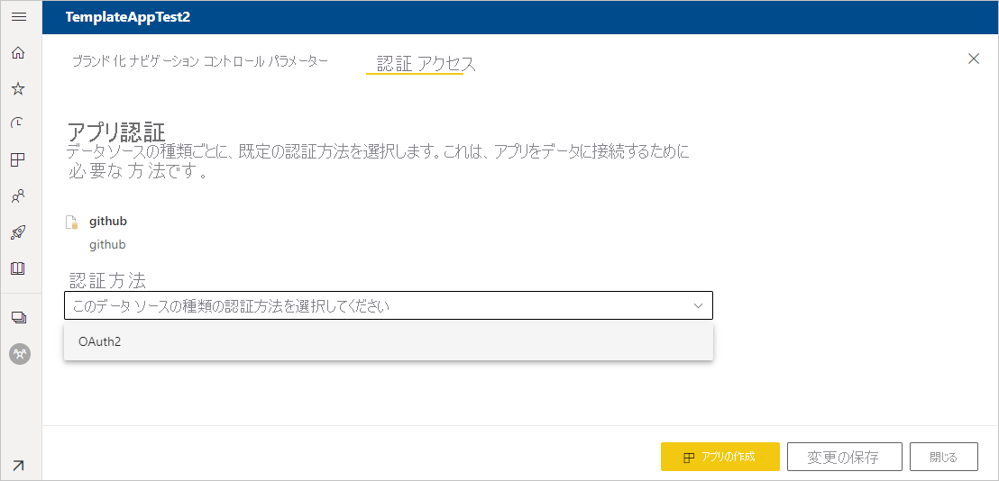

# Power BI でテンプレート アプリを作成する

Power BI "*テンプレート アプリ*" を利用すれば、Power BI パートナーはコードをほとんど、あるいはまったく記述せずに Power BI アプリを作成し、Power BI の顧客に展開できます。  この記事には、Power BI テンプレート アプリを段階的に作成する手順が含まれています。

Power BI のレポートやダッシュボードを作成できる場合、"*テンプレート アプリ ビルダー*" となって、分析コンテンツを作成し、パッケージ化して "*アプリ*" にすることができます。 作成したアプリは、AppSource など、利用できるあらゆるプラットフォームから他の Power BI テナントに配備できます。また、自分の Web サービスで使用するという方法もあります。 ビルダーは保護付きの分析パッケージを作成し、配布できます。

Power BI テナント管理者は、組織においてテンプレート アプリを作成できる人とそれをインストールできる人を管理します。 権限を与えられたこれらのユーザーはテンプレート アプリをインストールし、その後、そのアプリを変更したり、組織内の Power BI 利用者に配布したりできます。

## 前提条件

テンプレート アプリの作成要件:  

- [Power BI Pro ライセンス](../fundamentals/service-self-service-signup-for-power-bi.md)
- [Power BI Desktop をインストールしておくこと](../fundamentals/desktop-get-the-desktop.md) (任意)
- [Power BI の基本的概念](../fundamentals/service-basic-concepts.md)に関する知識
- テンプレート アプリをパブリックに共有するためのアクセス許可 (詳細については、Power BI [管理ポータルの [テンプレート アプリの設定]](../admin/service-admin-portal.md#template-apps-settings) を参照)

## テンプレート ワークスペースを作成する

他の Power BI テナントに配布できるテンプレート アプリを作成するには、それを新しいワークスペースで作成する必要があります。

1. Power BI サービスで、 **[ワークスペース]**  >  **[ワークスペースの作成]** の順に選択します。

    

2. **[ワークスペースの作成]** で、ワークスペースの名前、説明 (任意)、ロゴ画像 (任意) を入力します。

    

4. **[詳細]** セクションを展開し、**[テンプレート アプリを開発する]** を選択します。

    

5. **[保存]** を選択します。
>[!NOTE]
>テンプレート アプリを昇格させるには Power BI 管理者からのアクセス許可が必要です。

## テンプレート アプリ ワークスペースにコンテンツを追加する

通常の Power BI ワークスペースと同様に、次の手順はワークスペースにコンテンツを追加することです。  

- ワークスペースで [Power BI コンテンツを作成します](index.yml)。

Power Query でパラメーターを使用している場合は、適切に定義された型 (Text など) であることを確認してください。 Any 型と Binary 型はサポートされていません。

「[Power BI でのテンプレート アプリの作成に関するヒント](service-template-apps-tips.md)」には、テンプレート アプリのためにレポートやダッシュボードを作成するときに考慮してほしい事項が提案されています。

## テンプレート アプリのプロパティを定義する

ワークスペースにコンテンツを用意できたので、次はテンプレート アプリでそれをパッケージ化できます。 最初の手順は、テナントで組織内からのみアクセスできるテスト テンプレート アプリを作成することです。

1. テンプレート アプリ ワークスペースで **[アプリの作成]** を選択します。

    

    ここでは、テンプレート アプリの追加の作成オプションを入力します。タブは 6 つあります。

    **ブランド化**

    
    - アプリの名前
    - [説明]
    - サポート サイト (リンクは、テンプレート アプリを組織のアプリとして再配布した後にアプリ情報の下に表示されます)
    - アプリのロゴ (ファイル サイズの上限 45 K、縦横比 1:1、png .jpg .jpeg 形式)
    - アプリのテーマの色

    **ナビゲーション**

    **[新しいナビゲーション ビルダー]** をオンにすると、アプリのナビ ペインを定義できます (詳細については、この記事の「[ナビゲーション エクスペリエンスを設計する](../collaborate-share/service-create-distribute-apps.md#design-the-navigation-experience)」を参照してください)。

   
    
    **アプリのランディング ページ:** ナビゲーション ビルダーをオフにすることを選択した場合は、アプリのランディング ページを選択するオプションがあります。 アプリのランディング ページにするレポートまたはダッシュボードを定義します。 適切な印象を与えるランディング ページを使用します。

    **制御**

    アプリのユーザーに対するアプリのコンテンツの制限や制約を設定します。 このコントロールを使用し、アプリに含まれる知的財産を保護できます。

    

    >[!NOTE]
    >.pbix 形式へのエクスポートは常に、アプリをインストールするユーザーに対してはブロックされます。

    **パラメーター**

    パラメーターは元の pbix ファイルに作成されます (詳細については、[クエリ パラメーターの作成](https://powerbi.microsoft.com/blog/deep-dive-into-query-parameters-and-power-bi-templates/)に関するページを参照してください)。 このタブの機能を使用すると、アプリをインストールする人がデータに接続する場合に、インストール後にアプリを構成するのに役立ちます。

    このタブで、アプリのドキュメントへのリンクも指定します。

    

    各パラメーターには、クエリから取得される名前と説明、および値フィールドがあります。 インストール時にパラメーターの値を取得するための 3 つのオプションがあります。

    * インストールする人に値の入力を求めることができます。 この場合は、置き換える例を指定します。 この方法でパラメーターを構成するには、 **[必須]** チェックボックスをオンにし、テキストボックスに例を入力して、予期される値の種類をユーザーに示します。 次に例を示します。

       

    * アプリをインストールするユーザーが変更できない事前に設定された値を指定できます。 この方法で構成されたパラメーターは、アプリをインストールする人には表示されません。 この方法は、事前に設定された値がすべてのユーザーに対して有効であることが確実な場合にのみ使用してください。それ以外の場合は、ユーザー入力を求める前述の方法を使用してください。

       この方法でパラメーターを構成するには、 **[値]** ボックスに値を入力してから、ロック アイコンをクリックします。 これで値を変更できなくなります。 次に例を示します。

       

    * インストール中にユーザーが変更できる既定値を指定できます。 この方法でパラメーターを構成するには、 **[値]** テキストボックスに目的の既定値を入力し、ロック アイコンはロックが解除されたままにします。 次に例を示します。

      

    **認証**
    
    このタブで、使用される認証方法を選択します。 使用可能なオプションは、使用されるデータ ソースの種類によって異なります。

    

    プライバシー レベルは自動的に構成されます。
   * 単一のデータソース: 自動的にプライベートとして構成されます。
   * 複数の匿名データソース: 自動的にパブリックとして構成されます。

    **Access (アクセス)**
    
    テストの段階で、アプリをインストールしてテストできる組織内の他のユーザーを決定します。 心配はありません。この設定は後でいつでも変更できます。 この設定は、分散テンプレート アプリへのアクセスには影響しません。

    ![[アクセス] タブのスクリーンショット。](media/service-template-apps-create/power-bi-create-access.png)

2. **[Create app]\(アプリの作成\)** を選択します。

    テスト アプリが準備できたというメッセージが、コピーしてアプリ テスターと共有するためのリンクと共に表示されます。

    

    後続のリリース管理プロセスの最初の手順も完了しています。

## テンプレート アプリのリリースを管理する

このテンプレート アプリを公開する前に、準備完了を確認することが望まれます。 Power BI には、リリース管理ウィンドウが作成されています。このウィンドウでアプリ公開までの道のりを完全に追跡し、調査できます。 ステージ間の移行をトリガーすることもできます。 共通ステージ:

- テスト アプリを生成する: 組織内でのみテストします。
- テスト パッケージを実稼働前ステージに昇格させる: 組織外でテストします。
- 実稼働前パッケージを実稼働に昇格させる: 運用版です。
- パッケージを削除するか、前のステージからやり直します。

リリース ステージ間を移動しても URL は変わりません。 昇格により URL 自体に影響することはありません。

それでは各ステージを通過しましょう。

1. テンプレート ワークスペースで **[リリース管理]** を選択します。

    ![[リリース管理] アイコン](media/service-template-apps-create/power-bi-release-management-icon.png)

2. 上記の **[テスト テンプレート アプリを作成する]** セクションでテスト アプリを作成した場合は、 **[リンクの取得]** を選択します (結果として、 **[テスト]** の横にある黄色の点が既に入力されています)。

    アプリをまだ作成していない場合は、 **[アプリの作成]** を選択します。 これで、テンプレート アプリの作成プロセスに戻ります。

    

4. アプリのインストール体験をテストするには、通知ウィンドウのリンクをコピーし、新しいブラウザー ウィンドウに貼り付けます。

    ここからは、顧客が実行する手順と同じ手順を実行することになります。 「[組織でテンプレート アプリをインストールして配布する](service-template-apps-install-distribute.md)」を参照してください。

5. ダイアログ ボックスで **[インストール]** を選択します。

    インストールが正常に完了すると、新しいアプリの準備ができたことが通知されます。

6. **[アプリへ移動]** を選択します。
7. **[新しいアプリを開始する]** に自分のアプリが表示されます。これと同じ画面を顧客が見ることになります。

    
8. **[アプリを探索]** を選択し、テスト アプリとサンプル データを確認します。
9. 変更を行うには、元のワークスペースでアプリに戻ります。 納得できるまでテスト アプリを修正します。
10. アプリを実稼働前ステージに昇格させ、テナントの外でテストする準備ができたら、**[リリース管理]** ウィンドウに戻り、**[アプリの昇格]** を選択します。

    
    >[!NOTE]
    > アプリを昇格させると、組織の外部で一般に使用できるようになります。

    このオプションが表示されない場合、管理ポータルで[テンプレート アプリ開発の許可](../admin/service-admin-portal.md#template-apps-settings)を与えるよう、Power BI 管理者に連絡してください。
11. **[昇格]** を選択し、選択を確定します。
12. この新しい URL をコピーし、テスト目的でテナントの外と共有します。 このリンクは、[新しいパートナー センター オファー](/azure/marketplace/partner-center-portal/create-power-bi-app-offer)を作成して、AppSource 上でアプリを配信するプロセスを始めるときに送信するリンクでもあります。 パートナー センターには、実稼働前のリンクのみ送信します。 アプリが承認され、AppSource で公開されたという通知を受け取ってから初めて、Power BI でこのパッケージを実稼働に昇格させることができます。
13. アプリを運用する、あるいは AppSource 経由で共有する準備ができたら、**[リリース管理]** ウィンドウに戻り、**[実稼働前]** の隣にある **[アプリの昇格]** を選択します。
14. **[昇格]** を選択し、選択を確定します。

    これでアプリは実稼働に入りました。いつでも配布できます。

    

自分のアプリを世界中に何千人といる Power BI ユーザーに広く利用してもらうために、アプリを AppSource に提出することをお勧めします。 詳細については、「[Power BI アプリケーション プラン](/azure/marketplace/partner-center-portal/create-power-bi-app-offer)」を参照してください。

## 次のステップ

顧客がテンプレート アプリを操作するしくみについては、[組織でのアプリのインストールと配布](service-template-apps-install-distribute.md)に関するページをご覧ください。

アプリ配布の詳細については、「[Power BI アプリケーション プラン](/azure/marketplace/partner-center-portal/create-power-bi-app-offer)」をご覧ください。