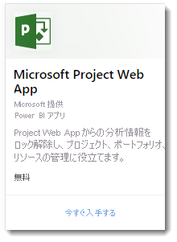
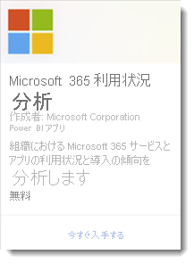
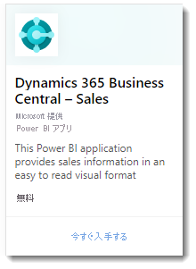
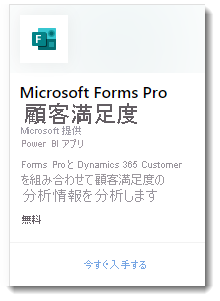

# Power BI テンプレート アプリとは

新しい Power BI *テンプレート アプリ*を利用すれば、Power BI パートナーはコードをほとんど、あるいはまったく記述せずに Power BI アプリを作成し、Power BI の顧客に配布できます。  この記事では、Power BI テンプレート アプリ プログラムの概要を説明します。

Power BI パートナーは、顧客向けのすぐに使えるコンテンツのセットを作成して自分で公開できます。  

顧客が自分のアカウントで接続してインスタンス化できるテンプレート アプリを作成します。 ドメインの専門家として、ビジネス ユーザーが簡単に利用できる方法でデータのロックを解除できます。  

テンプレート アプリをパートナー センターに送信します。 その後、アプリは、[Power BI Apps Marketplace](https://app.powerbi.com/getdata/services) と [Microsoft AppSource](https://appsource.microsoft.com/?product=power-bi) で一般提供されるようになります。 ここではパブリック テンプレート アプリの作成エクスペリエンスの概要を示します。

## Power BI Apps Marketplace

Power BI テンプレート アプリを使用すると、Power BI Pro または Power BI Premium のユーザーは、事前パッケージ済みのダッシュボードとライブ データ ソースに接続できるレポートを通して、分析情報をすぐに得ることができます。 [Power BI Apps Marketplace](https://app.powerbi.com/getdata/services) には、すぐに使用できる Power BI アプリが多数用意されています。

|  |
|     :---:      |
|     |
|  |

## プロセス
テンプレート アプリを開発し送信する一般的なプロセスには、複数のステージが含まれます。 いくつかのステージには同時に複数のアクティビティが含まれることがあります。

| ステージ | Power BI Desktop |  |Power BI サービス  |  |パートナー センター  |
|---|--------|--|---------|---------|---------|
| **1** | データ モデルとレポートを .pbix ファイルで作成します |  | ワークスペースを作成します。 .pbix ファイルをインポートします。 補完的なダッシュ ボードを作成します  |  | パートナーとして登録します |
| **2** |  |  | テスト パッケージを作成し、内部的な検証を実行します        |  | |
| **3** | |  | Power BI テナント外での検証のために運用前テスト パッケージをプロモートし、AppSource に送信します  |  | 運用前パッケージで、Power BI テンプレート アプリ オファーを作成し、検証プロセスを開始します |
| **4** | |  | 運用前パッケージを運用環境にプロモートします |  | ライブに移行します |

## 始める前に

テンプレート アプリを作成するには、作成するためのアクセス許可が必要です。 詳細については、Power BI 管理ポータルのテンプレート アプリの設定に関するセクションを参照してください。 

テンプレート アプリを Power BI サービスと AppSource に公開するには、[クラウド マーケットプレース パブリッシャーになる](https://docs.microsoft.com/azure/marketplace/become-publisher)ための要件を満たす必要があります。
 
## 概要手順

手順の概要を次に示します。 

1. [要件を見直し](#requirements)、満たしていることを確認します。 

2. Power BI Desktop でレポートを作成します。 他のユーザーが使用できるファイルとして保存できるようにパラメーターを使用します。 

3. Power BI サービス (app.powerbi.com) で、テナントにテンプレート アプリ用のワークスペースを作成します。 

4. .pbix ファイルをインポートし、ダッシュボードなどのコンテンツをアプリに追加します。 

5. テスト パッケージを作成し、組織内でテンプレート アプリをテストします。 

6. AppSource での検証と、テナント外でのテストのために、テスト アプリを運用前環境に昇格させてアプリを送信します。 

7. 発行に向けて、コンテンツを[パートナー センター](https://docs.microsoft.com/azure/marketplace/partner-center-portal/create-power-bi-app-offer)に送信します。 

8. AppSource でプランを "ライブ" にし、アプリを Power BI の運用環境に移動します。

9. 運用前環境の同じワークスペースで次のバージョンの開発を開始できます。 

## 要件

テンプレート アプリを作成するには、作成するためのアクセス許可が必要です。 詳細については、Power BI [管理ポータルのテンプレート アプリの設定](../admin/service-admin-portal.md#template-apps-settings)に関するセクションを参照してください。

テンプレート アプリを Power BI サービスと AppSource に公開するには、[クラウド マーケットプレース パブリッシャーになる](https://docs.microsoft.com/azure/marketplace/become-publisher)ための要件を満たす必要があります。
 > [!NOTE] 
 > テンプレート アプリの送信は、[パートナー センター](https://docs.microsoft.com/azure/marketplace/partner-center-portal/create-power-bi-app-offer)で管理されます。 同じ Microsoft デベロッパー センター登録アカウントを使用してサインインします。 ご自分の AppSource オファリング用に所持する Microsoft アカウントは 1 つだけとする必要があります。 アカウントは個々のサービスまたはオファーに固有のものとしないでください。

## ヒント 

- 誰でもクリックして開始できるようにアプリにサンプル データが含まれることを確認します。 
- 自分のテナントとセカンダリ テナントにインストールして、アプリケーションを慎重に調べます。 必要なものだけが顧客に表示されることを確認します。 
- オンライン ストアとして AppSource を使用して、アプリケーションをホストします。 これにより、Power BI を使用するすべてのユーザーがアプリを検索できます。 
- 独立した固有のシナリオのために複数のテンプレート アプリの提供を検討します。 
- カスタム接続や、インストーラーによるパラメーター構成のサポートなど、データをカスタマイズできるようにします。

他の推奨事項については、「[Power BI でのテンプレート アプリの作成に関するヒント](service-template-apps-tips.md)」をご覧ください。

## 既知の制限事項

| 特徴 | 既知の制限事項 |
|---------|---------|
|コンテンツ:データセット   | 厳密に 1 つのデータセットが存在する必要があります。 Power BI Desktop で作成されたデータセット (.pbix ファイル) だけが許可されます。  非サポート:他のテンプレート アプリからのデータセット、クロス ワークスペース データセット、改ページ調整されたレポート (.rdl ファイル)、Excel ブック |
|コンテンツ:ダッシュボード | リアルタイム タイルは許可されません (つまり、プッシュ データセットまたはストリーミング データセットはサポートされていません) |
|コンテンツ:データフロー | 非サポート:データフロー |
|ファイルからのコンテンツ | PBIX ファイルのみが許可されます。  非サポート: .rdl ファイル (改ページ調整されたレポート)、Excel ブック   |
| データ ソース | クラウドのスケジュールされたデータ更新がサポートされているデータ ソースは許可されます。  非サポート: <li> DirectQuery</li><li>ライブ接続 (Azure AS なし)</li> <li>オンプレミスのデータ ソース (パーソナル ゲートウェイとエンタープライズ ゲートウェイはサポートされていません)</li> <li>リアルタイム (プッシュ データセットはサポートされていません)</li> <li>複合モデル</li></ul> |
| データセット: クロスワークスペース | クロスワークスペースのデータセットは許可されません  |
| クエリ パラメーター | 非サポート:"Any" 型のパラメーターまたはデータセットの "Binary" 型のブロック更新操作 |
| Power BI ビジュアル | パブリックに使用可能な Power BI ビジュアルのみがサポートされます。 [組織の Power BI ビジュアル](../developer/visuals/power-bi-custom-visuals-organization.md)はサポートされません |
| ソブリン クラウド | テンプレート アプリはソブリン クラウドでは使用できません |

## サポート
開発中のサポートのために、[https://powerbi.microsoft.com/support](https://powerbi.microsoft.com/support) を使用してください。 私たちは、このサイトを常に見守り、管理しています。 顧客のインシデントは、すみやかに該当するチームに伝わります。

## 次の手順

[テンプレート アプリを作成する](service-template-apps-create.md)
