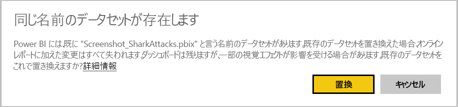
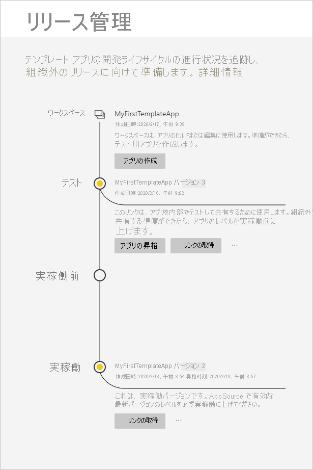
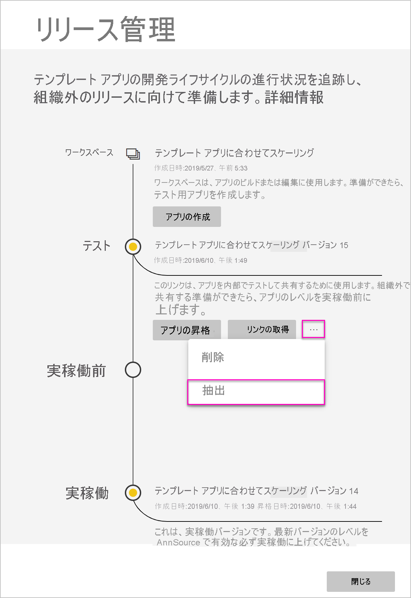
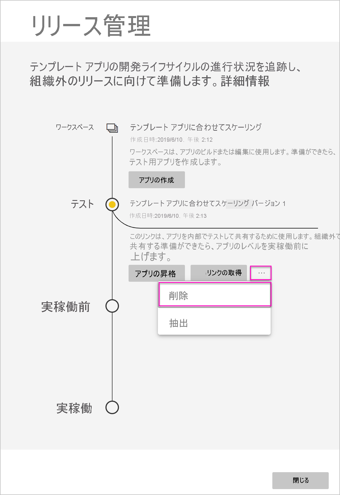
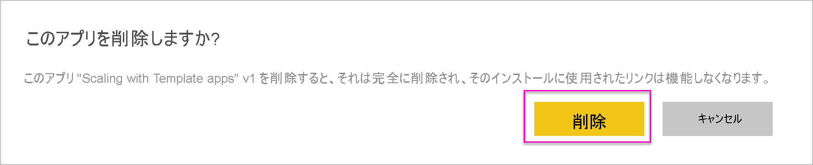

# テンプレート アプリの更新、削除、および抽出

これでアプリが実稼働に入りました。実稼働のアプリを邪魔することなく、テスト段階を繰り返すことができます。
## アプリを更新する

Power BI Desktop で変更を加えた場合は、ステップ (1) から開始します。 Power BI Desktop で変更を加えていない場合は、ステップ (4) から開始します。

1. 更新されたデータセットをアップロードし、既存のデータセットを上書きします。 **データセット名はまったく同じものを使用してください**。 別の名前を使用すると、アプリを更新するユーザーに新しいデータセットが作成されます。

1. コンピューターから pbix ファイルをインポートします。

1. 上書きを確認します。

1. **[リリース管理]** ウィンドウで **[アプリの作成]** を選択します。
1. アプリ作成プロセスを繰り返します。
1. **[ブランド]** 、 **[コンテンツ]** 、 **[コントロール]** 、 **[アクセス]** を設定し、もう一度 **[アプリの作成]** を選択します。
1. **[閉じる]** を選択し、 **[リリース管理]** に戻ります。

   これで実稼働のバージョンとテスト中の新しいバージョンという 2 つのバージョンが表示されます。

    

1. アプリを実稼働前ステージに昇格させ、テナントの外でテストする準備ができたら、[リリース管理] ウィンドウに戻り、 **[テスト]** の隣にある **[アプリの昇格]** を選択します。

   これで実稼働にバージョンが 1 つ、実稼働前にバージョンが 1 つ用意されました。

   ![テンプレート アプリの 2 つのバージョン。[アプリの昇格] が淡色表示になっています](media/service-template-apps-update-extract-delete/power-bi-template-app-update2.png)

   これでリンクはライブになります。 **実稼働前ステージの [アプリの昇格] ボタンが淡色表示になっていることにご注目ください**。これには、Cloud Partner Portal で新しいアプリ バージョンを検証し、承認する前に、現在のアプリ バージョンへの有効な実稼働リンクを誤って上書きすることを防ぐ目的があります。

1. [Power BI アプリ オファーの更新](/azure/marketplace/cloud-partner-portal/power-bi/cpp-update-existing-offer)に関する記事の手順に従って、Cloud パートナー ポータル (CPP) にリンクを再度送信します。 Cloud パートナー ポータルで、オファーをもう一度**公開**し、検証し、承認する必要があります。

   オファーが承認されると、[アプリの昇格] ボタンが再び有効になります。 
1. 実稼働ステージにアプリを昇格させます。
   
### 動作を更新する

1. アプリを更新すると、テンプレート アプリのインストーラーは、接続の構成を失うことなく、既にインストールされているワークスペースの[テンプレート アプリを更新する](service-template-apps-install-distribute.md#update-a-template-app)ことができるようになります。
1. データセットの変更がインストールされているテンプレート アプリにどのように影響するかについては、インストーラーの[上書き動作](service-template-apps-install-distribute.md#overwrite-behavior)を確認してください。
1. テンプレート アプリを更新 (上書き) すると、最初にサンプル データに戻され、ユーザーの構成 (パラメーターと認証) を使用して自動的に再接続されます。 更新が完了するまで、レポート、ダッシュボード、組織のアプリにはサンプル データ バナーが表示されます。
1. 更新されたデータセットにユーザーの入力を必要とする新しいクエリ パラメーターを追加した場合は、 *[必須]* チェック ボックスをオンにする必要があります。 これにより、アプリの更新後に、インストーラーに接続文字列が表示されます。
 

## ワークスペースの抽出
以前のバージョンのテンプレート アプリへのロールバックは、抽出機能を使用して今までより簡単になりました。 次の手順では、さまざまなリリースの段階から新しいワークスペースに特定のアプリ バージョンを抽出します。

1. [リリース管理] ウィンドウで、詳細 **(...)** を押してから、 **[抽出]** を押します。

     
2. ダイアログ ボックスで、抽出されたワークスペースの名前を入力します。 新しいワークスペースが追加されます。

新しいワークスペースのバージョン管理がリセットされ、新しく抽出されたワークスペースからテンプレート アプリの開発および配布を続行できます。

## テンプレート アプリのバージョンの削除
テンプレート ワークスペースは、アクティブな配布済みテンプレート アプリのソースです。 テンプレート アプリのユーザーを保護するために、まずワークスペース内の作成済みのアプリ バージョンをすべて削除しなければ、ワークスペースを削除することはできません。
アプリのバージョンを削除すると、機能しなくなるアプリ URL も削除されます。

1. [リリース管理] ウィンドウで、省略記号 **(...)** を押してから、 **[削除]** を選択します。
 
 

>[!NOTE]
>顧客や **AppSource** によって使用されているアプリのバージョンを削除しないようにしてください。削除すると、それらは機能しなくなります。

## 次の手順

顧客がテンプレート アプリを操作するしくみについては、[組織でのアプリのインストールと配布](service-template-apps-install-distribute.md)に関するページをご覧ください。

アプリ配布の詳細については、「[Power BI アプリケーション プラン](/azure/marketplace/cloud-partner-portal/power-bi/cpp-power-bi-offer)」をご覧ください。