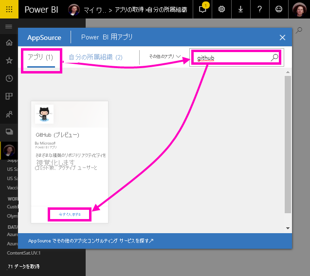
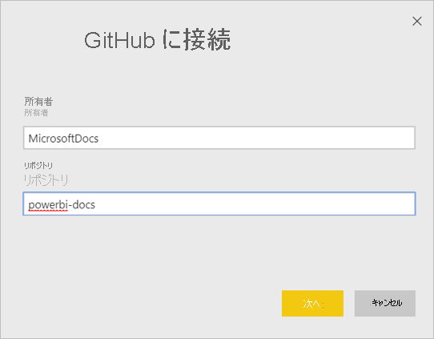
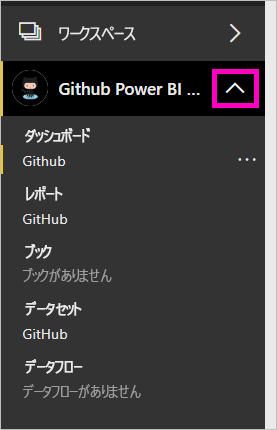
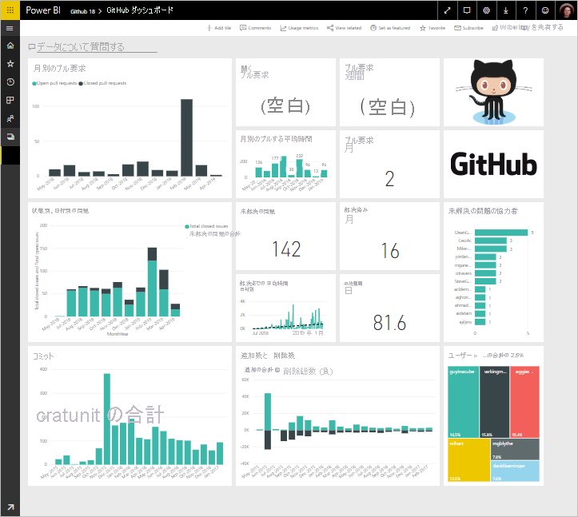
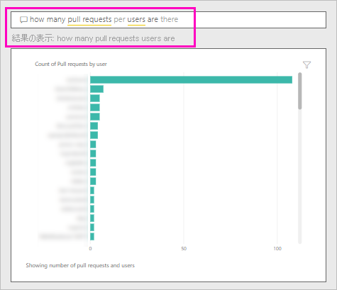

# チュートリアル:Power BI を使用して GitHub リポジトリに接続する
このチュートリアルでは、Power BI で GitHub サービスの実際のデータに接続します。Power BI でダッシュボードとレポートが自動的に作成されます。 Power BI のコンテンツ パブリック リポジトリ (単に "*リポジトリ*" とも呼ばれます) に接続すると、次のような質問に対する回答が表示されます。Power BI のパブリック コンテンツに寄稿しているユーザーの数、 最も寄稿が多いユーザーは誰か、 最も寄稿が多いのは何曜日か、 その他の質問もあります。 

このチュートリアルでは、以下の手順を実行します。

> [!div class="checklist"]
> * まだ持っていない場合は、GitHub アカウントにサインアップします 
> * Power BI アカウントにサインインするか、まだ行っていない場合はサインアップします
> * Power BI サービスを開きます
> * GitHub アプリを検索します
> * Power BI のパブリック GitHub リポジトリに関する情報を入力します
> * GitHub データでダッシュボードとレポートを表示します
> * アプリを削除することによってリソースをクリーンアップします

Power BI にサインアップしていない場合は、[無料の試用版にサインアップ](https://app.powerbi.com/signupredirect?pbi_source=web)してください。

## 前提条件

GitHub アカウントをまだ持っていない場合、このチュートリアルを行うにはアカウントが必要です。 

- [GitHub アカウント](/contribute/get-started-setup-github)にサインアップします。

## 接続する方法
1. Power BI サービスにサインインします (`https://app.powerbi.com`)。 
2. ナビ ペインで **[アプリ]** を選んでから、 **[アプリの取得]** を選びます。
   
    

3. **[アプリ]** を選び、検索ボックスに「**GitHub**」と入力して、 **[今すぐ入手する]** を選びます。
   
    

4. **[この Power BI アプリをインストールしますか?]** で、 **[インストール]** を選択します。
5. **[新しいアプリの準備完了]** で **[アプリへ移動]** を選択します。
6. **[新しいアプリを開始する]** で **[接続]** を選択します。

    

7. リポジトリの名前とリポジトリの所有者を入力します。 このリポジトリの URL は https://github.com/MicrosoftDocs/powerbi-docs なので、 **[リポジトリ所有者]** は「**MicrosoftDocs**」、 **[リポジトリ]** は「**powerbi-docs**」です。 
   
    

5. 作成した GitHub の資格情報を入力します。 お使いのブラウザーで GitHub に既にサインインしている場合、Power BI はこのステップを省略することがあります。 

6. **[認証方法]** に **[oAuth2]** が選択されている状態で \> **[サインイン]** をクリックします。

7. GitHub の認証画面に従います。 GitHub データへのアクセス許可を Power BI に付与します。
   
   Power BI は GitHub とそのデータに接続できるようになります。  データは、1 日に 1 回更新されます。

8. Power BI によってデータがインポートされると、新しい GitHub ワークスペースの内容が表示されます。 
9. ナビ ペインで、ワークスペース名の横にある矢印を選択します。 ワークスペースにダッシュボードとレポートが含まれていることがわかります。 

    

10. ダッシュボード名の横にある**その他のオプション** (...) を選択し、 **[名前の変更]** を選択し、「**GitHub dashboard**」と入力します。
 
     

8. グローバル ナビゲーション アイコンを選んでナビ ペインを最小化し、表示領域を大きくします。

    

10. GitHub ダッシュボードを選択します。
    
    GitHub ダッシュボードにはライブ データが含まれているため、表示される値は異なる場合があります。

    

    

## 質問する

1. **[データについて質問する]** にカーソルを置きます。 Power BI から、 **[Questions to get your started]\(開始するための質問\)** が提供されます。 

1. **[how many users are there]\(ユーザーの数\)** を選択します。
 
    

13. **[how many]** と **[users are there]** の間に「**pull requests per**」と入力します。 

     Power BI によって、ユーザーあたりの pull request 数を示す棒グラフが作成されます。

    

13. ピンを選択してダッシュボードにそれをピン留めし、 **[Q&A の終了]** をクリックします。

## GitHub のレポートを表示する 

1. GitHub ダッシュボードで、棒グラフ **[Pull Requests by Month]\(月別のプル要求\)** を選択し、関連レポートを開きます。

    

2. **[Total pull requests by user]\(ユーザー別の合計プル要求数\)** グラフでユーザー名を選択します。 この例では、ほとんどの時間が 2 月に含まれていたことがわかります。

    

3. **[Punch Card]** タブを選び、レポートで次のページを表示します。 
 
    

    明らかに、ユーザーが作業をチェックインする "*コミット*" が最も多いのは、火曜日の午後 3 時です。

## リソースをクリーンアップする

チュートリアルはこれで終わりなので、GitHub アプリを削除できます。 

1. ナビ ペインで **[アプリ]** を選択します。
2. GitHub のタイルをポイントし、 **[削除]** ごみ箱を選びます。

    

## 次の手順

このチュートリアルでは、GitHub のパブリック リポジトリに接続し、データを取得しました。データは、Power BI のダッシュボードとレポートで書式設定されました。 ダッシュボードとレポートを調べることにより、データに関するいくつかの質問に対する答えを得ました。 これで、Salesforce、Microsoft Dynamics、Google Analytics など、他のサービスへの接続についてさらに学習できます。 
 
> [!div class="nextstepaction"]
> [使用するオンライン サービスに接続する](service-connect-to-services.md)