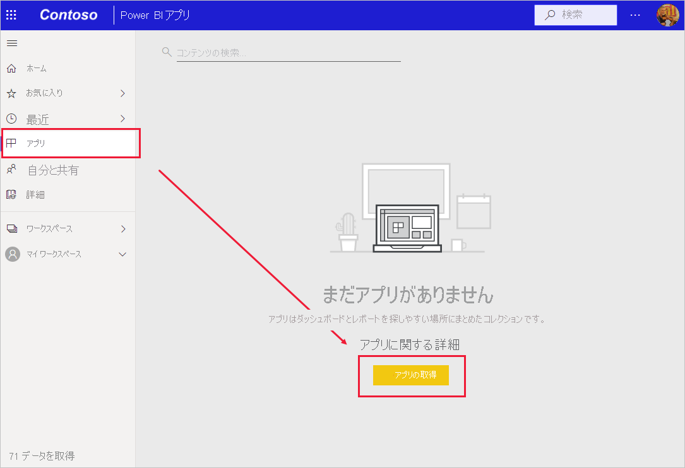
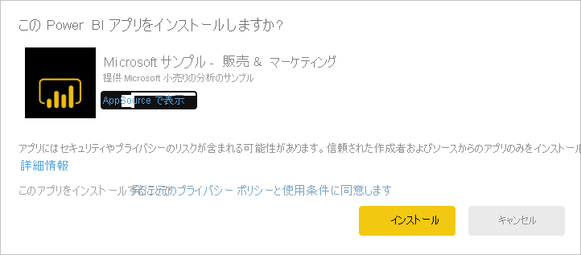
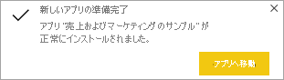
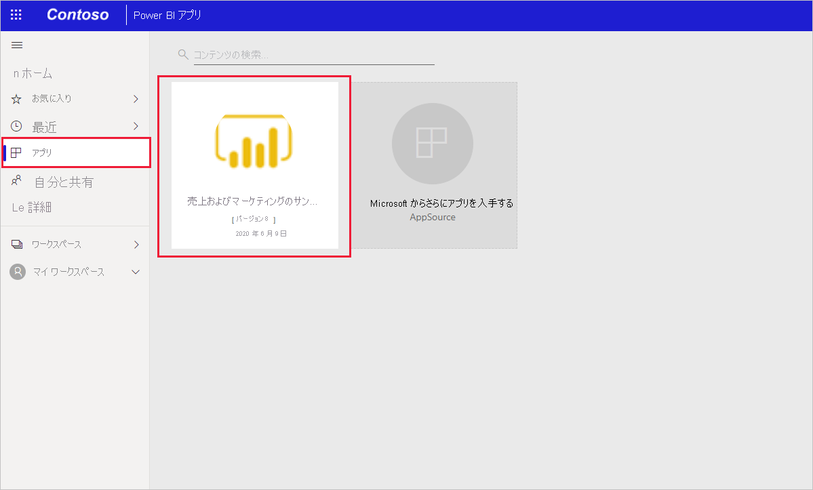
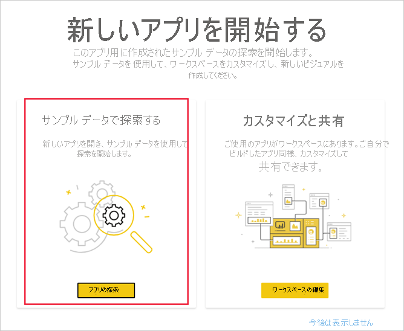

# サンプルの Sales & Marketing アプリをインストールして Power BI サービスで使用する

[!INCLUDE[consumer-appliesto-yyny](../includes/consumer-appliesto-yyny.md)]

[Power BI コンテンツを取得する方法の基本について理解](end-user-app-view.md)したら、次は Microsoft AppSource (appsource.com) から Sales & Marketing アプリを取得してみましょう。 

## Power BI アプリ マーケットプレースからアプリを入手する

1. まだサインインしていなければ、[Power BI サービスにサインイン](./end-user-sign-in.md)します。 

1. Power BI で、 **[アプリ] > [アプリの取得]** を選択します。 

    

1. Power BI アプリ マーケットプレースが開きます。 Sales および Marketing アプリを検索します。 表示されない場合は、検索ボックスに「Sales」と入力してみてください。

    

1. アプリのタイルをクリックします。 AppSource でのアプリのオファリングが開きます。 **[GET IT NOW]** をクリックします。

   

1. このアプリをインストールすることを確認します。

   

5. アプリがインストールされると、Power BI サービスに成功のメッセージが表示されます。 **[アプリへ移動]** を選択して、アプリを開きます。 デザイナーでアプリを作成した方法に応じて、アプリのダッシュボードまたはアプリのレポートのいずれかが表示されます。

    

    **[アプリ]** を選択し、 **[営業とマーケティング]** を選択することで、アプリのコンテンツ リストからアプリを直接開くこともできます。

    

6. 新しいアプリを探索するか、カスタマイズして共有するかを選択します。 Microsoft のサンプル アプリを選択したので、探索を開始しましょう。 

    

7.  新しいアプリがダッシュボードで開かれます。 アプリ "*デザイナー*" によって、代わりにレポートを開くように、アプリが設定されている可能性があります。  

    

## アプリのダッシュボードとレポートを操作する
時間をかけてアプリを構成するダッシュボードとレポートのデータを調べます。 フィルター処理、強調表示、並べ替え、ドリルダウンなど、標準の Power BI の相互作用のすべてにアクセスできます。  ダッシュボードとレポートの違いでまだ少し混乱していますか?  [ダッシュボードに関する記事](end-user-dashboards.md)と[レポートに関する記事](end-user-reports.md)を参照してください。  

## 次の手順
* [アプリの概要に戻る](end-user-apps.md)
* [Power BI レポートを表示する](end-user-report-open.md)
* [コンテンツを自分と共有するその他の方法](end-user-shared-with-me.md)
