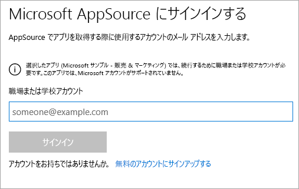
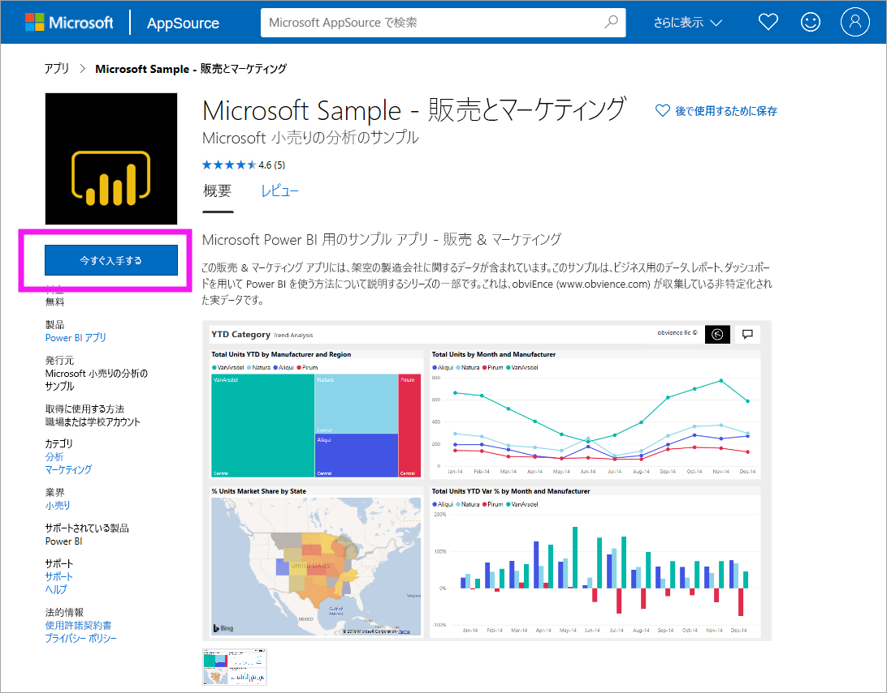
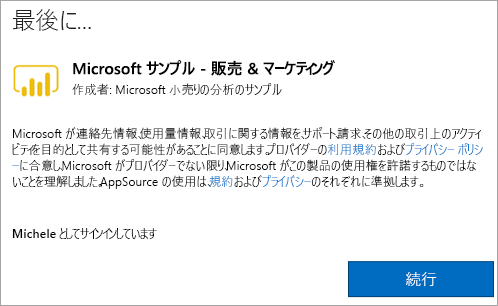

# サンプルの Sales & Marketing アプリをインストールして Power BI サービスで使用する

[!INCLUDE[consumer-appliesto-yyny](../includes/consumer-appliesto-yyny.md)]

[Power BI コンテンツを取得する方法の基本について理解](end-user-app-view.md)したら、次は Microsoft AppSource (appsource.com) から Sales & Marketing アプリを取得してみましょう。 

## Microsoft AppSource (appsource.com)
アプリのリンクはこちらです。[Sales & Marketing アプリ](https://appsource.microsoft.com/product/power-bi/microsoft-retail-analysis-sample.salesandmarketingsample?tab=Overview)。 このリンクを選択すると、Microsoft AppSource でこのアプリのダウンロード ページが開きます。 

1. アプリを入手するには、サインインするように求められることがあります。 Power BI に使用するものと同じメール アドレスを使用してサインインします。 

    

2. **[今すぐ入手する]** を選択します。 

    

3. AppSource に初めてサインインする場合は、使用条件に同意する必要があります。 

    

4. Power BI サービスが開きます。 このアプリをインストールすることを確認します。

    

5. アプリがインストールされると、Power BI サービスに成功のメッセージが表示されます。 **[アプリへ移動]** を選択して、アプリを開きます。 デザイナーでアプリを作成した方法に応じて、アプリのダッシュボードまたはアプリのレポートのいずれかが表示されます。

    

    **[アプリ]** を選択し、 **[営業とマーケティング]** を選択することで、アプリのコンテンツ リストからアプリを直接開くこともできます。

    

6. 新しいアプリを探索するか、カスタマイズして共有するかを選択します。 Microsoft のサンプル アプリを選択したので、探索を開始しましょう。 

    

7.  新しいアプリがダッシュボードで開かれます。 アプリ "*デザイナー*" によって、代わりにレポートを開くように、アプリが設定されている可能性があります。  

    

## アプリのダッシュボードとレポートを操作する
時間をかけてアプリを構成するダッシュボードとレポートのデータを調べます。 フィルター処理、強調表示、並べ替え、ドリルダウンなど、標準の Power BI の相互作用のすべてにアクセスできます。  ダッシュボードとレポートの違いでまだ少し混乱していますか?   [ダッシュボードに関する記事](end-user-dashboards.md)と[レポートに関する記事](end-user-reports.md)を参照してください。  

## 次の手順
* [アプリの概要に戻る](end-user-apps.md)
* [Power BI レポートを表示する](end-user-report-open.md)
* [コンテンツを自分と共有するその他の方法](end-user-shared-with-me.md)
