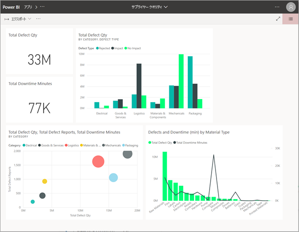
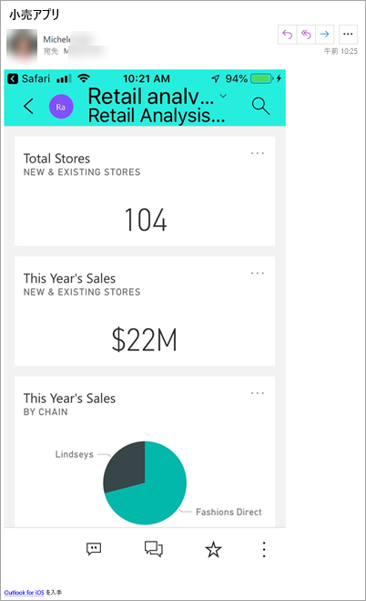
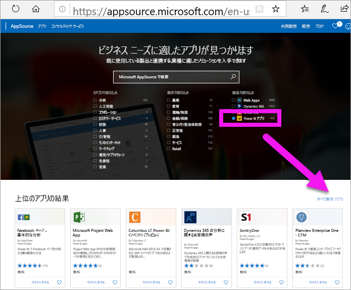
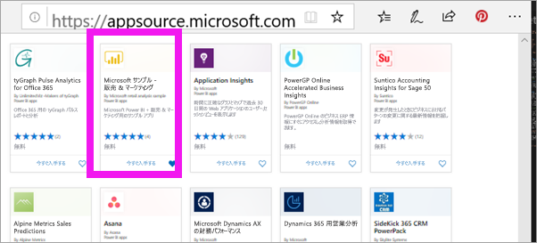
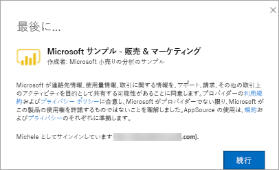
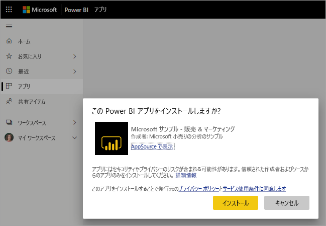
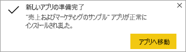
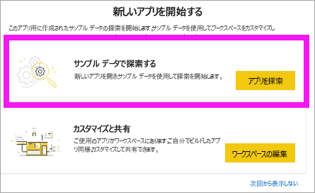
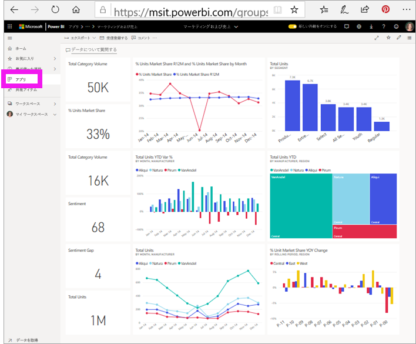

# Power BI でダッシュボードとレポートを含むアプリをインストールして使用する

[!INCLUDE [power-bi-service-new-look-include](../includes/power-bi-service-new-look-include.md)]

これで[アプリの基礎を理解](end-user-apps.md)できたので、次はアプリを開いて操作する方法を学習しましょう。 

## 新しいアプリの入手方法
新しいアプリの入手には、いくつかの方法があります。 レポートのデザイナーである同僚は、あなたの Power BI アカウントにアプリを自動的にインストールするか、アプリの直接リンクを送信することができます。 それから自分で AppSource に進み、社内外両方のアプリ デザイナーから提供されているアプリを検索することができます。 

モバイル デバイスの Power BI では、直接リンクからのみアプリをインストールできます。AppSource からはインストールできません。 アプリのデザイナーが自動的にアプリをインストールした場合は、アプリの一覧に表示されます。

## 直接リンクからのアプリをインストールする
新しいアプリを自分でインストールする最も簡単な方法は、アプリ デザイナーからのメールで直接リンクを入手することです。  

**コンピューターで** 

電子メールでこのリンクを選択すると、Power BI サービス ([https://powerbi.com](https://powerbi.com)) によってブラウザーでアプリが開かれます。 

**iOS または Android モバイル デバイスで** 

モバイル デバイスで電子メールにあるリンクを選択すると、アプリが自動的にインストールされ、モバイル アプリで開きます。 最初にサインインする必要がある場合があります。 

## Microsoft AppSource からアプリを取得する
アプリを Microsoft AppSource から検索してインストールすることもできます。 アクセスできる (つまり、アプリの作成者があなたまたはすべてのユーザーにアクセス許可を与えた) アプリのみが表示されます。

1. **[アプリ]**   >  **[アプリの取得]** を選択します。 
   
    ![[アプリの取得] アイコン](./media/end-user-app-view/power-bi-get-app2.png)    
2. [AppSource] の **[My organization (自分の組織)]** で、結果を絞り込むための検索を行って、探しているアプリを見つけることができます。
   
    ![AppSource の [自分の所属組織]](./media/end-user-app-view/power-bi-opportunity-app.png)
3. **[今すぐ入手する]** を選択して、これをアプリのコンテンツ リストに追加します。 

## Microsoft AppSource Web サイトからアプリを取得する (https://appsource.microsoft.com)
この例では、Microsoft のサンプル アプリの 1 つを開きます。 AppSource では、ビジネスに使用する多くのサービス向けアプリが見つかります。  Salesforce、Microsoft Dynamics、Google Analytics、GitHub、Zendesk、Marketo などのサービスです。 詳細については、[Power BI で使用するサービス向けアプリ](../service-connect-to-services.md)に関するページを参照してください。 

1. ブラウザーで https://appsource.microsoft.com を開き、 **[Power BI アプリ]** を選択します。

    

2. 現在、AppSource で利用可能なすべての Power BI アプリの一覧を表示するには、 **[すべて表示]** を選択します。 **Microsoft サンプル - 営業とマーケティング**という名前のアプリまでスクロールするか、検索します。

    

3. **[今すぐ入手]** を選択して、使用条件に同意します。

    

4. このアプリをインストールすることを確認します。

    

5. アプリがインストールされると、Power BI サービスに成功のメッセージが表示されます。 **[アプリへ移動]** を選択して、アプリを開きます。 デザイナーでアプリを作成した方法に応じて、アプリのダッシュボードまたはアプリのレポートのいずれかが表示されます。

    

    **[アプリ]** を選択し、 **[営業とマーケティング]** を選択することで、アプリのコンテンツ リストからアプリを直接開くこともできます。

    

6. 新しいアプリを探索するか、カスタマイズして共有するかを選択します。 Microsoft のサンプル アプリを選択したので、探索を開始しましょう。 

    

7.  新しいアプリがダッシュボードで開かれます。 アプリ "*デザイナー*" によって、代わりにレポートを開くように、アプリが設定されている可能性があります。  

    

## アプリのダッシュボードとレポートを操作する
時間をかけてアプリを構成するダッシュボードとレポートのデータを調べます。 フィルター処理、強調表示、並べ替え、ドリルダウンなど、標準の Power BI の相互作用のすべてにアクセスできます。  ダッシュボードとレポートの違いでまだ少し混乱していますか?  [ダッシュボードに関する記事](end-user-dashboards.md)と[レポートに関する記事](end-user-reports.md)を参照してください。  

## 次の手順
* [アプリの概要に戻る](end-user-apps.md)
* [Power BI レポートを表示する](end-user-report-open.md)
* [コンテンツを自分と共有するその他の方法](end-user-shared-with-me.md)
