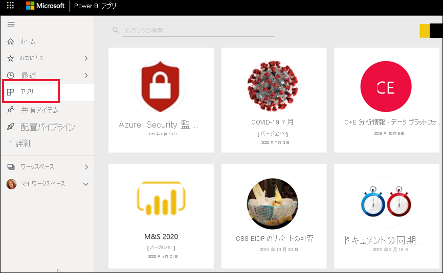
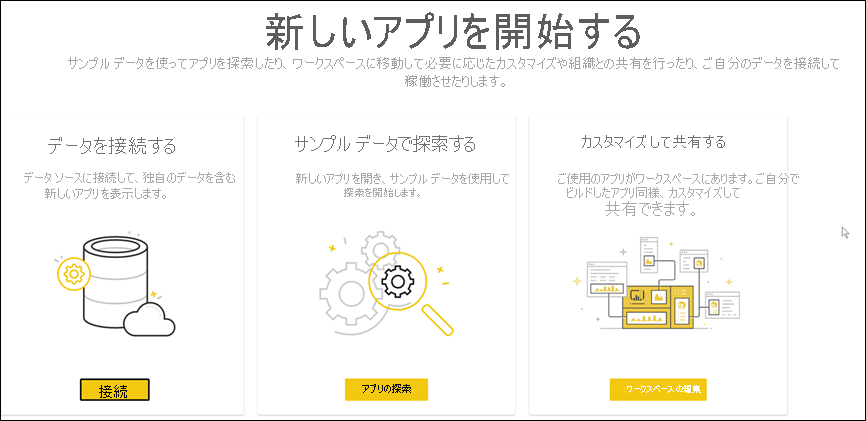
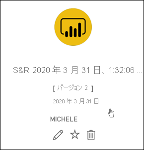
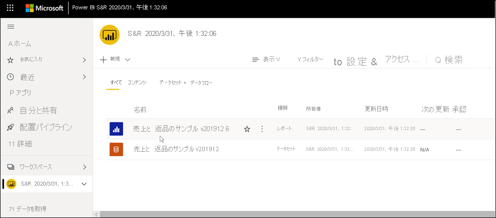
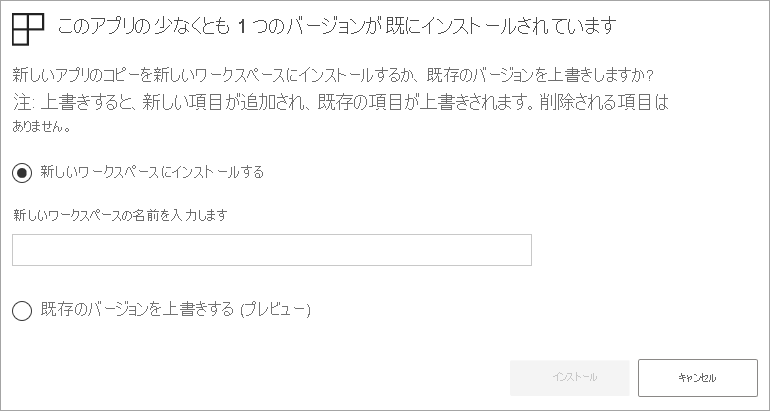

# Power BI でダッシュボードとレポートを含むアプリをインストールして使用する

[!INCLUDE[consumer-appliesto-ynny](../includes/consumer-appliesto-ynny.md)]

[!INCLUDE [power-bi-service-new-look-include](../includes/power-bi-service-new-look-include.md)]

これで[アプリの基礎を理解](end-user-apps.md)できたので、次はアプリを開いて操作する方法を学習しましょう。 

## 新しいアプリの入手方法
新しいアプリの入手には、いくつかの方法があります。
* これは、Power BI の Power BI アプリ マーケットプレースから入手できます。
* アプリ デザイナーから受信しているアプリの直接リンクを使用できます。 
* 組織のアプリ デザイナーは、Power BI アカウントでアプリを自動的にインストールできます。

Power BI モバイルを使用して、直接リンクからのみアプリをインストールできます。 アプリのデザイナーが自動的にアプリをインストールした場合は、アプリの一覧に表示されます。

## アプリとライセンス
すべての Power BI ユーザーがアプリを表示して操作できるわけではありません。 
- 無料のライセンスをお持ちの場合は、Premium 容量内のワークスペースに格納された共有のアプリを開くことができます。
- Pro ライセンスをお持ちの場合は、共有されているアプリを開くことができます。

## Power BI アプリ マーケットプレースからアプリを入手する

Power BI アプリ マーケットプレースでアプリを検索してインストールできます。 アプリ マーケットプレースでは、組織のアプリとテンプレート アプリの両方を入手できます。

- "*組織のアプリ*" は組織内の Power BI ユーザーが使用できます。 これらのアプリには、事前構築済みのダッシュボードおよびレポートも含まれており、これらをそのまま使用したり、カスタマイズして共有したりできます。 組織には、販売の追跡、パフォーマンスの測定、または採用の成功の分析を行うためのアプリがある場合があります。
- "*テンプレート*" アプリには、SalesForce、Microsoft Dynamics、Google Analytics など、ビジネスの実行に使用するさまざまなサービスに接続するために使用できる、事前構築済みのダッシュボードおよびレポートが付属しています。

1. まだサインインしていなければ、[Power BI サービスにサインイン](./end-user-sign-in.md)します。 

1. Power BI で、 **[アプリ] > [アプリの取得]** を選択します。 

    

1. Power BI アプリ マーケットプレースが開きます。

   

   3 つのタブを使用できます。
   * **すべてのアプリ** - テンプレート アプリと、使用可能なすべての組織アプリを参照します。 テンプレート アプリは、タイルの右上隅のショッピング バッグ アイコンによって区別されます。
   * **組織アプリ** - 自分と共有されている組織アプリを参照します。 
   * **テンプレート アプリ** - AppSource でホストされているテンプレート アプリを参照します。

   または、検索ボックスを使用して、さまざまなアプリからフィルター処理して選択することもできます。 アプリの名前か金融、分析、マーケティングなどのカテゴリ名の一部を入力して、探している項目を簡単に見つけることができます。 

   検索ボックスは、開いているタブの影響を受けます。選択されている種類のアプリのみが返されます。 **[すべてのアプリ]** タブが開いている場合は、組織アプリとテンプレート アプリの両方が返されます。 これは、組織アプリとテンプレート アプリの名前が同じである場合に、混乱を招く可能性があります。 テンプレート アプリのタイルには、右上隅にショッピング バッグ アイコンが付いていることを思い出してください。

目的のアプリが見つかったら、 **[今すぐ入手する]** を選択してインストールします。
* 組織アプリをインストールすると、アプリの一覧にすぐに追加されます。
* テンプレート アプリをインストールすると、AppSource のテンプレート アプリ オファリングに移動します。 Power BI アプリ マーケットプレースからサンプル テンプレート アプリをダウンロードしてインストールする方法の[例](end-user-app-marketing.md)を参照してください。 同じ名前のワークスペースと共に、アプリがインストールされます。

   > [!NOTE]
   > 無料ユーザー ライセンスをご使用の場合は、アプリをダウンロードできますが、Power BI Pro アカウントにアップグレードした場合や、Premium 共有容量にアプリが格納されている場合を除き、アプリを表示することはできません。 詳細については、[コンシューマー向けライセンス](end-user-license.md)に関する記事を参照してください。

## 直接リンクからのアプリをインストールする
アプリ デザイナーから受け取った電子メール内の直接リンクから、組織アプリをインストールすることもできます。  

**コンピューターで** 

電子メールでこのリンクを選択すると、Power BI サービス ([https://powerbi.com](https://app/powerbi.com)) によってブラウザーでアプリが開かれます。 

**iOS または Android モバイル デバイスで** 

モバイル デバイスで電子メールにあるリンクを選択すると、アプリが自動的にインストールされ、モバイル アプリで開きます。 最初にサインインする必要がある場合があります。 

## アプリのダッシュボードとレポートを操作する
時間をかけてアプリを構成するダッシュボードとレポートのデータを調べます。 フィルター処理、強調表示、並べ替え、ドリルダウンなど、標準の Power BI の相互作用のすべてにアクセスできます。  ダッシュボードとレポートの違いでまだ少し混乱していますか?  [ダッシュボードに関する記事](end-user-dashboards.md)と[レポートに関する記事](end-user-reports.md)を参照してください。  

### アプリを開く

アプリをインストールしたか、仕事仲間からアプリを受信しました。 このアプリを表示するには、ナビゲーション ウィンドウで **[アプリ]** を選択して、アプリのコンテンツ リストを開きます。

アプリをポイントして選択し、開きます。 アプリによっては、次のようなプロンプトが表示される場合があります。

選択するオプションの詳細については、[テンプレート アプリのインストール](../connect-data/service-template-apps-install-distribute.md)に関するページを参照してください。

アプリをポイントして詳細を確認し、アプリ カードを選択してアプリを開きます。

アプリが開きます。 アプリごとにレイアウト、ビジュアル、色、オプションが異なります。 ただし、すべてのアプリにはいくつかの共通の機能があります。

1. アプリの名前と最終更新時刻。 ドロップダウン矢印を選択すると、所有者とヘルプ連絡先を確認できます。
1. **[Power BI]** を選択すると、[ホーム](end-user-home.md)に戻ります。
1. アクション バー。 
1. レポート ページ キャンバス。
1. アプリのナビゲーション ウィンドウ。  アプリの名前の下には、レポート ページの一覧が表示されます。 レポート ページ名を選択すると、そのページが開きます。 ここでは、 *[利益率]* ページが開いています。 
1. 矢印を選択すると、 **[フィルター]** ウィンドウが展開されます。

また、関連付けられているワークスペースを調べることもできます。 [ワークスペースについて学習する](end-user-workspaces.md)

## アプリの更新 

アプリ デザイナーは、アプリの新しいバージョンをリリースすることもあります。 新しいバージョンを取得する方法は、元のものをどのように受け取ったかによって異なります。 

* 所属する組織からアプリを取得した場合、新しいバージョンへの更新は完全に透過的に行われます。ご自分では何もする必要はありません。 

* AppSource からアプリを取得した場合、次回アプリを開いたときに通知バナーが表示されます。 この通知により、新しいバージョンが利用可能であることを確認できます。 

    1. 更新するには、 **[Get it]\(取得\)** を選択します。  

        <!-- -->

    2. 更新されたアプリのインストールを求めるメッセージが表示されたら、 **[インストール]** を選択します。 

         

    3. このアプリのバージョンは既に存在するため、既存のバージョンを置き換えるか、更新されたアプリを新しいワークスペースにインストールするかを決定します。   

         

    > [!NOTE] 
    > 新しいバージョンをインストールすると、レポートとダッシュボードに加えた変更はいずれも上書きされます。 変更したレポートおよびダッシュボードを維持するには、インストールする前に、それらを別の名前で保存するか、別の場所に保存します。 

    4. 更新されたバージョンをインストールしたら、 **[アプリを更新]** を選択して更新プロセスを完了します。 

## 考慮事項とトラブルシューティング

- アプリをインストールする機能は、Power BI 管理者が有効または無効にすることができます。 この機能を有効にする必要がある場合は、IT 部門またはヘルプ デスクにお問い合わせください。    
- アプリを使用するには、Pro ライセンスを使用するか、アプリを Premium 共有容量に格納する必要があります。 [ライセンスについてはこちらをご覧ください](end-user-license.md)。

## 次の手順
* [アプリの概要に戻る](end-user-apps.md)
* [Power BI レポートを表示する](end-user-report-open.md)
* [コンテンツを自分と共有するその他の方法](end-user-shared-with-me.md)

