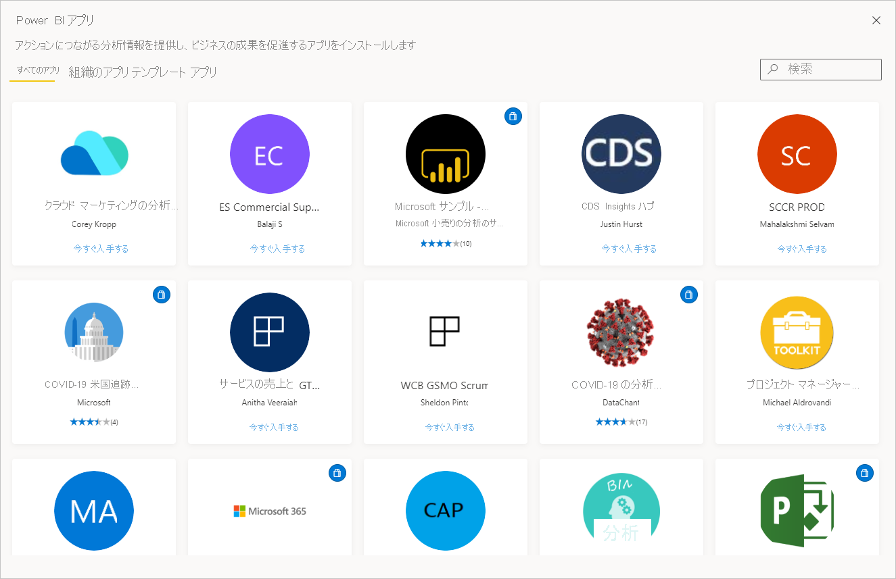

# Power BI のアプリ

[!INCLUDE[consumer-appliesto-ynny](../includes/consumer-appliesto-ynny.md)]

[!INCLUDE [power-bi-service-new-look-include](../includes/power-bi-service-new-look-include.md)]

## Power BI とは?
*アプリ*とは、関連するダッシュ ボードとレポートがすべて 1 か所にまとめられた Power BI のコンテンツの種類です。 アプリでは、1 つ以上のダッシュ ボードと 1 つ以上のレポートをすべてまとめることができます。 アプリは、あなたのような*コンシューマー*に、アプリを配布するおよび共有する Power BI *デザイナー*によって作成されます。 

ご使用のアプリは、 **[アプリ]** コンテンツ リストにまとめられます。 アプリを表示するには、 **[アプリ]** を選択します。 アプリの上にマウス カーソルを移動すると、最後に更新された日付と所有者が表示されます。 

アプリ機能を使用するには、Power BI Pro ライセンスが必要です。またはアプリを Premium 容量に格納する必要があります。 ライセンスと Premium 容量の詳細については、[コンシューマー向けライセンス](end-user-license.md)に関する記事を参照してください。

## アプリの*デザイナー*とアプリの*コンシューマー*
自分の役割によっては、自分用または仕事仲間と共有するアプリの作成者 ("*デザイナー*") である場合があります。 または、他のユーザーが作成したアプリを受け取り、ダウンロードするユーザー ("*コンシューマー*") である場合があります。 この記事は、アプリの*コンシューマー*を対象としています。

## アプリの利点
アプリは、さまざまな種類のコンテンツを一度に共有するための簡単な方法です。 アプリの "*デザイナー*" は、ダッシュボードとレポートを作成し、それらをアプリにまとめます。 その後、"*デザイナー*" は、"*コンシューマー*" がアクセスできる場所にアプリを共有または発行します。 関連するダッシュボードとレポートはまとめられているため、Power BI サービス ([https://powerbi.com](https://powerbi.com)) とご利用のモバイル デバイスの両方でより簡単に検索してインストールできます。 アプリのインストール後は、さまざまなダッシュボードやレポートの名前を覚えておく必要がありません。ご利用のブラウザー内やモバイル デバイス上で 1 つのアプリにまとめて表示されるためです。

アプリの作者が更新プログラムを公開するたびに、自動的に変更が反映されます。 作成者はデータの更新頻度も制御するため、最新の状態が維持されているかを気にする必要はありません。 

<!-- add conceptual art -->
## 新しいアプリを取得する
新しいアプリを取得する最善の方法は、[Power BI アプリ マーケットプレース](https://app.powerbi.com/groups/me/getapps/apps)を利用することです。

アプリを入手するには、他にもいくつかの方法があります。 以下では一部の方法を示します。 アプリを取得して探索する詳細な手順については、[アプリを開いて操作する方法](end-user-app-view.md)に関するページを参照してください。

* アプリ デザイナーによって、アプリが自分の Power BI アカウントに自動的にインストールされ、次回、Power BI サービスを開いたときに、新しいアプリが **[アプリ]** コンテンツ リストに表示されます。 
* アプリ デザイナーでは、ユーザーにアプリへの直接リンクを送信することができます。 このリンクを選択すると、アプリが Power BI サービスで開きます。
* モバイル デバイスの Power BI では、直接リンクからのみアプリをインストールできます。AppSource からはインストールできません。 アプリの作成者が自動的にアプリをインストールした場合は、アプリの一覧に表示されます。 

## 次の手順
* [アプリを開いて操作する](end-user-app-view.md)
* [コンテンツを共有する他の方法](end-user-shared-with-me.md)

