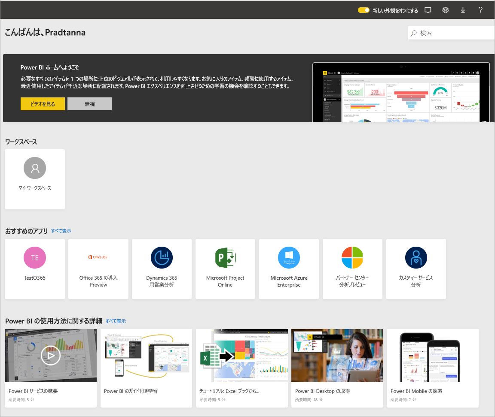
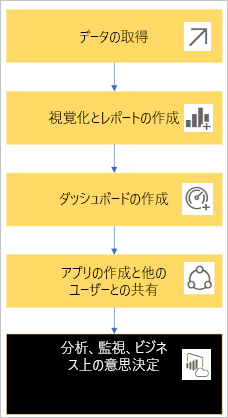
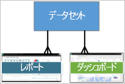
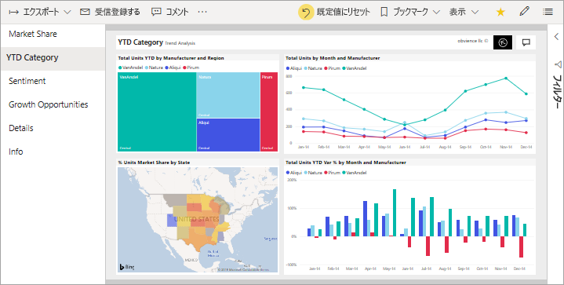
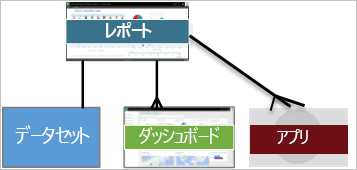
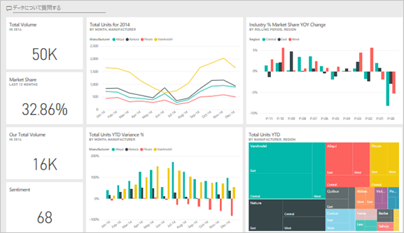
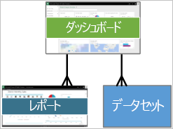
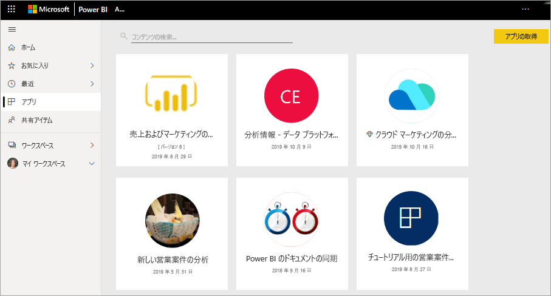
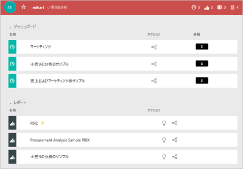

# Power BI サービスのコンシューマーの基本的な概念

[!INCLUDE[consumer-appliesto-ynnm](../includes/consumer-appliesto-ynnm.md)]

[!INCLUDE [power-bi-service-new-look-include](../includes/power-bi-service-new-look-include.md)]

この記事は、[Power BI の概要](../fundamentals/power-bi-overview.md)に関する記事を既に読んでいて、ご自分を [Power BI **_コンシューマー_** ](end-user-consumer.md)と認識していることを前提としています。 コンシューマーは、仕事仲間からダッシュボードやレポートなどの Power BI のコンテンツを受け取ります。 コンシューマーは、Power BI の Web サイト ベースのバージョンである Power BI サービスを使用します。

他のユーザーからコンテンツを受け取るには、Power BI Pro ユーザー ライセンスまたは Power BI Premium 容量ライセンスが必要です。 [お使いのライセンスの種類を調べる](end-user-license.md)

"Power BI Desktop" あるいは単に "Desktop" という用語をご存知かと思います。 これは、ダッシュボードおよびレポートをビルドしてお客様と共有する "*デザイナー*" によって使用されるスタンドアロン ツールです。 その他の Power BI ツールが存在することを知っておくことは重要です。 お客様がコンシューマーである限り、Power BI サービスのみを操作します。 この記事は Power BI サービスにのみ適用されます。

## 用語と概念

この記事は、Power BI の視覚的なツアーでも、実践的なチュートリアルでもありません。 そうではなく、これは Power BI の用語と概念になじんでいただけるようにする概要の記事です。 専門用語や状況を説明します。 Power BI サービスとそのナビゲーションのツアーについては、「[クイック スタート - Power BI サービス内の移動](end-user-experience.md)」にアクセスしてください。

## Power BI サービスを初めて開く

Power BI コンシューマーのほとんどは Power BI サービスを入手しています。1) 会社でライセンスを購入し、2) 管理者がお客様のような従業員にそのライセンスを割り当てているためです。

開始するには、ブラウザーを開いて、「**app.powerbi.com**」と入力します。 初めて Power BI サービスを開くと、次のようなものが表示されます。

Power BI を使用するときに、Web サイトを開くたびに表示する内容をカスタマイズします。 たとえば、Power BI で**ホーム**を開きたい人もいれば、お気に入りのダッシュボードを最初に表示したい人もいます。 ご安心ください。この記事で、エクスペリエンスの個人設定の方法を説明します。

- [Power BI ホームとグローバル検索の紹介](https://powerbi.microsoft.com/blog/introducing-power-bi-home-and-global-search)

- [Power BI サービスのおすすめのダッシュボード](end-user-featured.md)

しかし、さらに進める前に、話を戻して Power BI サービスを構成する文書パーツについて説明しましょう。

_______________________________________________________

## Power BI コンテンツ

### 文書パーツの概要

Power BI コンシューマーの場合、文書パーツは 5 つあります。 **_視覚化_** 、 **_ダッシュボード_** 、 **_レポート_** 、 **_アプリ_** 、 **_データセット_** です。 これらは *Power BI* の **_コンテンツ_** と呼ばれる場合があります。 "*コンテンツ*" は、 **_ワークスペース_** 内に存在します。 一般的なワークフローには、これらすべての文書パーツが含まれます。Power BI "*デザイナー*" (以下の図の黄色) は、"*データセット*" からデータを収集し、分析のために Power BI に移動し、関心のある事実や分析情報を強調表示する完全な "*視覚化*" の "*レポート*" を作成し、レポートからダッシュボードに視覚化をピン留めし、ご自身のような "*コンシューマー*" (以下の図の黒色) とレポートやダッシュボードを共有します。 "*デザイナー*" は、"*アプリ*" の形式またはその他の種類の共有コンテンツでそれらを共有します。

最も基本的な要素は次のとおりです。

-  **_視覚化_** (または "*ビジュアル*") は、Power BI の "*デザイナー*" によって作成されたグラグの種類です。 ビジュアルは、"*レポート*" と "*データセット*" からのデータを表示します。 通常、*デザイナー*は Power BI Desktop でビジュアルをビルドします。

    詳しくは、「[レポート、ダッシュボード、アプリでビジュアルを操作する](end-user-visualizations.md)」をご覧ください。

-  "*データセット*" はデータのコンテナーです。 たとえば、世界保健機関の Excel ファイルなどです。 また、お客様の会社が所有しているデータベースであったり、Salesforce ファイルであったりします。  

-  "*ダッシュボード*" は、対話型のビジュアル、テキスト、グラフィックを含む単一の画面です。 ダッシュボードでは、ストーリーを伝えたり、質問に回答したりするために、ご自分の最も重要なメトリックを収集します (1 つの画面上)。 ダッシュボードのコンテンツは、1 つ以上のレポートおよび 1 つ以上のデータセットからのものです。

    詳しくは、「[Power BI サービスの利用者向けのダッシュ ボード](end-user-dashboards.md)」をご覧ください。

-  "*レポート*" は、単一のレポートをまとめて構成する対話型のビジュアル、テキスト、グラフィックの 1 ページまたは複数のページです。 Power BI は、1 つのデータセットに基づいてレポートを作成します。 多くの場合、このサービスでは、関心の中心となる領域に対応したり、1 つの質問に答えたりするためにレポート ページを編成します。

    詳しくは、「[Power BI のレポート](end-user-reports.md)」をご覧ください。

-  "*アプリ*" は、関連するダッシュボードとレポートを "*デザイナー*" がまとめて共有する方法です。 *コンシューマー*は一部のアプリを自動的に受け取りますが、仕事仲間やコミュニティによって作成されたその他のアプリを検索することができます。 たとえば、既にご利用中かもしれませんが、Google アナリティクスや Microsoft Dynamics CRM などの外部サービスでは、Power BI アプリを提供します。

明確にするために示しますが、新しいユーザーで、初めて Power BI にログインした場合、まだダッシュボード、アプリ、レポートは表示されません。

_______________________________________________________

## データセット

*データセット*は、*デザイナー*がインポートまたは接続して、レポートとダッシュボードをビルドするために使用するデータのコレクションです。 コンシューマーとして、データセットを直接操作することはありませんが、それらが全体の中でどのように適合するかを知るのは有益です。  

各データセットは、データ の 1 つのソースを表します。 たとえば、ソースとしては、OneDrive 上の Excel ブック、オンプレミスの SQL Server Analysis Services の表形式データセット、Salesforce データセットなどがあります。 Power BI では、多くのさまざまなデータ ソースがサポートされています。

デザイナーがアプリをお客様と共有する場合、デザイナーがアプリに含めたデータセットを確認できます。

![Power BI ユーザー インターフェイスと、キャンバスの [データセット] セクションを指す矢印のスクリーンショット。](media/end-user-basic-concepts/power-bi-dataset-lists.png)

1 つのデータセットを...

- レポート デザイナーがダッシュボードやレポートを作成するために繰り返し使用できます。

- 多くのさまざまなレポートの作成に使用できます

- その 1 つのデータセットからのビジュアルを、多くのさまざまなダッシュボードで表示できます

  

次の文書パーツ「視覚化」に進みます。

_______________________________________________________

## 視覚化

視覚化 (ビジュアルとも呼ばれる) には、Power BI がデータ内で検出した分析情報が表示されます。 視覚化により、分析情報を解釈しやすくなります。脳は数字のスプレッドシートよりも速く画像を理解できるためです。

Power BI で目にする視覚化の一部には、ウォーターフォール、リボン、ツリーマップ、円、じょうご、カード、散布図、ゲージがあります。

   

[Power BI に含まれる視覚エフェクトの完全な一覧](../power-bi-visualization-types-for-reports-and-q-and-a.md)に関するページを参照してください。

"*Power BI ビジュアル*" と呼ばれる視覚化は、コミュニティからも利用できます。 理解できないビジュアルでレポートを受信した場合、カスタム ビジュアルである可能性が高いです。 カスタム ビジュアルの解釈でサポートが必要な場合は、レポートまたはダッシュボードの "*デザイナー*" の名前を参照して、その人にお問い合わせください。

レポート内の 1 つの視覚化を...

- 同じレポート内で複数回表示できます

- 多くのさまざまなダッシュボードで表示できます

_______________________________________________________

## レポート

Power BI レポートは、視覚エフェクト、グラフィック、テキストの 1 つ以上のページです。 レポートのすべての視覚エフェクトは 1 つのデータセットから取得されます。 *デザイナー*は、[*閲覧表示*](end-user-reading-view.md)でレポートを操作する*コンシューマー*とレポートを共有します。

1 つのレポートを...

- 複数のダッシュボードに関連付けることができます (その 1 つのレポートから固定されたタイルが、複数のダッシュボードに表示されることがあります)。

- 1 つのデータセットのみからのデータを使用して作成できます。  

- 複数のアプリの一部にできます。

  

_______________________________________________________

## ダッシュボード

ダッシュボードは、基になるデータセットの一部のサブセットのカスタマイズしたビューを表します。 *デザイナー*はダッシュボードをビルドし、個別またはアプリの一部として*コンシューマー*と共有します。 ダッシュボードは、"*タイル*"、グラフィック、テキストを含む 1 つのキャンバスです。

  

タイルは、*デザイナー*が、(たとえば、レポートからダッシュボードに) *ピン留めする*ビジュアルのレンダリングです。 ピン留めされたタイルにはそれぞれ、デザイナーでデータセットから作成されてダッシュボードにピン留めされた[視覚化](end-user-visualizations.md)が表示されます。 また、タイルにはレポート ページ全体を含めることもでき、ライブ ストリーミング データまたはビデオを含めることができます。 "*デザイナー*" がタイルをダッシュ ボードに追加する方法は多数あります。 あまりに多すぎて、この概要の記事では紹介できません。 詳しくは、「[Power BI のダッシュボードのタイル](end-user-tiles.md)」をご覧ください。

コンシューマーはダッシュ ボードを編集できません。 ただし、コメントの追加、関連するデータの表示、お気に入りとしての設定、受信登録などを行うことができます。

ダッシュボードにはどのような目的がありますか?   その一部を次に示します。

- 意思決定に必要なすべての情報をひとめで確認できるようにするため

- 業務に関する最も重要な情報を監視するため

- すべての同僚が、同じ情報を表示および使用して、同じ考えを持てるようにするため

- ビジネス、製品、事業分野、マーケティング キャンペーンなどの正常性を監視するため

- 大きなダッシュボードの個人ビューを作成して、自分の関心のあるメトリックスをそこに表示するため

**1 つの** ダッシュボードに...

- 多くの異なるデータセットの視覚エフェクトを表示できます。

- 多くの異なるレポートの視覚エフェクトを表示できます。

- 他のツール (Excel など) からピン留めされた視覚エフェクトを表示できます。

  

_______________________________________________________

## Apps

これらのダッシュボードとレポートのコレクションは、関連するコンテンツが 1 つのパッケージにまとめて整理されます。 Power BI *Designers* は、これらをビルドし、個人、グループ、組織全体、またはパブリックと共有します。 コンシューマーとして、お客様と仕事仲間が同じデータ (真実の唯一の信頼できるバージョン) を使用していることを確信できます。

> [!NOTE]
> アプリを使用するには、Power BI Pro または Premium ライセンスが必要です。 

アプリは [Power BI サービス](https://powerbi.com)とご利用のモバイル デバイスで簡単に検索してインストールすることができます。 アプリをインストールした後は、多数の異なるダッシュ ボードの名前を覚える必要はありません。 それらは、ブラウザー内やモバイル デバイス上で 1 つのアプリにまとめられます。

このアプリには、単一のアプリを構成する 3 つの関連するダッシュボードと 3 つの関連するレポートがあります。

アプリの作者が更新プログラムを公開するたびに、自動的に変更が反映されます。 また、作成者は、Power BI でデータを最新の情報に更新する頻度のスケジュールも制御します。 最新の状態に保つことについて心配する必要はありません。

さまざまな方法でアプリを入手できます。

- アプリ デザイナーは、Power BI アカウントでアプリを自動的にインストールできます。

- アプリ デザイナーは、ユーザーにアプリの直接リンクを送信できます。

- 使用できるすべてのアプリが表示される [Microsoft AppSource](https://appsource.microsoft.com/marketplace/apps?product=power-bi) でそれを検索できます。

ご利用のモバイル デバイスの Power BI では、直接リンクからのみアプリをインストールできます。AppSource からはインストールできません。 アプリのデザイナーが自動的にアプリをインストールした場合は、アプリの一覧に表示されます。

アプリをインストールしたら、ご自分のアプリの一覧からそれを選択し、最初に開いて参照するダッシュボードまたはレポートを選択するだけです。

この記事で、コンシューマー向けの Power BI サービスを構成する文書パーツをご理解いただければ幸いです。

## 次の手順

- [用語](end-user-glossary.md)を確認してブックマークする

- [Power BI サービスのツアー](end-user-experience.md)を開始する

- [コンシューマー専用に作成さらた Power BI の概要](end-user-consumer.md)を確認する

- ビデオを見る。このビデオでは、Will が Power BI サービスの基本的な概念と概要について説明しています

    <iframe width="560" height="315" src="https://www.youtube.com/embed/B2vd4MQrz4M" frameborder="0" allowfullscreen></iframe>
