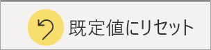
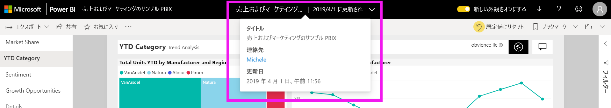

# Power BI レポートでのグラフの並べ替え方法の変更

[!INCLUDE[consumer-appliesto-ynnn](../includes/consumer-appliesto-ynnn.md)]

> [!IMPORTANT]
> **この記事は、レポートまたはデータセットに対する編集アクセス許可を持たず、Power BI のオンライン バージョン (Power BI サービス) のみを使用する Power BI ユーザーを対象としています。レポート "*デザイナー*"、"*管理者*"、または "*所有者*" の場合は、必要な情報がこの記事に記載されていない可能性があります。代わりに、「[Power BI Desktop での列による並べ替え](../create-reports/desktop-sort-by-column.md)** 」を参照してください。

Power BI サービスでは、さまざまなデータ フィールドを並べ替えることで視覚効果を変更できます。 ビジュアルをどのように並べるかで、伝えたい情報を強調表示できます。 数値データ (売り上げ高など) を使用している場合でも、テキスト データ (州名など) を使用している場合でも、希望どおりにお使いの視覚化を並べ替えることができます。 Power BI は柔軟な並べ替え機能とクイック メニューを備えています。 

ダッシュボード上の視覚エフェクトを並べ替えることはできません。 ただし、Power BI レポートでは、ほとんどの視覚エフェクトを一度に 1 フィールド (場合によっては 2 フィールド) ずつ並べ替えることができます。 視覚エフェクトの種類によっては、並べ替えをまったく使用できない場合があります。ツリー マップ、ゲージ、マップなどです。 

## 作業の開始

まず、共有してもらったレポートを開きます。 ビジュアル (並べ替え可能) を選択し、 **[その他のアクション]** (...) を選択します。並べ替えには 3 つのオプションがあります。 **[降順で並べ替え]** 、 **[昇順で並べ替え]** 、 **[並べ替え]** です。 
    

### アルファベット順または数値順での並べ替え

ビジュアルは、ビジュアルのカテゴリのテキスト名をアルファベット順に、または各カテゴリの数値で並べ替えることができます。 たとえば、このグラフでは、X 軸のカテゴリの店舗の **[名前]** がアルファベット順に並べ替えられています。

カテゴリ (店舗名) から値 (平方フィートごとの売上) に、並べ替えの基準を簡単に変更できます。 **[その他の操作]** (...) を選択し、 **[並べ替え]** を選択します。 ビジュアルで使用されている数値を選択します。  この例では、 **[Sales Per Sq Ft]** が選択されています。

![[並べ替え] の選択と値を示すスクリーンショット](media/end-user-change-sort/power-bi-sort-value.png)

必要に応じて、昇順と降順で並べ替え順序を変更します。  再度 **[その他のアクション]** (...) を選び、 **[降順で並べ替え]** または **[昇順で並べ替え]** を選びます。 並べ替えに使用されているフィールドは太字で表示され、黄色のバーが表示されます。

   ![[並べ替え]、[昇順で並べ替え]、[降順で並べ替え] の順に選択しているビデオ](media/end-user-change-sort/sort.gif)

> [!NOTE]
> すべてのビジュアルが並べ替え可能なわけではありません。 たとえば、次のビジュアルは並べ替えできません: ツリーマップ、マップ、塗り分け地図、散布図、ゲージ、カード、ウォーターフォール。

## 複数の列による並べ替え
次の表のデータは、**Number of Customers** で並べ替えられています。  このことは、*Number* という単語の下にある小さな矢印からわかります。 矢印は下向きです。これは、列が "*降順*" で並べ替えられていることを意味します。

並べ替え順序にさらに列を追加するには、次に並べ替え順序に追加したい列のヘッダーを、Shift キーを押しながらクリックします。 たとえば、**Number of Customers** をクリックしてから、Shift キーを押しながら **Total Revenue** をクリックすると、表はまず顧客で、次に収益で並べ替えられます。 赤色の枠線は、並べ替え順序が変更された領域を示しています。

同じ列をもう一度 Shift キーを押しながらクリックすると、その列の並べ替え方向が変わります。 さらに、以前に並べ替え順序に追加した列を Shift キーを押しながらクリックすると、その列は並べ替え順序の後ろに移動します。

## 並べ替え順序の変更を保存する
[読み取りビュー](end-user-reading-view.md)で作業している場合でも、Power BI レポートには、フィルター、スライサー、並べ替え、およびその他のデータ ビューに加えた変更が保持されます。 そのため、レポートを終了し後で戻ったときに、ご自身の並べ替えの変更は保存されています。  レポートの "*デザイナー*" の設定に戻す場合、上のメニュー バーから **[既定値にリセット]** を選択します。 

ただし、 **[既定値にリセット]** ボタンが淡色表示になっている場合は、ユーザーの変更を保存する (永続化する) 機能がレポートの*デザイナー*によって無効にされています。

## 考慮事項とトラブルシューティング

### その他の条件を使用した並べ替え
別のフィールド (ビジュアルには含まれません) またはその他の条件を使用して、ビジュアルを並べ替えたい場合があります。  たとえば、月をアルファベット順ではなく順番に並べ替えることや、数値を数字ではなく数値全体で (たとえば、0、1、20、9 ではなく、0、1、9、20 の順序で) 並べ替えることができます。  

これらの変更は、レポートをデザインしたユーザーのみが行うことができます。 "*デザイナー*" の連絡先情報は、ヘッダー バーからレポート名を選択することで確認できます。

ご自分が "*デザイナー*" であり、コンテンツに対して編集アクセス許可を持っている場合は、「[Power BI Desktop での列による並べ替え](../create-reports/desktop-sort-by-column.md)」を読み、データセットを更新して、この種類の並べ替えを有効にする方法を確認してください。

## 次の手順
「[Power BI での視覚化](end-user-visualizations.md)」をご覧ください。

[Power BI - 基本的な概念](end-user-basic-concepts.md)
