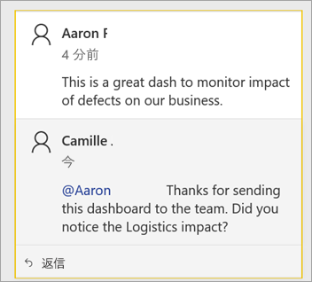
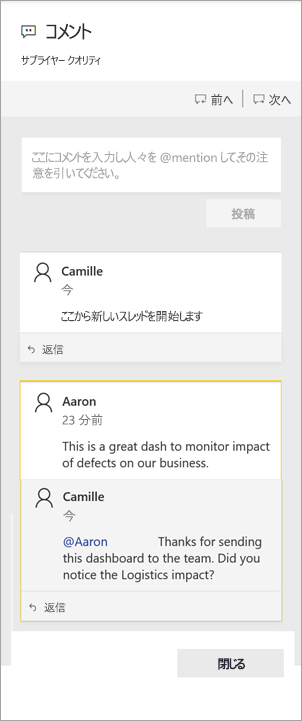
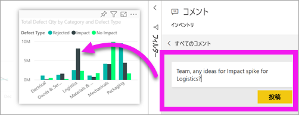
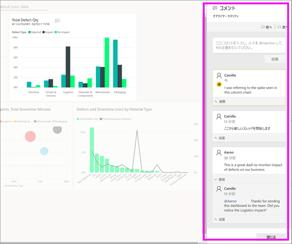

# ダッシュボードまたはレポートにコメントを追加する

[!INCLUDE[consumer-appliesto-ynny](../includes/consumer-appliesto-ynny.md)]

[!INCLUDE [power-bi-service-new-look-include](../includes/power-bi-service-new-look-include.md)]

個人のコメントを追加するか、同僚とダッシュボードまたはレポートに関する会話を開始します。 **コメント**機能は、*コンシューマー*が共同作業するための方法の 1 つにすぎません。 

> [!NOTE]
> 共有レポートにコメントを追加するなど、他のユーザーと共同作業するには、Power BI Pro または Premium ライセンスが必要です。 [私のライセンスの種類は何ですか?](end-user-license.md)

## コメント機能を使用する方法
コメントは、ダッシュボード全体、ダッシュボード上の個々のビジュアル、レポート ページ、ページ分割されたレポート、レポート ページ上の個々のビジュアルに追加することができます。 一般的なコメント、または特定の同僚に宛てたコメントを追加します。  

レポートにコメントを追加すると、Power BI によって現在のフィルターとスライサーの値がキャプチャされます。 つまり、コメントを選択またはコメントに応答すると、レポート ページまたはレポートのビジュアルが変更されて、コメントが最初に追加されたときにアクティブだったフィルターとスライサーの選択が表示される場合があります。  

これが重要である理由 たとえば、同僚が、チームと共有したい興味深い分析情報を示すフィルターを適用したとします。 そのフィルターが選択されていないと、コメントに意味がない場合があります。

ページ分割されたレポートを使用している場合、レポートに関する一般的なコメントのみを残しておくことができます。  ページ番号が付けられた個々のレポート ビジュアルにコメントを残すことはできません。

### ダッシュボードまたはレポートに一般的なコメントを追加する
ダッシュボードまたはレポートにコメントを追加するプロセスは似ています。  この例では、ダッシュボードを使用しています。 

1. Power BI ダッシュボードまたはレポートを開き、 **[コメント]** アイコンを選択します。 これによって [コメント] ダイアログが開きます。

    ![[コメント] アイコン](media/end-user-comment/power-bi-comment-menu.png)

    ここでは、ダッシュ ボードの作成者が既に一般的なコメントを追加しています。  このコメントは、このダッシュボードにアクセスできるすべてのユーザーが参照できます。

    ![[コメント] アイコン](media/end-user-comment/power-bi-first-comments.png)

2. 返信するには、 **[返信]** を選択し、返信を入力し、 **[投稿]** を選択します。  

    ![コメントの [返信] アイコン](media/end-user-comment/power-bi-comment-reply.png)

    Power BI では、既定で、コメントのスレッドを開始した同僚に返信が送られます。この場合は、Aaron です。 

    

 3. 既存のスレッドの一部ではないコメントを追加する場合は、コメントを上部のテキスト フィールドに入力します。

    ![コメントの [返信] アイコン](media/end-user-comment/power-bi-new-comments.png)

    このダッシュボードに対するコメントは、次のように表示されます。

    

### 特定のダッシュボードまたはレポートのビジュアルにコメントを追加する
ダッシュボード全体またはレポート ページ全体にコメントを追加するだけでなく、個々のダッシュボード タイルと個々のレポート ビジュアルにコメントを追加することができます。 これらのプロセスは似ています。この例では、レポートを使用しています。

1. ビジュアルをポイントし、**その他のオプション** (...) を選びます。    
2. ドロップダウンから、 **[コメントを開く]** を選択します。

    ![[コメントの追加] が最初の選択肢](media/end-user-comment/power-bi-report-comment.png)  

3.  **[コメント]** ダイアログが開き、ページの他のビジュアルがグレーで表示されます。このビジュアルには、まだコメントがありません。 

      

4. コメントを入力し、 **[投稿]** を選択します。

      

    - レポート ページで、ビジュアルに対して作成されたコメントを選択すると、そのビジュアルが強調表示されます (上記を参照)。

    - ダッシュボードでは、グラフ アイコン ![[グラフ] アイコン付きのコメント](media/end-user-comment/power-bi-comment-chart-icon.png) で、コメントが特定のビジュアルに関連付けられていることがわかります。 ダッシュボード全体に適用されるコメントには、特別なアイコンがありません。 グラフ アイコンを選択すると、ダッシュボード上の関連するビジュアルが強調表示されます。
    

    

5. **[閉じる]** を選択して、ダッシュボードまたはレポートに戻ります。

### @ 記号を使用して同僚の注目を得る
ダッシュボード、レポート、タイル、ビジュアル コメントのいずれを作成する場合でも、"\@" 記号を使用して同僚の注目を集めることができます。  "\@" 記号を入力すると、Power BI では、組織のユーザーを検索および選択できるドロップダウンが開かれます。 "\@" 記号が前につく検証済みのすべての名前は、青のフォントで表示されます。 

これは、視覚エフェクトの*デザイナー*と行っている会話です。 @ 記号を使用して、確実にコメントを見ることができるようにしています。 このコメントは自分に対するものであることはわかっています。 Power BI でこのアプリ ダッシュボードを開くときに、ヘッダーから **[コメント]** を選択します。 **[コメント]** ウィンドウに会話が表示されます。

  

## 次の手順
[コンシューマーの視覚エフェクト](end-user-visualizations.md)  に戻る  
<!--[Select a visualization to open a report](end-user-open-report.md)-->
