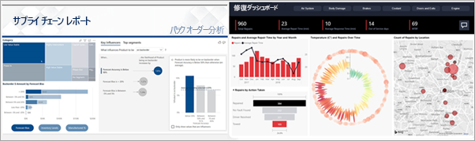
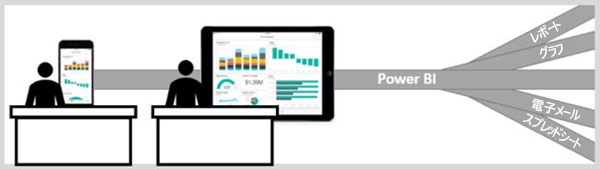

# 利用者向けの Power BI

現代のデータ カルチャでは、ビジネス上の意思決定は意見ではなく事実に基づいて行われます。 これらの決定を行うにはデータが必要であり、同僚に失望することはありません。     
 
あらゆる種類のレポート、スプレッドシート、グラフを含むメール、さらに印刷された配布資料が送信されます。 データが増えるにつれて、必要なものをすばやく見つけることが難しくなり、最新の情報を使用していないのではないかと心配になることがあるでしょう。  
 

## "*コンシューマー*" 向けの Power BI サービス

Power BI によって仕事が簡単になり、同時にインパクトも増します。 データはすべてチャートとグラフになり、データが視覚化されます。 データの分析情報は、数字や語句から成る長い一覧や表ではなく、データの分析情報についてのストーリーを示す、"***美しく***"、カラフルで説得力のあるビジュアルです。 

 
ブラウザーまたはモバイル デバイスで Power BI サービスを開くだけです。 お客様も同僚も、自動的に更新およびリフレッシュされる、信頼済みの同じダッシュボードとレポートから作業を行うため、常に最新コンテンツで作業できます。   

コンテンツは静的ではないため、傾向、分析情報、およびその他のビジネス インテリジェンスを調べることができます。 コンテンツを細かく分けます。自分の言葉を使って質問することもできます。 または、自分から何もしなくても、データによって興味深い分析情報が見つかります。データが変更されるとアラートが送信され、設定したスケジュールに基づいてメールでレポートが送信されます。 任意のデバイスから、クラウドまたはオンプレミスのすべてのデータをいつでも使用できます。 これは、Power BI で実行できることのほんの始まりにしかすぎません。 

## Power BI の "*コンシューマー*" かどうかの確認

Power BI をどのように操作するかは、ご自分の仕事上の役割により異なります。 エンドユーザーまたは "*コンシューマー*" の場合、同僚からコンテンツ (ダッシュボード、レポート、アプリ) を受け取ります。 Power BI のオンラインまたはモバイル バージョン (Power BI サービスと呼ばれます) で作業し、このコンテンツをレビューおよび操作してビジネス上の決定を行います。 
   
コンシューマーとして、Power BI の全機能にアクセスできるわけではありませんが、これは問題ありません。お客様の仕事は、ダッシュボードやレポートの作成ではないからです。 分析、監視、探索、意思決定のために Power BI サービスを使用します。 

"Power BI Desktop" または "Desktop" という用語を聞いたことが間違いなくあるでしょう。これは、ダッシュボードおよびレポートをビルドし、お客様と共有する "*デザイナー*" によって使用されるスタンドアロン ツールです。  他の Power BI ツールがあるということを理解することは重要ですが、お客様がコンシューマーの場合、Power BI サービスのみでの作業となります。 

## コンテンツを安全に操作する 
フィルター、スライス、サブスクライブ、エクスポートも心配ありません。基になっているデータセットや元の共有コンテンツ (ダッシュボード、レポート、アプリ) が作業の影響を受けることはありません。  

データが破損される可能性はありません。  Power BI は、何かを "破損する" 心配をせずに探索や実験ができる素晴らしい場所です。  
 
それは変更を保存できないという意味ではありません。保存できます。 ただし、それらの変更が反映されるのは、コンテンツの表示のみです。 また、ボタンをクリックするだけで、簡単に元の既定のビューに戻すことができます。  

## 次の手順

[コンシューマー向けの Power BI サービスのツアーを見る](end-user-reading-view.md)    
[コンシューマー向けの Power BI サービス トレーニング](https://docs.microsoft.com/en-us/learn/paths/consume-data-with-power-bi/)    
[Power BI "*コンシューマー*" の用語と概念](end-user-basic-concepts.md)    

