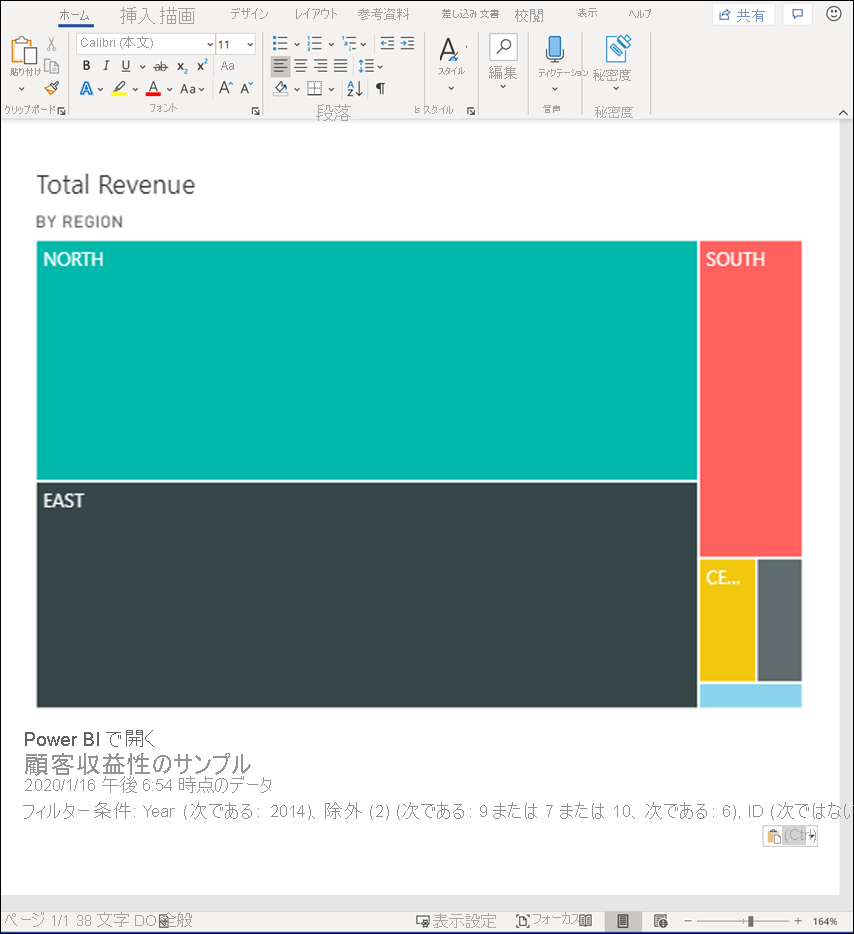
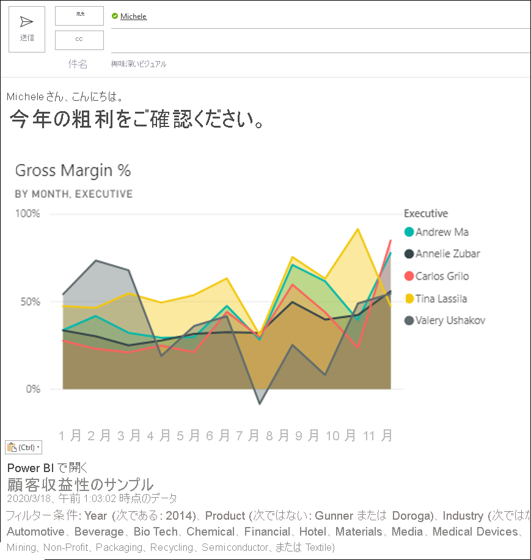
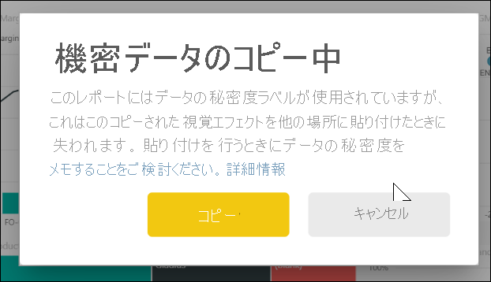
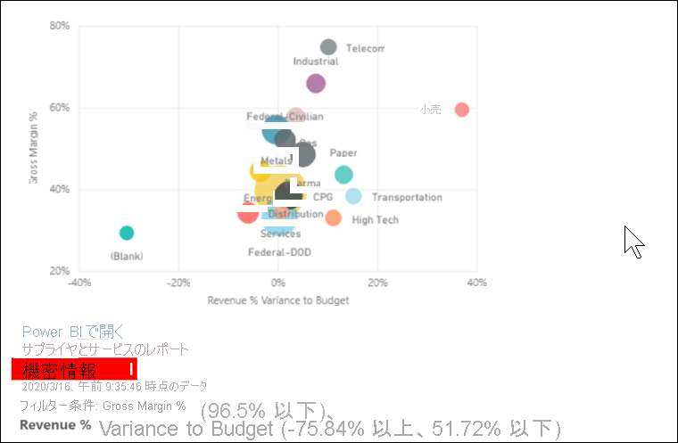
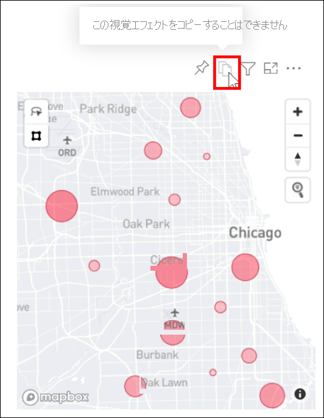

# ビジュアルをイメージとしてクリップボードにコピーする

[!INCLUDE[consumer-appliesto-yyyn](../includes/consumer-appliesto-yyyn.md)]

Power BI レポートまたはダッシュボードからイメージを共有したいと思ったことはありませんか。 ビジュアルをコピーし、貼り付けがサポートされる他のアプリケーションに貼り付けられるようになりました。 

ビジュアルの静的なイメージをコピーするときに、メタデータと共にビジュアルのコピーを取得します。 これには、以下のことが含まれます。
* Power BI レポートまたはダッシュボードに戻るリンク
* レポートまたはダッシュボードのタイトル
* イメージに機密情報が含まれているかどうかの通知
* 最終更新タイム スタンプ
* ビジュアルに適用されるフィルター

### ダッシュボード タイルからコピーする

1. コピー元のダッシュボードに移動します。

2. ビジュアルの右上隅にある **[その他のアクション] (...)** を選択し、 **[視覚エフェクトをイメージとしてコピー]** を選択します。 

    ![表示されている [視覚エフェクトをイメージとしてコピー] アイコン](media/end-user-copy-paste/power-bi-copy-dashboard.png)

3. **[Your visual is ready to copy]\(ビジュアルをコピーする準備ができました\)** ダイアログが表示されたら、 **[クリップボードにコピー]** を選択します。

    ![[クリップボードにコピー] オプションを含むダイアログ](media//end-user-copy-paste/power-bi-copied.png)

4. ビジュアルをコピーしたら、**Ctrl + V** キーを使用して別のアプリケーションに貼り付けるか、右クリックして [貼り付け] を選択します。 以下のスクリーンショットでは、ビジュアルが Microsoft Word に貼り付けられています。 

    

### レポートのビジュアルからコピーする 

1. コピー元のレポートに移動します。

2. ビジュアルの右上隅にある **[視覚エフェクトをイメージとしてコピー]** のアイコンを選択します。 

    ![表示されている [視覚エフェクトをイメージとしてコピー] アイコン](media/end-user-copy-paste/power-bi-copy-icon.png)

3. **[Your visual is ready to copy]\(ビジュアルをコピーする準備ができました\)** ダイアログが表示されたら、 **[クリップボードにコピー]** を選択します。

    ![[クリップボードにコピー] オプションを含むダイアログ](media//end-user-copy-paste/power-bi-copied.png)

4. ビジュアルをコピーしたら、**Ctrl + V** キーを使用して別のアプリケーションに貼り付けるか、右クリックして [貼り付け] を選択します。 次のスクリーンショットでは、ビジュアルがメールに貼り付けられています。

    

5. レポートにデータの機密ラベルが適用されている場合、コピー アイコンを選択すると警告が表示されます。  

    

    また、貼り付けられたビジュアルの下のメタデータには、機密ラベルが追加されます。 

    

## 考慮事項とトラブルシューティング

   

Q:ビジュアルでコピー アイコンが無効になっているのはなぜですか?    
A:現在、ネイティブ Power BI 視覚化と認定済みカスタム ビジュアルがサポートされています。 次のような特定のビジュアルのサポートは制限されています。 
- ESRI とその他のマップ ビジュアル 
- Python のビジュアル 
- R ビジュアル 
- PowerApps    

A:ビジュアルをコピーする機能は、IT 部門または Power BI 管理者が無効にする可能性があります。

Q:ビジュアルが正しく貼り付けられないのはなぜですか?    
A:カスタム ビジュアルとアニメーション視覚化には制限があります。 

## 次の手順
[Power BI レポートでの視覚化](end-user-visual-type.md)についての詳細を参照する

他にわからないことがある場合は、 [Power BI コミュニティを利用してください](https://community.powerbi.com/)。

