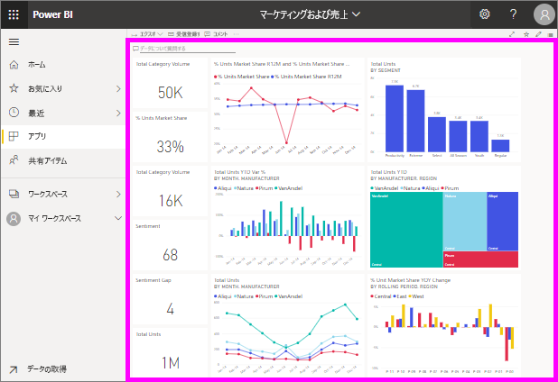

# ダッシュボードの表示

[!INCLUDE[consumer-appliesto-ynny](../includes/consumer-appliesto-ynny.md)]

[!INCLUDE [power-bi-service-new-look-include](../includes/power-bi-service-new-look-include.md)]

Power BI *コンシューマー*は、ダッシュボードの表示に多くの時間を使います。 ダッシュボードは、基になるレポートとデータセットから特定の情報を強調表示するために設計されています。 Power BI コンシューマーは、その情報を追跡、監視、質問への回答、テストなどに使用して、データ駆動型のビジネス上の意思決定を行います。

Power BI Pro または Premium ライセンスは、ダッシュボードの共有と共有ダッシュボードの表示の両方に必要です。 [お使いのライセンスの種類について](end-user-license.md)。 

## ダッシュボードを開く

|              |         |
|------------|--------------------------------|
|      |ダッシュボードは、Power BI サービスのさまざまな場所から開くことができます。   このダッシュボード アイコンを探してください。 ダッシュボードを特定したら、  簡単に開くことができます。それを選択するだけで、ダッシュボードが Power BI のキャンバスに表示されます。 |
|                    |          |

ダッシュボードはナビ ペインにあるすべてのコンテナーで見つけることができます。 

- **ホーム** 
- **[お気に入り]** : [お気に入りとしてダッシュボードを設定](end-user-favorite.md)した場合
- **[最近]** : ダッシュボードに最近アクセスした場合
- **[アプリ]** : ほとんどのアプリにはダッシュボードとレポートの両方が含まれています
- **[自分と共有]** : 同僚が[自分とダッシュボードを共有した場合](end-user-shared-with-me.md)
- **[マイ ワークスペース]** : [Power BI サンプル](../create-reports/sample-datasets.md)のいずれかをダウンロードした場合

## 次のステップ
* [サンプル ダッシュボード](../create-reports/sample-tutorial-connect-to-the-samples.md)のツアーを利用してダッシュボードに慣れます。    
* [ダッシュボードのタイル](end-user-tiles.md)およびタイルを選んだときの結果について学習します。
