# Power BI での視覚エフェクトのドリル モード

この記事では、Microsoft Power BI サービスと Power BI Desktop での視覚化のドリルダウンの方法を示します。 Power BI レポートにより、複数の階層のデータからデータに関する最大の分析情報を得ることができます。 データ ポイントでドリルダウンとドリルアップを使用すると、データに関する詳細を深く掘り下げて調べることができます。 モバイル デバイスのスモール フォーム ファクターでも活用できます。

## ドリルには階層が必要

視覚化に階層がある場合、ドリルダウンしてさらに詳細な情報を表示できます。 たとえば、分野、競技、種目で構成された階層でオリンピック メダル数を表示する視覚化があるものとします。 既定では、視覚化には分野 (体操、スキー、水泳など) 別にメダル数が表示されます。 しかし、これは階層構造になっているので、いずれかの視覚化要素 (棒、線、バブルなど) を選ぶと、さらに詳細な図が表示されます。 **水泳**要素を選ぶと、競泳、飛び込み、水球のデータが表示されます。  **飛び込み**要素を選ぶと、飛び板飛び込み、高飛び込み、シンクロナイズド ダイビングの各種目に関する詳細が表示されます。

階層を追加できるのは自分が所有するレポートだけであり、自分に共有されているレポートには追加できません。
どの Power BI 視覚化に階層が含まれるかわからない場合は、 視覚化をポイントします。 次のようなドリル コントロールが上部の隅に表示される場合、その視覚化には階層があります。

    
   

日付は、他とは違う種類の階層です。 視覚化に日付フィールドを追加すると、年、四半期、月、日を含む時間階層が自動的に追加されます。 詳しくは、[視覚化の階層とドリルダウンの動作](../guided-learning/visualizations.yml?tutorial-step=18)に関する記事、または次のビデオをご覧ください。

<iframe width="560" height="315" src="https://www.youtube.com/embed/MNAaHw4PxzE?list=PL1N57mwBHtN0JFoKSR0n-tBkUJHeMP2cP" frameborder="0" allowfullscreen></iframe>

> [!NOTE]
> Power BI Desktop を使用して階層を作成する方法についての説明は、[階層を作成および追加する方法](https://youtu.be/q8WDUAiTGeU)のビデオをご覧ください。

## 前提条件

1. Power BI サービスまたは Power BI Desktop では、階層のある視覚化でなければドリルできません。

1. 作業を進めるために、[小売りの分析のサンプル](../sample-datasets.md)を開きます。 次のような**ツリーマップ**の視覚化を作成します。

    | ウェル | フィールド |
    | ---- | ----- |
    | 値 |売上 \|\_ Total Units This Year |
    | グループ | Store \|\_ Territory \|\_ City \|\_ Postal Code \|\_ Name

    ツリーマップには、地域、都市、郵便番号、および都市名で構成された階層があります。 各地域には 1 つ以上の都市があり、各都市には 1 つ以上の郵便番号があります。 リストの先頭が *Territory* なので、既定では、視覚化に地域のデータのみが表示されます。

    ![[Territory] フィールドが強調された [視覚化] ウィンドウのスクリーンショット。](media/end-user-drill/power-bi-hierarcy-list.png)

1. さまざまなドリル アイコンの動作をまとめて理解しようとすると、わかりにくいことがあります。 ツリーマップをフィルター処理して、次の 2 つの小さい地域だけが表示されるようにします。**KY** と **TN** です。 ツリーマップを選び、 **[ビジュアル レベル フィルター]** で **Territory** を展開して、**KY** と **TN** を選びます。

    ![KY と TN でフィルター処理した [視覚化] ウィンドウのスクリーンショット。](./media/end-user-drill/power-bi-filter.png)

    ツリーマップに 2 つの地域だけが表示されるようになります。

    

## ドリル機能を使用する 3 つの方法

階層を持つ視覚エフェクトのドリルダウン、ドリルアップ、展開機能にアクセスするには複数のオプションがあります。 この記事では、最初のオプションを使用する方法を示します。 ドリルダウンおよび展開の基本を習得すれば、3 つすべての使用方法がわかります。 これらはすべて同じことを行います。 それらを試して、最も気に入ったものを選んでください。

- 視覚エフェクトをポイントし、アイコンを表示して使用します。  

    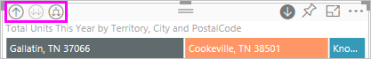

- 視覚エフェクトを右クリックし、メニューを表示して使用します。

    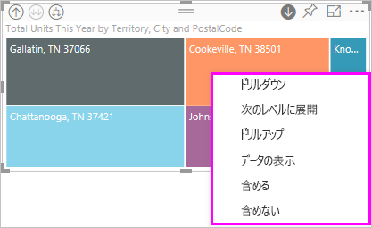

- Power BI メニュー バーの **[探索]** ボタンを選びます。

   ![[探索] を選択してドリルのアイコンとオプションを表示しているスクリーンショット。](media/end-user-drill/power-bi-explore.png)

## ドリルの経路

### ドリルダウン

視覚エフェクトをドリルして移動するには複数の方法があります。 **ドリルダウン**は、階層内の次のレベルに移動します。 **Territory** レベルを表示している場合は、都市レベル、郵便番号レベル、名前レベルの順にドリルダウンできます。 パスの各ステップでは、新しい情報が表示されます。

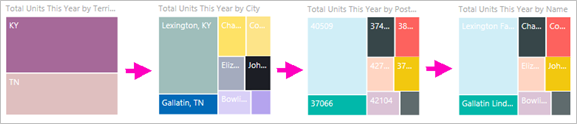

### 展開

"**展開**" は、現在のビューに新しい階層レベルを追加します。 したがって、**Territory** レベルを表示している場合は、展開して都市、郵便番号、名前の詳細をツリーマップに追加できます。 パスの各ステップでは、前のレベルと同じ情報に、次のレベルの新しい情報が追加されます。

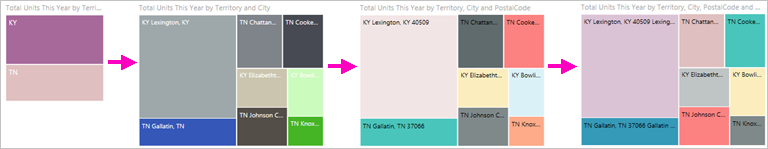

一度に 1 つのフィールドをドリルダウンまたは展開するか、すべてのフィールドを一度にドリルダウンまたは展開するかも選択できます。

## すべてのフィールドを一度にドリルダウンする

1. KY と TN. のデータが表示されているツリーマップの最上位レベルから始めます。 ハンドルの 1 つを選んで右側にドラッグして、ツリーマップの幅を広げます。

    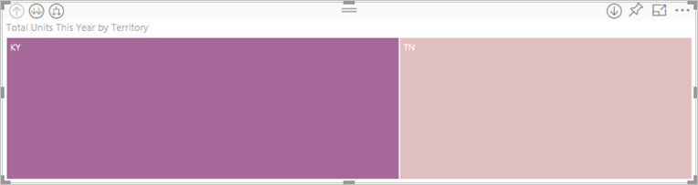

1. "*すべてのフィールドを一度に*" ドリルダウンするには、視覚化の左上隅にある二重矢印  を選択します。 ツリーマップにケンタッキーとテネシーの市のデータが表示されます。

    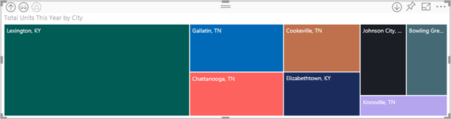

1. もう一度ドリルダウンして階層の郵便番号レベルに移動します。

    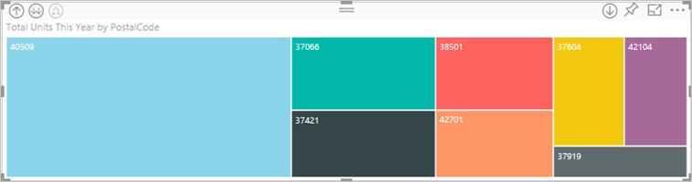

1. ドリルアップして戻るには、視覚化の左上隅にある上向き矢印を選びます .

## 一度に 1 つのフィールドをドリルダウンする

この方法では、視覚化自体の右上隅に表示されるドリルダウン アイコンを使います。

1. ドリルダウン アイコンを選択して、オンにします .

    "**一度に 1 つのフィールド**" をドリルダウンできるようになります。

    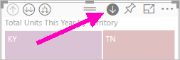

    ドリルダウンをオンにしないと、視覚化要素 (棒、バブル、リーフなど) を選択してもドリル ダウンされません。 代わりに、それによって、レポート ページ上の他のグラフがクロス フィルター処理されます。

1. **TN** のリーフを選択します。 ツリーマップに、店舗があるテネシー州のすべての都市が表示されます。

    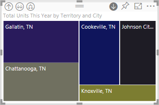

1. この時点で、次のようなことができます。

    1. テネシー州のドリルダウンを続行する。

    1. テネシー州の特定の都市をドリル ダウンする。

    1. 別に展開する (以下の**すべてのフィールドを一度に展開**に関する記事を参照)。

    一度に 1 つのフィールドのドリルダウンを続けます。  **Knoxville, TN** を選びます。 ツリーマップに Knoxville の店舗の郵便番号が表示されます。

    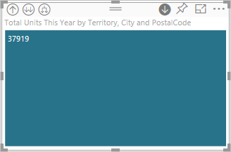

    階層を上下に移動するとタイトルが変わることに注意してください。

## 一度に全フィールドおよび 1 フィールドを展開する

郵便番号のみが表示されるツリーマップでは役に立ちません。  そこで、階層内の 1 レベル下を展開します。  

1. ツリーマップをアクティブにして、"*下方向に展開*" アイコン  を選択します。 ツリーマップに、階層の 2 つのレベル (郵便番号と店舗名) が表示されます。

    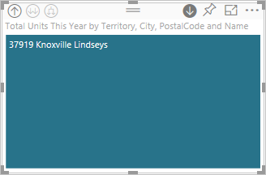

1. テネシー州の 4 つの階層レベルすべてのデータを表示するには、ツリーマップの第 2 レベル **Territory および City による Total Units This Year** に達するまでドリルアップ矢印を選択します。

    

1. ドリルダウンがオンのままである  ことを確認し、 "*下方向に展開*" アイコン  を選択します。 ツリーマップに、追加の詳細がいくつか表示されます。 都市と州だけでなく、郵便番号も表示されるようになります。

    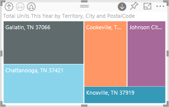

1. "*下方向に展開*" アイコンをもう一度選択し、ツリーマップのテネシー州に対する 4 つの階層レベルすべての詳細を表示します。 リーフをポイントするとさらに多くの詳細が表示されます。

    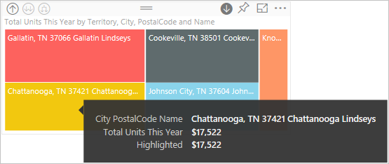

## 他の視覚化に詳細なフィルターを適用する

ドリル モードで作業するときに、ドリルダウンと展開がページの他の視覚エフェクトにどのような影響を及ぼすかを決定します。

既定では、ドリルによってレポートの他のビジュアルはフィルター処理されません。 Power BI Desktop と Power BI サービスでこの機能を有効にすることができます。

1. Desktop では、 **[書式]** タブを選び、 **[他の視覚化に詳細なフィルターを適用する]** チェック ボックスをオンにします。

    ![Power BI Desktop の [他の視覚化に詳細なフィルターを適用する] 設定を示すスクリーンショット](./media/end-user-drill/power-bi-drill-filters-desktop.png)

1. これで、階層のある視覚化のドリルダウン、ドリルアップ、または展開を行うと、ページ上の他のビジュアルがフィルター処理されるようになります。

    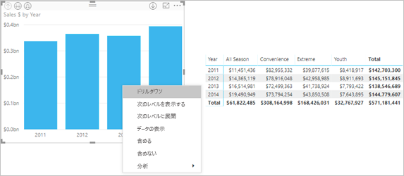

    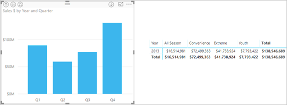

> [!NOTE]
> Power BI サービスでこれを有効にするには、上部のメニュー バーから **[ビジュアル対話]**  >  **[他の視覚化に詳細なフィルターを適用する]** を選択します。
>
> ![Power BI サービスの [他の視覚化に詳細なフィルターを適用する] 設定のスクリーンショット](./media/end-user-drill/power-bi-drill-filters-service.png)

## 階層軸と階層グループについて

階層軸と階層グループは、表示するデータの細分性を上げたり下げたりするために使えるメカニズムと考えることができます。 カテゴリとサブカテゴリに編成できるデータは、日付や時刻などの階層を持つことができます。

Power BI で階層を持つ視覚化を作成するには、1 つ以上のデータ フィールドを選択して **[軸]** ウェルまたは **[グループ]** ウェルに追加します。 次に、調べるデータをデータ フィールドとして **[値]** ウェルに追加します。 データが階層的かどうかは、視覚化の左上隅と右上隅に "*ドリル モード*" アイコンが表示されるかどうかでわかります。

基本的には、2 種類の階層データを考えると便利です。

- 日付と時刻のデータ - DateTime データ型のデータ フィールドが存在する場合は、既に階層データがあります。 Power BI では、すべてのデータ フィールドの階層が自動的に作成されます。 それらの値を [DateTime](https://msdn.microsoft.com/library/system.datetime.aspx) 構造に解析することができます。 **[軸]** または **[グループ]** ウェルに 1 つの DateTime フィールドを追加することだけが必要です。

- カテゴリ データ - Power BI がサブコレクションを含むコレクションからデータを取得する場合、またはそれ以外で共通の値を共有するデータの行を持つ場合は、階層データになります。

Power BI では、1 つまたはすべてのサブセットを展開できます。 データをドリルダウンして各レベルで 1 つのサブセットを表示することも、ドリルダウンして各レベルで同時にすべてのサブセットを表示することもできます。 たとえば、特定の年をドリルダウンしたり、階層を下りながら各年のすべての結果を表示したりできます。

同じ方法でドリルアップすることもできます。

次のセクションでは、最上位のビュー、中間のビュー、最下位のビューからのドリルダウンについて説明します。

### 階層データと時刻データ

次の例の場合:

1. [小売りの分析のサンプル](../sample-datasets.md)に従って、次のような積み上げ縦棒グラフの視覚化を作成します。

    | ウェル | フィールド |
    | ---- | ----- |
    | 軸 | 時刻 \|\_ Month |
    | 値 | 売上 \|\_ TotalSales |

    軸データ フィールドは **Month** ですが、 **[軸]** ウェルには **Year** カテゴリも作成します。 これは、Power BI は読み取るすべての値に対する完全な DateTime 構造を提供するためです。 階層の最上部では、年のデータが表示されます。

    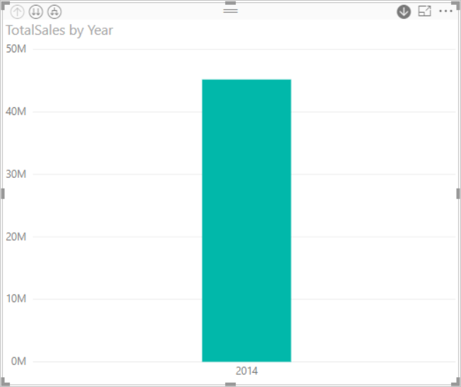

1. ドリルダウン モードをオンにし、グラフの棒を選択して、階層の 1 つ下のレベルに移動します。 使用可能な四半期のデータに対する 3 つの棒が表示されます。

1. 左上のアイコンで **[Expand all down one level of the hierarchy]\(階層の 1 レベル下をすべて展開する\)** を選択します。

1. 同じことをもう一度行って、各月の結果を示す、階層の最下位レベルを表示します。

    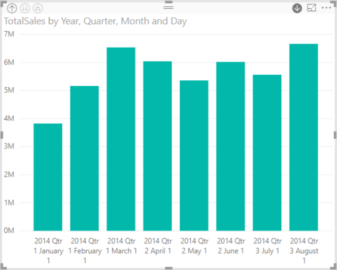

視覚エフェクトとは別に、各レポートにレンダリングされるデータに反映された階層も確認できます。 右上隅で省略記号を選択してから、 **[データの表示]** を選択します。 次の表は、1 つの月またはすべての月からのドリルダウンの結果を示しています。

|展開モード|年|Quarter|月|日|
| --- |:---:|:---:|:---:|---|
|単一|||||
|すべて|||||

**Quarter** と **Year** のレポートのデータが同じであることに注意してください。 **[値]** に指定されている詳細レベルにドリルダウンすると、1 つのレポートがより具体的になって "すべての月" レポートのデータが増えることがわかります。

### 階層カテゴリ データ

コレクションとサブコレクションからモデル化されたデータは階層的です。

よい例は場所データです。 列が国、都道府県、市、郵便番号であるデータ ソース内のテーブルを考えてください。 同じ国、都道府県、市を共有するデータは階層的です。

次の例の場合:

1. [小売りの分析のサンプル](../sample-datasets.md)に従います。 次のような積み上げ縦棒グラフの視覚化を作成します。

    | ウェル | フィールド |
    | ---- | ----- |
    | 値 |売上 \|\_ Total Units This Year |
    | 軸 | Store \|\_ Territory \|\_ City - **[凡例]** ウェルから **[軸]** ウェルに City をドラッグすることが必要な場合があります。 \|\_ Postal Code \|\_ Name |

    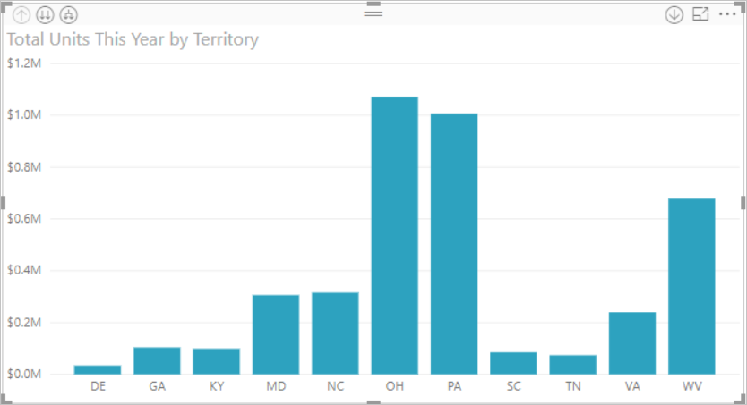

1. ドリルダウン モードをオンにして、左上のアイコンで **[Expand all down one level of the hierarchy]\(階層の 1 レベル下をすべて展開する\)** を 3 回選択します。

    階層の最下位レベルにいることになり、Territory、City、および Postal Code の結果が表示されます。

    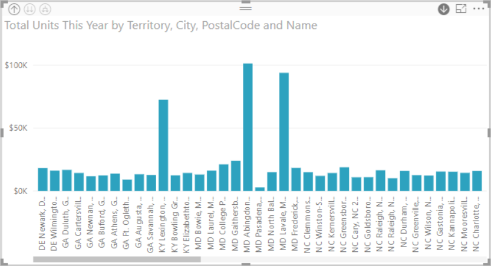

視覚エフェクトとは別に、各レポートにレンダリングされるデータに反映された階層も確認できます。 右上隅で省略記号を選択してから、 **[データの表示]** を選択します。 次の表は、1 つの地域またはすべての地域のドリルダウンの結果を示しています。

| 展開モード|担当地域|市区町村|郵便番号|名前|
| ---|:---:|:---:|:---:|---|
|単一|||||
|すべて|||||

 ドリルダウンすると、**1 つ**のレポートがより具体的になり、**すべての**地域 レポートのデータが増えることがわかります。

## 考慮事項と制限事項

視覚化に日付フィールドを追加しても階層が作成されない場合は、日付フィールドが実際には日付として保存されていない可能性があります。 データセットを所有している場合:

1. Power BI Desktop の "*データ*" ビューでそれを開きます。

1. 日付を含む列を選択します。

1. **[モデリング]** タブで、 **[データ型]** を **[日付]** または **[日付/時刻]** に変更します。

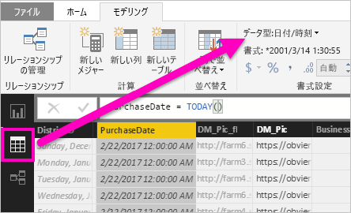

他のユーザーからレポートを共有されている場合は、所有者に連絡して変更を頼みます。

## 次の手順

[Power BI レポートでの視覚化](../visuals/power-bi-report-visualizations.md)

[Power BI レポート](end-user-reports.md)

[Power BI - 基本的な概念](end-user-basic-concepts.md)

他にわからないことがある場合は、 [Power BI コミュニティを利用してください](http://community.powerbi.com/)。
