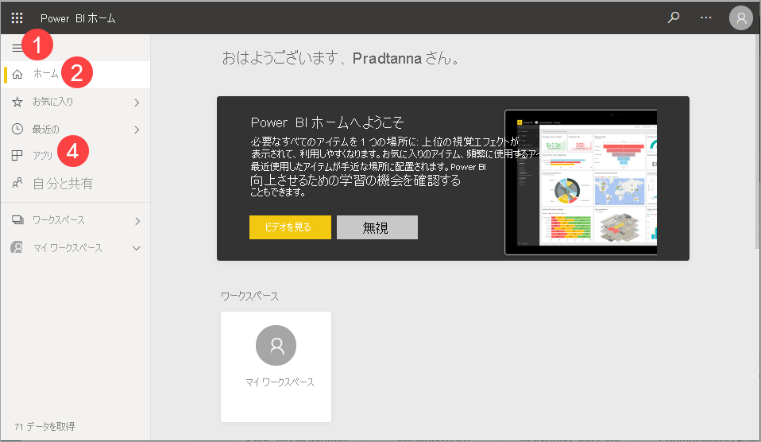
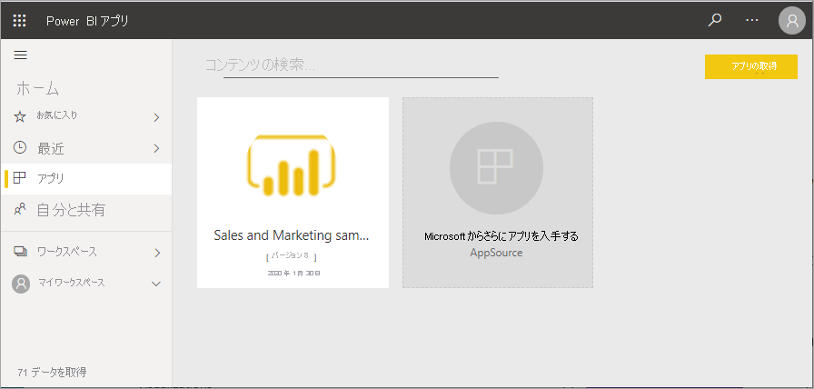
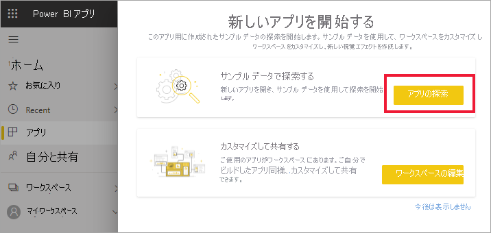
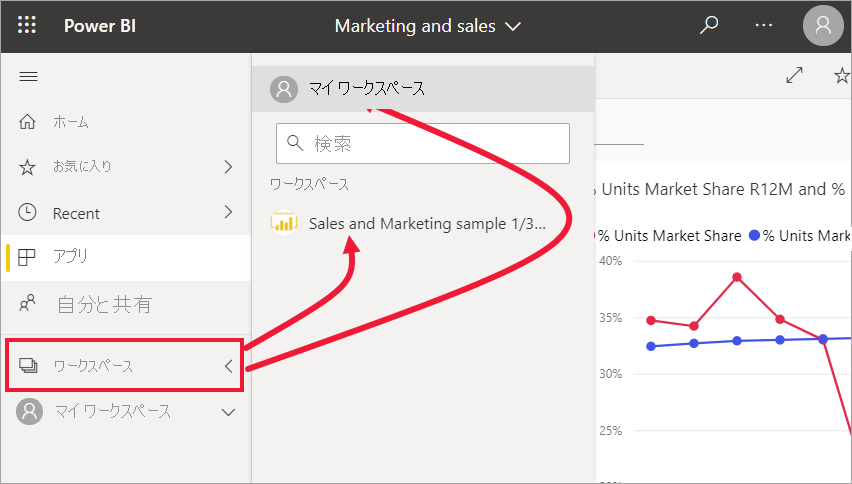
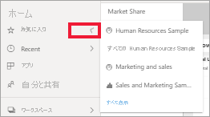
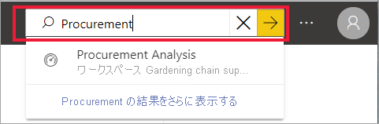
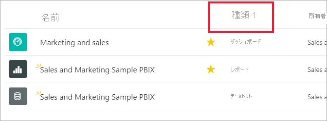

# クイック スタート - Power BI サービス内の移動

[!INCLUDE [power-bi-service-new-look-include](../includes/power-bi-service-new-look-include.md)]

Power BI の基本を理解したので、**Power BI サービス**の操作について説明します。 前述のとおり、チームのメンバーが、**Power BI Desktop** だけを使って、データを組み合わせたり、他のユーザーのためのレポートを作成したりすることがあります。 一方で、Power BI サービスだけを使って、他のユーザーが作成したコンテンツを表示し、操作するユーザーもいます (エクスペリエンスの**消費**)。 このクイック スタートでは、サンプル データをインポートし、そのデータを使って Power BI サービスの操作方法を説明します。 
 
## 前提条件

- Power BI にサインアップしていない場合は、[無料の試用版にサインアップ](https://app.powerbi.com/signupredirect?pbi_source=web)してください。

- [Power BI サービスの基本概念](end-user-basic-concepts.md)についてお読みください

## Power BI サービスを開く

開始するには、Power BI サービス (app.powerbi.com) を開いて、**ホーム** に移動します。 
1. 左側のナビゲーション ペインが折りたたまれている場合は、ナビゲーション ペインのアイコン  を選択して展開します。 

1. ホームがまだ開いていない場合は、 **[ホーム]** を選択します。 

1. サンプル データを取得します。 この Power BI サービスのツアーに使用するサンプル データを取得します。 調査用にあらゆる種類のサンプル データが提供されていますが、今回はマーケティングと売上に関するデータを使用します。 

    作業を進めるために、次の手順を行って、[サンプルの Sales & Marketing アプリ](end-user-app-marketing.md)をインストールします。

1. アプリをインストールしたら、ナビゲーション ペインで **[アプリ]** を選択します。 

   

2. **[アプリ]** 画面で、 **[サンプルの Sales & Marketing]** アプリを選択します。

    

2. **[アプリを探索]** を選択します。

    

3. Power BI サービスで、アプリのダッシュボードが開きます。 ダッシュボードは Power BI サービスの機能で、これが Power BI Desktop と異なる点です。 サンプルには、レポートとデータセットも含まれています。 

    

    *コンシューマー*が受け取るほとんどのアプリでは、基になるデータセットに直接アクセスできません。 Power BI のサンプルは、すべての Power BI ユーザー向けに作成されているため、データセットが含まれます。 同僚の*デザイナー*は、データセットを使用して、新しいダッシュボードとレポートの作成方法を習得します。 

## コンテンツ (ダッシュボードとレポート) を表示する
最初に、基本コンテンツ (ダッシュボード、レポート、アプリ) の編成方法について説明します。 コンテンツはワークスペースのコンテキスト内で表示されます。 すべてのコンシューマーは少なくとも 1 つのワークスペースを持っています。これは**マイ ワークスペース**と呼ばれます。 アプリをインストールするたびに、そのアプリのワークスペースが作成されます。  サンプルの Sales & Marketing アプリをインストールしたので、現在、2 つのワークスペースがあります。 

左側のナビゲーションで **[ワークスペース]** を選択して、自分で確認してください。 

**マイ ワークスペース**には、ユーザーが所有および作成するすべてのコンテンツが格納されます。 これは、個人用サンドボックスまたはユーザーのコンテンツの作業領域と考えることができます。 Power BI を使用する多くの*コンシューマー*の場合、**マイ ワークスペース**は空のままです。これは、ジョブに新しいコンテンツの作成が含まれていないためです。  定義上、*コンシューマー*は、他のユーザーが作成したデータを利用し、そのデータを使用してビジネス上の意思決定を行います。 コンテンツを作成することがわかっている場合は、代わりに、[*デザイナー*向けの Power BI に関する記事](../power-bi-creator-landing.md)を参照することを検討してください。

**アプリ ワークスペース**には、特定のアプリのすべてのコンテンツが含まれます。  *デザイナー*は、アプリを作成するときに、そのアプリを利用するために必要なすべてのコンテンツをアプリにバンドルします。  [Sales & Marketing] ワークスペースを選択すると、*デザイナー*がアプリにバンドルしたコンテンツが表示されます。 

Sales & Marketing アプリのワークスペースには、1 つのダッシュボード、1 つのレポート、1 つのデータセットが含まれます。 すべてのアプリに、これらの 3 つの種類のコンテンツが含まれているとは限りません。 1 つのダッシュボードのみを含むアプリや、各コンテンツの種類を 3 つずつ含むアプリもあります。また、20 個以上ものレポートを含むアプリもあります。 これはすべて、*デザイナー*がアプリにどんなコンテンツを含めるかによって異なります。 Sales & Marketing アプリのデータはサンプルであるため、データセットは含まれます。 しかし、一般的には、*コンシューマー*のアプリ ワークスペースにデータセットは含まれません。 

ワークスペースは、単にコンテンツを一覧表示するだけのものではありません。 このページでは、ワークスペースのダッシュボードやレポートの詳細を確認できます。 コンテンツの所有者、最終更新日、関連コンテンツ、推奨を確認するには、数分かかります。 ワークスペースに説明があれば、その説明によって、ワークスペースの目標や、ワークスペースをビジネス上の目的で使用する方法をより十分に理解することができます。 また、ワークスペースに多数のコンテンツが含まれている場合、検索や並べ替えのオプションを使用して、必要なコンテンツをすばやく見つけることができます。

![[その他のアクション] メニューを表示したアプリ ワークスペースの画面](./media/end-user-experience/power-bi-workspace-app.png)

ワークスペースは、データへのパスの 1 つでもあります。 一覧からダッシュボードまたはレポートを選択して開きます。  ダッシュボードまたはレポートをお気に入りに追加するには、星アイコンにカーソルを合わせて選択します。 *デザイナー*から[共有アクセス許可](end-user-shared-with-me.md)を付与されている場合、カーソルを合わせると、そのアクションも表示されます。 

ダッシュボードの名前を選択してダッシュボードを開きます。

## ダッシュボードやレポートをお気に入りに追加する
**[お気に入り]** を使用すると、最も重要なコンテンツに簡単にアクセスできます。 ここまでは、ワークスペースからダッシュボードをお気に入りに追加する方法について説明しました。 ダッシュボードやレポートから直接お気に入りを作成することもできます。

1. ダッシュボードを開いて、メニュー バーから **[お気に入り]** を選択します。
   
   
   
   **[お気に入り]** が **[お気に入りから外す]** に変わり、星形アイコンが黄色になります。
   
   

2. お気に入りとして追加したすべてのコンテンツの一覧を表示するには、ナビゲーション ペインで、 **[お気に入り]** の右にある矢印を選びます。 ナビゲーション ペインは Power BI サービスの固定機能であるため、Power BI サービス内のどこからでもこの一覧にアクセスできます。
   
    
   
    この Power BI ユーザーは、これまでに 4 つのコンテンツをお気に入りに指定しました。 ダッシュボード、レポート、またはアプリをお気に入りに指定できます。  

詳細については、[お気に入り](end-user-favorite.md)に関するページを参照してください。

## 最新のコンテンツを探す

1. [お気に入り] と同様に、ナビゲーション ペインの **[最近]** の横にある矢印を選んで、Power BI サービス内のどこからでも最近アクセスしたコンテンツをすぐに表示することができます。

   ![[最近] ポップアップ](./media/end-user-experience/power-bi-flyout-recent.png)

    ポップアップから、開くコンテンツを選びます。

2. 最近のコンテンツを単に開くだけでなく、情報を表示したり、他のアクション (分析情報の表示や Excel へのエクスポートなど) を実行したりしたい場合があります。 そのような場合は、ナビゲーション ペインで **[最近]** またはそのアイコンを選んで、 **[最近]** ペインを開きます。 この例の Power BI ユーザーは複数のワークスペースを持っているため、この一覧には、それらのすべてのワークスペースのコンテンツを含めることができます。

   ![[最近] ペイン](./media/end-user-experience/power-bi-recent-action.png)

詳しくは、「[Power BI サービスの [最近] のコンテンツ](end-user-recent.md)」をご覧ください。

### コンテンツの検索と並べ替え
Power BI サービスを初めて使用する場合は、いくつかのコンテンツのみが表示されます。 しかし、使用を開始してから、同僚があなたとコンテンツを共有したり、あなたがアプリをダウンロードしたりするに従って、コンテンツの一覧は長くなってしまう可能性があります。 検索と並べ替えが非常に役立つのは、このような場合です。

検索は、Power BI サービスのほぼすべての部分で使用できます。 検索ボックスを探すか、拡大鏡アイコンを見つけます。    

検索フィールドに、ダッシュボード、レポート、ブック、アプリ、または所有者の名前の全部または一部を入力します。 Power BI によってすべてのコンテンツが検索されます。

コンテンツを並べ替える方法も多数あります。 列ヘッダーにカーソルを合わせて、列の並べ替えが可能なことを示す矢印を探します。 並べ替えることができるのは一部の列に限られます。 

または、キャンバスの右上隅付近にある並べ替えコントロールを探します。 日付、名前、または所有者のどれを基準に昇順または降順のどちらで並べ替えるかを選択します。  

詳細については、[Power BI ナビゲーションの検索と並べ替え](end-user-search-sort.md)に関するページをご覧ください。

## Power BI ホーム
最後に、このクイックスタートを始めた場所、つまり Power BI **ホーム**について説明します。 

ホームには、検索と並べ替えのツール、ナビゲーション ペイン、キャンバスがまとめて表示されます。キャンバスには、ダッシュボード、レポート、アプリを開くために選択できる*カード*が表示されます。 最初は、ホーム キャンバスにそれほど多くのコンテンツが表示されない場合もありますが、Power BI の使用を開始して、同僚と共に使用するに従って外観は変化します。 ホーム キャンバスはまた、推奨コンテンツや学習リソースで更新されます。

詳細については「[Power BI ホーム](end-user-home.md)」を参照してください。

## リソースをクリーンアップする
このクイックスタートが完了した後、不要であれば、サンプルのダッシュ ボード、レポート、データセットを削除することができます。

1. Power BI サービス (app.powerbi.com) を開いてサインインします。    
2. Power BI ホームを開いて、 **[ワークスペース]** まで下方向にスクロールし、 *[Sales & Marketing]* を選択します。      

3. ダッシュボード、レポート、またはデータセットにカーソルを合わせて、 **[その他のオプション (...)]**  >  **[削除]** の順に選択します。 3 つすべてが削除されるまで繰り返します。

    

## 次の手順

> [!div class="nextstepaction"]
> [Power BI サービスの読み取りビュー](end-user-reading-view.md)
