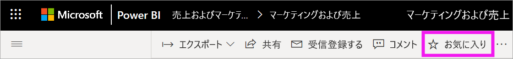
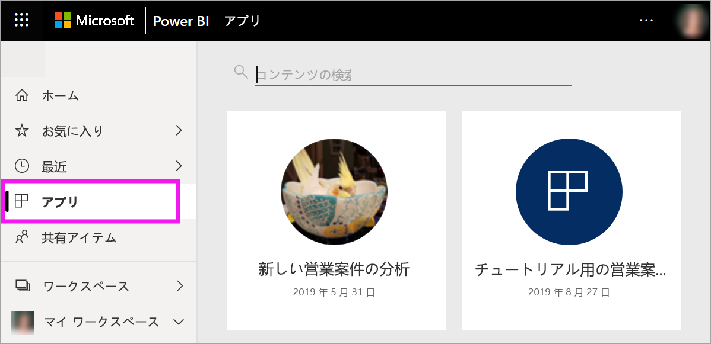
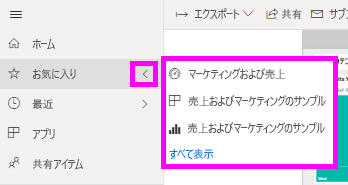

# Power BI サービスでのお気に入りのダッシュボード、レポート、アプリ
コンテンツを "*お気に入り*" にすると、 **[お気に入り]** コンテンツ リストから、および Power BI の **[ホーム]**  >  **[お気に入り+ 頻繁に使用]** から、簡単にアクセスできるようになります。 お気に入りは通常、最も頻繁にアクセスするコンテンツであり、識別子として黄色い星が付きます。

   ![[お気に入り] アイコン](./media/end-user-favorite/power-bi-favorite-nav.png)

   ![[お気に入り + 頻繁に使用] アイコン](./media/end-user-favorite/power-bi-home.png)

Power BI サービスの[おすすめのダッシュボード](end-user-featured.md)として、1 つのダッシュボードを選択することもできます。

## お気に入りとしてダッシュボードまたはレポートを追加する

1. よく使用するダッシュボードまたはレポートを開きます。 他のユーザーによって共有を設定されたコンテンツをお気に入りにすることもできます。

2. Power BI サービスの上部メニュー バーから、 **[お気に入り]** または星  アイコンを選択します。
   
   
   
   [ホーム]、[最近]、[アプリ]、[自分と共有] など、星のアイコンが表示されている場所であれば、ダッシュボードやレポートをお気に入りにできます。 
   
   ![黄色の星が表示された [ダッシュボード] タブ](./media/end-user-favorite/power-bi-recent.png)

## アプリをお気に入りとして追加する

1. ナビ ペインから **[アプリ]** を選択します。

   

2. アプリの上にカーソルを合わせると、詳細が表示されます。 星  アイコンを選んでお気に入りとして設定します。
   
   

## お気に入りを操作する
1. お気に入りにアクセスするには、 **[お気に入り]** の右にあるポップアップ矢印を選択します。 ここからお気に入りを選んで開くことができます。 最大で 5 つのお気に入りがアルファベット順に一覧表示されます。 5 つより多い場合、 **[すべて表示]** を選択し、[お気に入り] コンテンツ リストを開きます。 
   
   
2. お気に入りとして追加したすべてのコンテンツを表示するには、ナビ ペインで **[お気に入り]** またはお気に入り  アイコンを選択します。 
   
    ![[お気に入り] ウィンドウ](./media/end-user-favorite/power-bi-fav-screen.png)
   
   ここから、アクションを実行できます。 お気に入りを開いたり、所有者を確認したり、お気に入りを同僚と共有したりすることもできます。

## コンテンツをお気に入りから外す
以前ほど使用しなくなったレポートは、お気に入りから外すことができます。 コンテンツをお気に入りから外すと、お気に入りの一覧から削除されますが、Power BI からは削除されません。

1. ナビ ペインで **[お気に入り]** を選択し、 **[お気に入り]** 画面を開きます。
   
   ![[お気に入り] 画面](./media/end-user-favorite/power-bi-un-favorite.png)
2. お気に入りから外すコンテンツの横にある黄色の星を選びます。

> [!NOTE]
> ダッシュボード、レポート、アプリをお気に入りから外すこともできます。 対象を開き、黄色のアイコンの選択を解除するだけです。 
> 
> 
## 制限事項と考慮事項
現時点では、アプリにお気に入りを設定できます。そのアプリのすべてのレポートとダッシュボードが自動的にお気に入りになります。 アプリの個々のレポートまたはダッシュボードをお気に入りにすることはできません。 

## 次の手順
- [Power BI:基本的な概念](end-user-basic-concepts.md)
- 他にわからないことがある場合は、 [Power BI コミュニティ](https://community.powerbi.com/)を利用してください。

