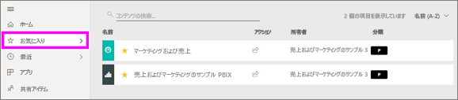
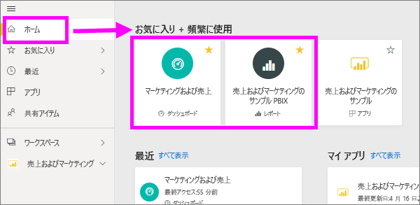

# Power BI サービスのお気に入りのダッシュボード、レポート、アプリ
コンテンツを*お気に入り*にすると、 **[お気に入り]** コンテンツ リストから、また、 **[Power BI ホーム]** の **[お気に入りと頻繁にアクセスするもの]** から簡単にアクセスできるようになります。  お気に入りは通常、最も頻繁にアクセスするコンテンツであり、識別子として黄色い星が付きます。

   

   

Power BI サービスの[おすすめのダッシュボード](end-user-featured.md)として、1 つのダッシュボードを選択することもできます。

## "*お気に入り*" としてダッシュボードまたはレポートを追加する

1. よく使用するダッシュボードまたはレポートを開きます。 他のユーザーによって共有を設定されたコンテンツを "*お気に入り*" にすることもできます。

2. Power BI サービスの上部リボンから **[お気に入り]** または星  アイコンを選択します。
   
   
   
   [ホーム]、[最近]、[アプリ]、[自分と共有] など、星のアイコンが表示されている場所であれば、ダッシュボードやレポートをお気に入りにできます。 
   
   ![黄色の星が表示された [ダッシュボード] タブ](./media/end-user-favorite/power-bi-recent.png)

## アプリを "*お気に入り*" として追加する

1. ナビゲーション ウィンドウから、 **[アプリ]** を選択します。

   

2. アプリの上にカーソルを合わせると、詳細が表示されます。  星   アイコンを選んでお気に入りとして設定します。
   
   

## *お気に入り*の操作
1. お気に入りにアクセスするには、 **[お気に入り]** の右にあるポップアップ矢印を選択します。  ここからお気に入りを選んで開くことができます。 一覧に表示されるお気に入りは (アルファベット順に) 5 つだけです。 5 つより多い場合、 **[すべて表示]** を選択し、[お気に入り] コンテンツ リストを開きます (下記の 2 を参照してください)。 
   
   
2. お気に入りとして追加した**すべて**のコンテンツを表示するには、ナビゲーション ウィンドウで **[お気に入り]** またはお気に入りアイコン  を選択します。  
   
    ![[お気に入り] ウィンドウ](./media/end-user-favorite/power-bi-favorites-screen.png)
   
   ここからコンテンツを開いたり、所有者を確認したり、同僚と共有したりすることができます。

## コンテンツをお気に入りから外す
あまり使用しなくなったレポートは、  お気に入りから外すことができます。 コンテンツをお気に入りから外すと、お気に入りの一覧から削除されますが、Power BI からは削除されません。

1. 左側のナビゲーション ウィンドウで **[お気に入り]** を選択し、 **[お気に入り]** 画面を開きます。
   
   ![[お気に入り] 画面](./media/end-user-favorite/power-bi-unfavorites-screen.png)
2. お気に入りから外すコンテンツの横にある黄色の星を選びます。

> [!NOTE]
> ダッシュボード、レポート、アプリ自体をお気に入りから外すこともできます。 コンテンツを開き、黄色のアイコンの選択を解除します。   
> 
> 
## 制限事項と考慮事項
現時点では、アプリにお気に入りを設定できます。そのアプリのすべてのレポートとダッシュボードが自動的にお気に入りになります。 アプリの個々のレポートまたはダッシュボードをお気に入りにすることはできません。 

## 次の手順
[Power BI - 基本的な概念](end-user-basic-concepts.md)

他にわからないことがある場合は、 [Power BI コミュニティを利用してください](http://community.powerbi.com/)。

