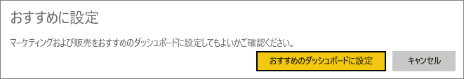
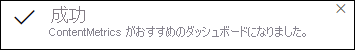
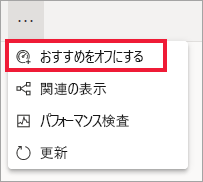

# Power BI サービスのおすすめのダッシュボード

[!INCLUDE [power-bi-service-new-look-include](../includes/power-bi-service-new-look-include.md)]

多くのユーザーには、他のダッシュボードより頻繁にアクセスする 1 つのダッシュボードがあります。 それは、ビジネスの運営に使用するダッシュボードかもしれません。 または、多くの異なるダッシュボードとレポートから取られたタイルの集合体が含まれるダッシュボードの場合もあります。

## おすすめのダッシュボードを作成する
ダッシュボードを "*おすすめ*" に設定すると、Power BI サービスを開くたびに、そのダッシュボードが表示された状態で開きます。 

複数のダッシュボードを選んで、お気に入りに設定することもできます。 「[お気に入りのダッシュボード](end-user-favorite.md)」を参照してください。

おすすめのダッシュボードを設定していない場合、Power BI では、最後に使用したダッシュボードか、または Power BI の **[ホーム]** が開きます。 

### ダッシュボードをおすすめとして設定する

1. おすすめに設定するダッシュボードを開きます。 
2. 上部のメニューバーで、**その他のオプション** (...) を選択し、 **[おすすめに設定]** を選択します。 
   
    ![[おすすめに設定] のオプションが含まれるドロップボックスを示すスクリーンショット](./media/end-user-featured/power-bi-set-as-featured.png)
3. 選択内容を確認します。
   
    

## おすすめのダッシュボードを変更する
後で考えが変わった場合、新しいダッシュボードをおすすめのダッシュボードとして設定できます。 ダッシュボードをおすすめから解除しても、Power BI から削除されることはありません。 

1. 前の手順 1 と 2 に従います。
   
2. **[おすすめのダッシュボードに設定]** を選択します。 
   
    

## おすすめのダッシュボードを削除する
おすすめのダッシュボードを 1 つも設定しない場合に、ダッシュボードのおすすめを解除する方法を次に示します。

1. 現在のおすすめのダッシュボードを開きます。
2. 上部のメニューバーで、**その他のオプション** (...) を選択し、 **[おすすめをオフにする]** を選択します。

    
   
## 次のステップ
- [ダッシュボードをお気に入りにする](end-user-favorite.md)    
- 他にわからないことがある場合は、 [Power BI コミュニティ](https://community.powerbi.com/)を利用してください。

