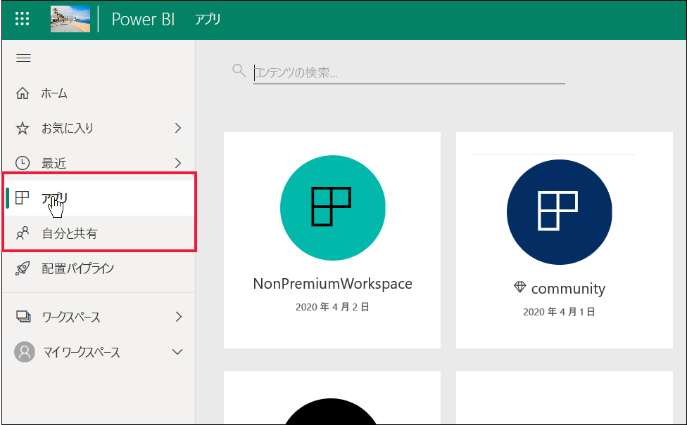
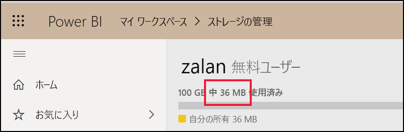
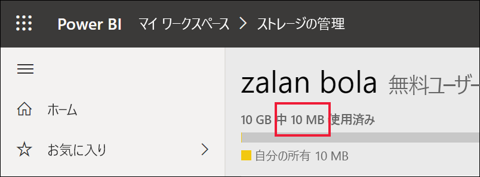

# "*コンシューマー*" および無料ライセンスを持つその他のユーザー向けの Power BI 機能の一覧

[!INCLUDE[consumer-appliesto-ynnn](../includes/consumer-appliesto-ynnn.md)]

"*コンシューマー*" の場合、Power BI サービスを使用して、意思決定を行うためにレポートやダッシュボードを調べます。 これらのレポートとダッシュボードは、Power BI *Pro* ライセンスを持つ "*デザイナー*" によって作成されます。 Pro ユーザーは、同僚とコンテンツを共有したり、同僚がそのコンテンツに対して実行できる操作とできない操作を制御したりすることができます。 場合によっては、デザイナーがリンクを送信してコンテンツを共有したり、コンテンツが自動的にインストールされ、Power BI の **[アプリ]** または **[自分と共有]** の下に表示されたりすることもあります。

デザイナーがコンテンツを共有する方法はたくさんあります。 しかし、この記事は Power BI "*コンシューマー*" を対象としているため、コンシューマーがコンテンツを受信して操作する方法についてのみ説明します。 コンテンツを共有する他の方法の詳細については、「[Power BI で作業を共有する方法](../collaborate-share/service-how-to-collaborate-distribute-dashboards-reports.md)」を参照してください。

[前の記事](end-user-license.md)では、ライセンス、ロールとアクセス許可、コンテンツの格納場所という 3 つのことによって、Power BI サービスのダッシュボード、レポート、アプリ (コンテンツ) で使用できる機能が異なることを説明しました。

この記事では、"*コンシューマー*" が使用できる Power BI サービスの機能を一覧で示します。 定義上、"*コンシューマー*" とは、無料ライセンスを使用して、Power BI Desktop ではなく、Power BI サービスで作業し、Premium 容量を持つ組織のメンバーです。

<art>

## 用語の簡単な確認
一覧を表示する前に、Power BI の概念をいくつか確認しましょう。 ここでは簡単に確認するだけであるため、詳細が必要な場合は、[コンシューマー向けのライセンス](end-user-license.md)、または [Power BI の基本概念](end-user-basic-concepts.md)に関するページを参照してください。

### ワークスペースとロール
2 種類のワークスペース、**マイ ワークスペース**とアプリ ワークスペースがあります。 ユーザーは**自分のマイ ワークスペース**にのみアクセスできます。 コラボレーションや共有を行う場合、Power BI Pro ライセンスを持つコンテンツの "*デザイナー*" は、アプリ ワークスペースを使用する必要があります。 

アプリ ワークスペース内では、そのワークスペース内でどのユーザーがどの機能を使用できるかを管理するため、デザイナーによって "*ロール*" が割り当てられます。 "*コンシューマー*" には**閲覧者**ロールが割り当てられます。 

### Premium 容量
組織が Premium 容量サブスクリプションを持っている場合、管理者と Pro ユーザーは "*専用容量*" にワークスペースを割り当てることができます。 専用容量内のワークスペースは、Pro ユーザーが無料ユーザーとの共有や共同作業を行うことができる場所であり、無料ユーザーが Pro ライセンスを持つ必要はありません。 これらのワークスペース内では、無料ユーザーに管理者特権のアクセス許可が与えられます (下記一覧を参照)。 

### ライセンス 
各 Power BI サービス ユーザーは、Free ライセンスまたは Pro ライセンスのいずれかを持っています。 "*コンシューマー*" は、無料ライセンスを持っています。

- **無料ライセンス** - 通常は、組織内の "*コンシューマー*" に割り当てられます (下の 1 つめの画像を参照)。 また、個人として Power BI サービスにサインアップし、[スタンドアロン モードの Power BI サービス](../fundamentals/service-self-service-signup-for-power-bi.md)を試すユーザーに割り当てられます (下の 2 つめの画像を参照)。 

    

    無料ユーザーの場合、Premium 容量を持つ組織のメンバーになると、非常に大きな権限が与えられます。 Pro の同僚が Premium 容量ワークスペースを使用してコンテンツを共有している限り、無料ユーザーは閲覧したり、これらの Pro の同僚と共同作業を行ったりすることができます。  **このようにして、無料ユーザーは Power BI "*コンシューマー*" になり、ビジネス上の意思決定のためにコンテンツを受信および共有できるようになります。** 
 
    

   

## "*コンシューマー*" および無料ユーザー向けの Power BI 機能の一覧
次の表には、Premium 容量および共有容量のコンテンツを操作する "*コンシューマー*" が実行できるタスクが示されています。    

最初の列は、 **[マイ ワークスペース]** のコンテンツを操作する無料ユーザーを表します。 このユーザーは、Power BI サービス内の同僚と共同作業することはできません。 同僚は、このユーザーと直接コンテンツを共有することはできません。また、このユーザーは **[マイ ワークスペース]** から共有することはできません。 

2 番目の列は "*コンシューマー*" を表します。  このコンシューマーは、

- 無料ユーザー ライセンスを持っています
- Premium 容量サブスクリプションを持つ組織に属しています
- 専用容量のアプリ ワークスペースを使用して、コンテンツを共有する Pro ユーザーからコンテンツ (アプリ、ダッシュボード、レポート) を取得します。
- これらのアプリ ワークスペースに対する**閲覧者**ロールが割り当てられています。 

### 凡例
の機能は、現在のシナリオで使用できます    
 の機能は、現在のシナリオで使用できません    
 **** の機能の使用は、 **[マイ ワークスペース]** に限定されます。 **[マイ ワークスペース]** のコンテンツは、所有者が個人的に使用するためのものであり、Power BI の他のユーザーが共有したり表示したりすることはできません。    
 \* が付いている場合、この機能へのアクセスは、Pro ユーザーまたは管理者が有効または無効にすることができます。    
   

### 機能の一覧

|機能   | シナリオ 1:専用容量でホストされているコンテンツにアクセスできない Power BI 無料ユーザー。    | シナリオ 2: 専用容量に格納されているコンテンツに対して**閲覧者**権限を持つ Power BI 無料ユーザー。 このユーザーは Power BI "*コンシューマー*" です。 |
|---|---|---|
|**アプリ** 
|自動的にインストールする |  | *| 
|開く |  |   | 
|お気に入り |  |   |
 |編集、更新、再共有、再発行する |  |   |
 |新しいアプリの作成 |  |   |
 |Appsource: ダウンロードして開く |   | | 
|組織ストア: ダウンロードして開く|  |  |
 |**アプリ ワークスペース**
| ワークスペースまたはコンテンツを作成、編集、または削除する  |   | |
|保証を追加する |   | | 
|開いて表示する  |   |    | 
| ワークスペース データフローの格納データを読み取る | ||
|**ダッシュボード**
|同僚からのダッシュボードの受信、表示、操作を行う |  |    | 
| タイルにアラートを追加する  |   |    | 
| 他のユーザーからのコメントを表示して応答する: 独自のコメントを追加する  |   |  *  | 
| コピーの保存 |  | | 
|ビジュアルをイメージとしてコピーする? | ||
|作成、編集、更新、削除する |  | | 
|タイルを Excel にエクスポートする | | |
|お気に入り || |
|特徴 | ||
|全画面表示とフォーカス モード | | |
|グローバル検索 |* |* |
|タイルに関する分析情報 |     | *|
|  Q&A: ダッシュボードで使用する  |* |* |
|Q&A: おすすめおよび保存された質問を追加する |   | |
|Q&A: 寄せられた質問を確認する |   | |  
|パフォーマンス検査 |  | |
|Q&A またはレポートからタイルをピン留めする |  | | 
|印刷 |* |* |
|更新 |  | | 
|再共有する |   | | 
|自分がサブスクライブする |* |*  |
|他のユーザーがサブスクライブする |   | | 
|**データセット**
|  追加、削除、編集する  |    |   |   
| このワークスペース内のデータセットに基づいて、別のワークスペースにレポートを作成する |   | |  
|  データセットに関する分析情報  |   || 
|更新のスケジュール設定 |  || 
|**レポート**
|同僚からレポートを受信する |  |    | 
| 同じバージョンのレポートで同僚と共同作業する | |    | 
| Excel でレポートを分析する  |*  |*  | 
| 他のユーザーによって作成されたブックマークを表示し、独自のブックマークを追加する  | |  |
| 他のユーザーからのコメントを表示して応答する: 新しいコメントを追加する  | |  |
|表示サイズを変更する   |  |   | 
| コピーの保存 | |*  
|ビジュアルをイメージとしてコピーする* |
| レポート ビジュアルをクロス強調表示およびクロスフィルターする   | |  |
|  ドリル   |  |  |
| ドリルスルー |* |* |
|  埋め込む (Web に公開、パブリック) | * | |  
|  レポート ビジュアルから集計データをエクスポートする*  | | |
|レポート ビジュアルから基になるデータをエクスポートする* |  |  | 
|  レポートをお気に入りに追加する  | | |
|  フィルター: 種類を変更する  |* |* |
|  フィルター: 対話   || |
|  フィルター: 永続的  |* |* |
| フィルター ウィンドウで検索する |* |* |
| 全画面表示とフォーカス モード   | | |
|  レポートに関する分析情報1  |   || 
| 系列ビュー  | | |
|PDF: レポート ページから作成する | |  |
|パフォーマンス検査 || |
| PowerPoint: レポート ページから作成する*   | | |
|  コンテンツをホームに昇格する  |   | | 
| レポート ページを印刷する* | | |
|Q&A ビジュアルを操作する | | |
|QR コード | | |
|  更新  | | |
|  外部ユーザーとコンテンツを共有する  |   | | 
| 共有する: 他のユーザーが項目を再共有できるようにする |   | | 
|テーブルとして表示する (データを表示する)| | |
|  スライサー: 追加または削除する  | | |
| スライサーを操作する | | |
|  レポート ビジュアルを並べ替える  | | |
|  自分がレポートをサブスクライブする* | | |
|  他のユーザーがレポートをサブスクライブする  |   | | 
|  関連の表示 | | |
|  ビジュアル: レポートで種類を変更する  |* |* |
|  ビジュアル対話を変更する  |  | |
|  ビジュアル: 新規追加する  |  | |
|  ビジュアル: 新しいフィールドを追加する  |   | |
|ビジュアル: 種類を変更する |  | |
| ビジュアル: カーソルを移動して詳細とヒントを表示する  |  | |

1. **[自分と共有]** コンテンツ ビューからのみ使用できます。 

## 次の手順
["*コンシューマー*" 向けの Power BI](end-user-consumer.md)    
