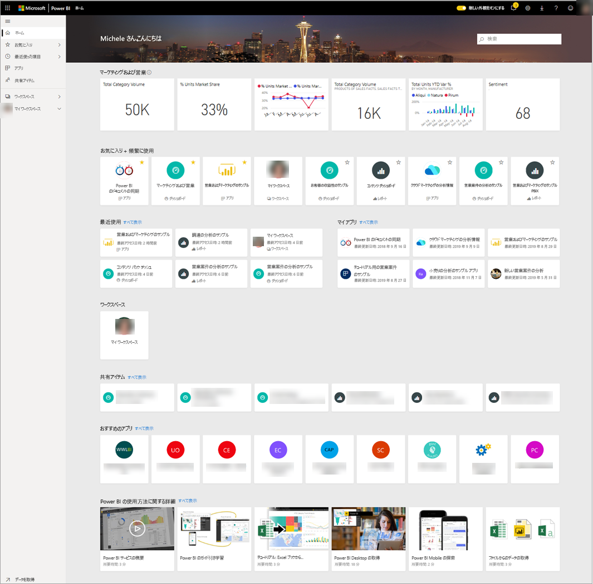
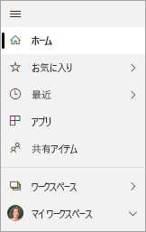

# ダッシュボード、レポート、アプリを検索する
Power BI では、*コンテンツ*という用語はアプリ、ダッシュボード、レポートを指します。 コンテンツは Power BI *デザイナー*によって作成され、デザイナーの同僚と共有されます。 コンテンツは Power BI サービスでアクセスしたり、表示したりできます。Power BI はホーム ランディング ページから始めることをおすすめします。

## Power BI ホームを試す
サインインすると、次の画像のように Power BI が開き、ホーム キャンバスが表示されます。
 

Power BI ホームには、コンテンツを探して表示する方法が 3 つあります。 3 つの方法のいずれでも、同じコンテンツ プールにアクセスします。そのコンテンツにたどり着くまでの方法が異なるだけです。 何かを見つけるとき、検索が最も簡単で速い方法となることもあれば、ホーム キャンバスで*カード*を選択する方法が推奨されることもあります。

- ホーム キャンバスには、お気に入りや最近使用されたコンテンツと共に推奨コンテンツや学習リソースが整理された上で表示されます。 コンテンツはそれぞれ、*カード*として表示され、タイトルとアイコンが付きます。 カードを選択すると、そのコンテンツが開きます。
- 左側にあるナビ ペインはナビ ペインと呼ばれています。 このウィンドウでは整理方法が少し異なり、同じコンテンツがそれぞれ [お気に入り]、[最近]、[アプリ]、[自分と共有] ごとに表示されます。 ここからコンテンツの一覧を表示したり、コンテンツを選択して開いたりすることができます。
- 右上隅にあるグローバル検索ボックスでは、タイトル、名前、キーワードでコンテンツを検索することができます。

次のトピックでは、コンテンツを検索し、表示するためのオプションを 1 つずつ確認します。

## ホーム キャンバス
ホーム キャンバスでは、使用権限が与えられているすべてのコンテンツを表示できます。 はじめは、ホーム キャンバスにあまりコンテンツがないかもしれませんが (上の画像を参照してください)、同僚と Power BI を使い始めれば変わります。

ホーム キャンバスはまた、推奨コンテンツや学習リソースで更新されます。 
 
Power BI サービスで作業していると、同僚からダッシュボード、レポート、アプリが届き、お使いのホーム ページがゆくゆくは充実します。 しばらくすると、ホーム ページは次のような外観になるかもしれません。

 
次からのトピックでは、このホームページを上から下まで詳しく見ていきます。

## 最も重要なコンテンツを手元に

### [お気に入り] と [頻繁に使用]
一番上のこのセクションには、最も頻繁にアクセスするコンテンツや[おすすめまたはお気に入り](end-user-favorite.md)のタグを付けたコンテンツのリンクが含まれます。 一部のカードに黄色い星が付いていることにご注目ください。この 2 つのアプリとそのダッシュボードにはお気に入りのタグが付けられています。
 
### [最近使用] と [マイ アプリ]
次のセクションには、最近アクセスしたコンテンツが表示されます。 各カードのタイムスタンプにご注目ください。 **[マイ アプリ]** セクションには、共有アプリか [AppSource からダウンロードした](end-user-apps.md)アプリが一覧表示されます。ここには、最近使用したアプリが一覧表示されます。 **[すべて表示]** を選択すると、すべての共有アプリが一覧表示されます。

### ワークスペース
Power BI *コンシューマー*には通常、 **[マイ ワークスペース]** という 1 つのワークスペースしかありません。 

### 自分と共有
同僚はアプリだけでなく、個々のダッシュボードとレポートを共有できます。 **[自分と共有]** セクションには、同僚が共有した 3 つのダッシュボードと 3 つのレポートがあることにご注目ください。

### おすすめのアプリ
Power BI では、アクティビティとアカウント設定に基づき、一連の推奨アプリが表示されます。 アプリ カードを選択すると、アプリが開きます。
 
### 学習リソース
ホーム キャンバスの一番下に一連の学習リソースがあります。 表示されるリソースは、アクティビティ、設定、Power BI 管理者に依存します。 
 
## ナビ ペインの詳細

ナビ ペインを使用し、ダッシュボード、レポート、アプリを見つけたり、切り替えたりします。 コンテンツまで移動する方法としては、ナビ ペインの利用が一番速いことがあります。
ナビ ペインは、ホーム ランディング ページを開いたときに表示されます。Power BI サービスの他の領域を開いたとき、そのまま残ります。
  
ナビ ペインでは、ホーム キャンバスで既に確認したものと同様のコンテナーにコンテンツが整理されます。[お気に入り]、[最近]、[アプリ]、[自分と共有] です。 ポップアップを使用すると、各コンテナーで最近使用したコンテンツだけを表示できます。あるいは、コンテンツの一覧に移動すると、コンテナー カテゴリ別にすべてのコンテンツを表示できます。
 
- このようなコンテンツ セクションの 1 つを開き、すべてのアイテムを一覧表示するには、見出しを選択します。
- 各コンテナーで最近使用したものを表示するには、ポップアップ ( **>** ) を選択します。

    ![[最近] にナビ ペインを使用する動画](media/end-user-home/power-bi-nav-bar.gif)

 
コンテンツを簡単に見つけるもう 1 つの方法がナビ ペインです。 コンテンツはホーム キャンバスと同様の方法で整理されています。ただし、カードではなく、一覧で表示されます。 

## すべてのコンテンツを検索する
場合によっては、コンテンツを見つける最速の方法は検索です。 たとえば、しばらく使用していなかったダッシュボードがホーム キャンバスに表示されていないことに気付いたとします。 あるいは、同僚の Aaron に共有してもらったが、その名前もコンテンツの種類 (ダッシュボードなのか、レポートなのか) も覚えていないとします。
 
ダッシュボード名の全部または一部を入力し、検索できます。 また、同僚の名前を入力し、その同僚から共有してもらったコンテンツを検索できます。 自分が所有するかアクセス許可が与えられているすべてのコンテンツを照合することが検索範囲となります。

![[最近] の検索フィールドを使用する様子をとらえたスクリーンショット](media/end-user-home/power-bi-search.png)

## 次の手順
[Power BI の基本概念](end-user-basic-concepts.md)の概要
