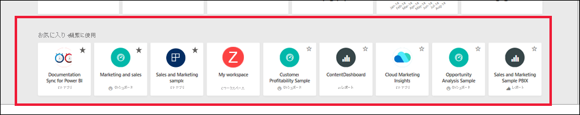
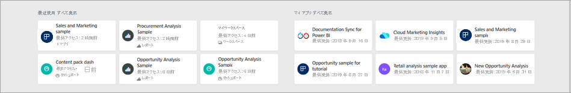
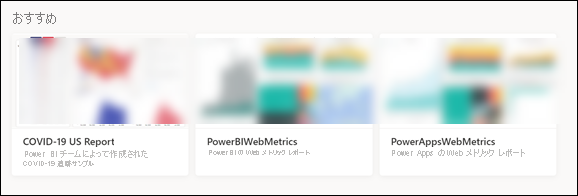

# ダッシュボード、レポート、アプリを検索する

[!INCLUDE[consumer-appliesto-yynn](../includes/consumer-appliesto-yynn.md)]
Power BI では、*コンテンツ*という用語はアプリ、ダッシュボード、レポートを指します。 コンテンツは Power BI *デザイナー*によって作成され、デザイナーの同僚と共有されます。 コンテンツは Power BI サービスでアクセスしたり、表示したりできます。Power BI は Power BI **ホーム**から使い始めることをお勧めします。

## Power BI ホームを試す
Power BI サービスにサインインした後、ナビゲーション ペインから **[ホーム]** を選択します。 

![Power BI サービスのナビゲーション ペインと選択された [ホーム] のスクリーンショット。](media/end-user-home/power-bi-select-home.png)

次の図に示すように、Power BI にホーム キャンバスが表示されます。
 

Power BI ホームには、コンテンツを探して表示する方法が 3 つあります。 3 つのいずれでも、同じコンテンツ プールにアクセスします。そのコンテンツにたどり着くまでの方法が異なるだけです。 何かを見つけるとき、検索が最も簡単で速い方法となることもあれば、ホーム キャンバスで*カード*を選択する方法が推奨されることもあります。

- ホーム キャンバスには、お気に入りや最近使用されたコンテンツと共に推奨コンテンツや学習リソースが整理された上で表示されます。 コンテンツはそれぞれ、*カード*として表示され、タイトルとアイコンが付きます。 カードを選択すると、そのコンテンツが開きます。
- 左側にあるナビゲーション ペインはナビ ペインと呼ばれます。 このウィンドウでは整理方法が少し異なり、同じコンテンツがそれぞれ [お気に入り]、[最近]、[アプリ]、[自分と共有] ごとに表示されます。 ここからコンテンツの一覧を表示したり、コンテンツを選択して開いたりすることができます。
- 右上隅にあるグローバル検索ボックスでは、タイトル、名前、キーワードでコンテンツを検索することができます。

次のトピックでは、コンテンツを検索し、表示するためのオプションを 1 つずつ確認します。

## ホーム キャンバス
ホーム キャンバスでは、使用権限が与えられているすべてのコンテンツを表示できます。 はじめは、ホーム キャンバスにあまりコンテンツがないかもしれませんが (上の画像を参照してください)、同僚と Power BI を使い始めれば変わります。

ホーム キャンバスはまた、推奨コンテンツや学習リソースで更新されます。 
 
Power BI サービスで作業していると、同僚からダッシュボード、レポート、アプリが届き、ゆくゆくは Power BI ホームが充実します。 しばらくすると、次のような外観になるかもしれません。

 
次からのトピックでは、このホーム キャンバスを上から下まで詳しく見ていきます。

## 最も重要なコンテンツを手元に

### [お気に入り] と [頻繁に使用]
一番上のこのセクションには、最も頻繁にアクセスするコンテンツや[おすすめまたはお気に入り](end-user-favorite.md)のタグを付けたコンテンツのリンクが含まれます。 一部のカードに黒い星が付いていることに注目してください。これらお気に入りというタグが付けられたものです。 

また、コンテンツには[おすすめ](end-user-featured.md)のタグを付けることができます。 最も頻繁に表示すると予想されるダッシュボードを選び、それを*おすすめ*のコンテンツとして設定します。 Power BI サービスを開くたびに、このおすすめのダッシュボードが最初に表示されます。 

### [最近使用] と [マイ アプリ]
次のセクションには、最近アクセスしたコンテンツが表示されます。 各カードのタイムスタンプにご注目ください。 **[マイ アプリ]** セクションには、共有アプリか [AppSource からダウンロードした](end-user-apps.md)アプリが一覧表示されます。ここには、最近使用したアプリが一覧表示されます。 **[すべて表示]** を選択すると、すべての共有アプリが一覧表示されます。

### おすすめ
**[おすすめ]** セクションには、管理者が [ホーム] に "*昇格*" させたコンテンツが表示されます。 通常、これは仕事をする上で重要な、または役立つコンテンツです。 この例では、おすすめコンテンツに成功を追跡するメトリックが表示されています。

### Workspaces
各 Power BI サービス ユーザーには、 **[マイ ワークスペース]** が 1 つあります。 **[マイ ワークスペース]** には、Microsoft のサンプルをダウンロードした場合、または独自のダッシュボード、レポート、またはアプリを作成した場合にのみコンテンツが含まれます。 多くの "*ビジネス ユーザー*" は **[マイ ワークスペース]** が空であり、空のままです。 新しいユーザーの場合、ワークスペースは **[マイ ワークスペース]** の 1 つのみです。 

![ワークスペースは [マイ ワークスペース] の 1 つのみ](./media/end-user-home/power-bi-one-workspace.png)

その 1 つのワークスペースを選択すると、空であることがわかります。

![空の [マイ ワークスペース]](./media/end-user-home/power-bi-empty-workspace.png)

[アプリをダウンロードする](end-user-app-marketing.md)たびに、または[アプリが共有される](end-user-apps.md)たびに、新しいワークスペースが作成されます。 時間の経過と共に、ワークスペースは増えます。 "*アプリ ワークスペース*" を開くには、ホーム キャンバスで選択します。 

![[ホーム] の [ワークスペース] セクションのスクリーンショット](./media/end-user-home/power-bi-workspace-more.png)

キャンバス上のアプリが開き、ナビ ペインに一覧表示されているワークスペースの名前を確認できます。 ワークスペース内では、Power BI サービスによってコンテンツがダッシュボードとレポートの種類別に分かれています。 場合によっては、ブックとデータセットも表示されます。 ワークスペースを選ぶと、この編成方法で表示されます。 この例の **[Gardening chain]\(ガーデニング チェーン\)** ワークスペースには、4 つのダッシュボードと 2 つのレポートがあります。

![選択された [Gardening]\(ガーデニング\) ワークスペース](./media/end-user-home/power-bi-search-workspace.png)

### 自分と共有
同僚はアプリだけでなく、個々のダッシュボードとレポートを共有できます。 **[自分と共有]** セクションには、同僚が共有した 3 つのダッシュボードと 3 つのレポートがあることにご注目ください。

### おすすめのアプリ
ユーザーのアクティビティとアカウント設定に基づき、Power BI によって一連の推奨アプリが表示されます。 アプリ カードを選択すると、アプリが開きます。
 
### 基本の学習用リソース
ホーム キャンバスの一番下に一連の学習用リソースがあります。 表示されるリソースは、アクティビティ、設定、Power BI 管理者によって変わります。 
 
## ナビ ペインの詳細

ナビ ペインでは、必要なものを迅速に見つけることができる方法でコンテンツが分類されています。  

ナビ ペインを使用し、ダッシュボード、レポート、アプリを見つけたり、切り替えたりします。 コンテンツまで移動する方法としては、ナビ ペインの利用が一番速いことがあります。 ナビ ペインは、ホーム ランディング ページを開いたときに表示されます。Power BI サービスの他の領域を開いたとき、そのまま残ります。 折りたたむには、[非表示] アイコンを選択します  .
  
ナビゲーション ウィンドウでは、ホーム キャンバスで既に表示したものと同様のコンテナーにコンテンツが整理されます。[お気に入り]、[最近]、[アプリ]、[自分と共有]、ワークスペース。 ポップアップを使用すると、各コンテナーで最近使用したコンテンツだけを表示できます。あるいは、コンテンツの一覧に移動すると、コンテナー カテゴリ別にすべてのコンテンツを表示できます。
 
- コンテンツ セクションの 1 つを開き、すべての項目を一覧表示するには、見出しを選択します。
- 各コンテナーで最近使用したものを表示するには、ポップアップ ( **>** ) を選択します。

    ![[最近] にナビ ペインを使用する動画](media/end-user-home/power-bi-nav-bar.gif)

 
コンテンツを簡単に見つけるもう 1 つの方法がナビ ペインです。 コンテンツはホーム キャンバスと同様の方法で整理されています。ただし、カードではなく、一覧で表示されます。 

## すべてのコンテンツを検索する
コンテンツを探すとき、検索するのが一番速いことがあります。 たとえば、しばらく使用していなかったダッシュボードがホーム キャンバスに表示されていないことに気付いたとします。 あるいは、同僚の Aaron に共有してもらったが、その名前も共有されたコンテンツの種類 (ダッシュボードなのか、レポートなのか) も覚えていないとします。 または、コンテンツが多すぎて、スクロールや並べ替えよりも検索の方が簡単な場合があります。 
 
検索フィールドは、ホーム メニュー バーの右上のセクションにあります。 そのダッシュボードの名前を全部または一部入力することで検索できます。 また、同僚の名前を入力し、その同僚から共有してもらったコンテンツを検索できます。 検索の範囲は、自分が所有している、またはアクセスできるすべてのコンテンツ内で一致するものに限定されます。

![[最近] の検索フィールドを使用する様子をとらえたスクリーンショット](media/end-user-home/power-bi-search-field.png)

## 次のステップ
[Power BI の基本概念](end-user-basic-concepts.md)の概要
