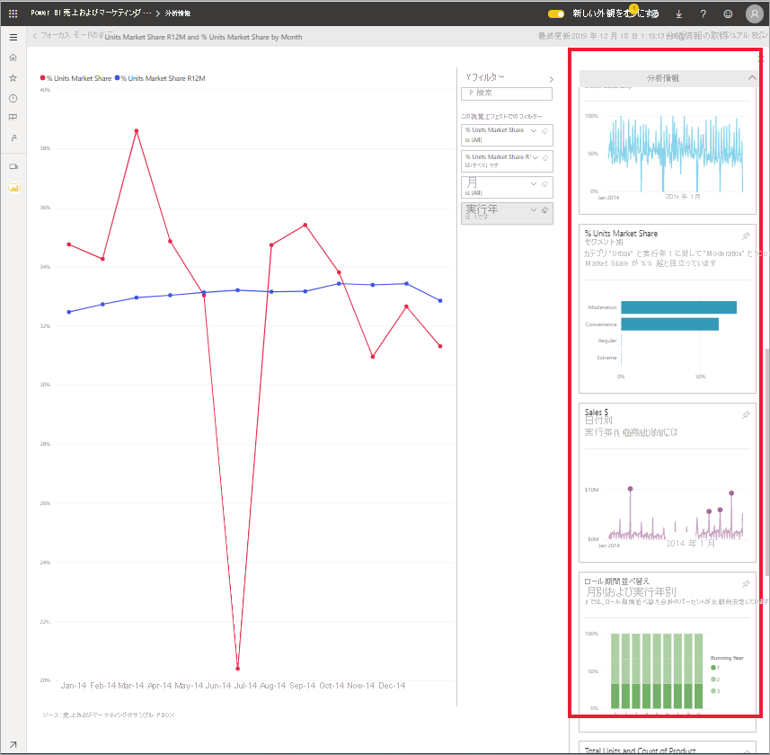
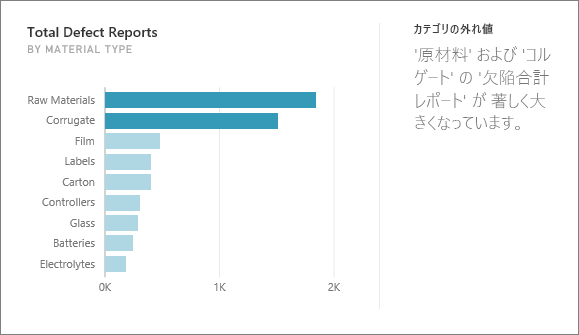
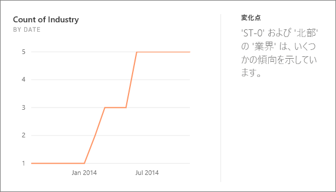
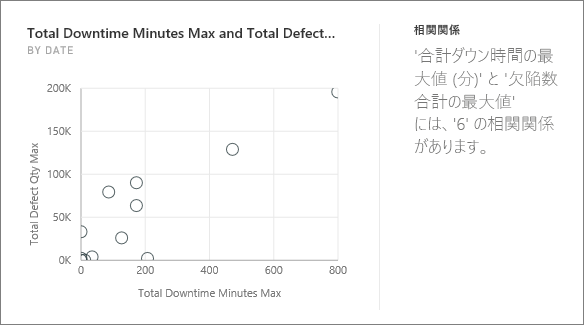
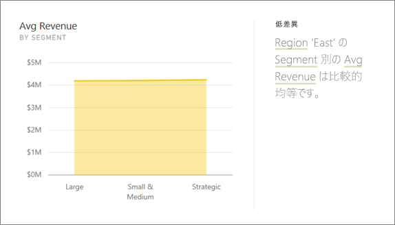
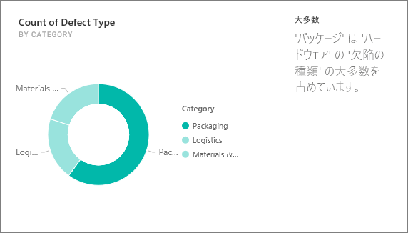
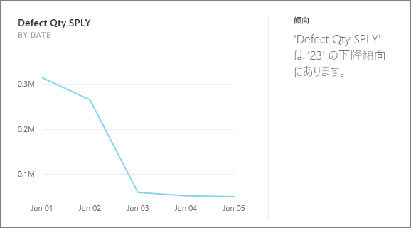
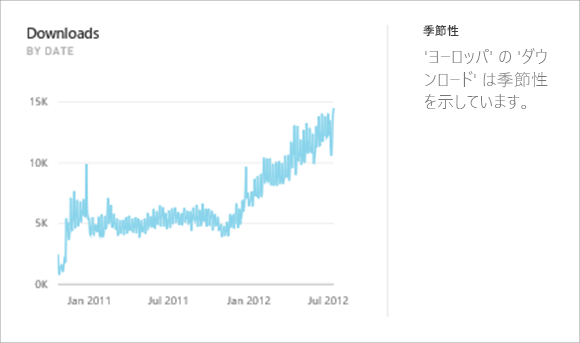
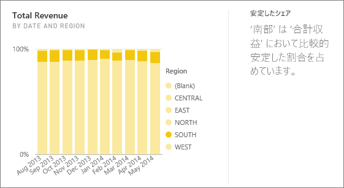
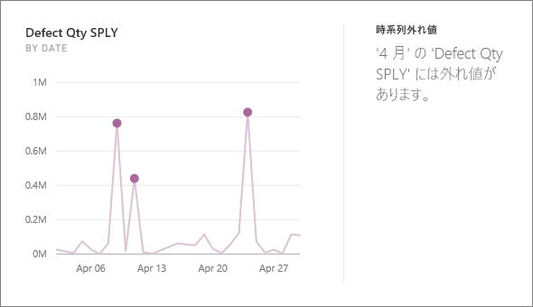

# Power BI でサポートされているインサイトの種類

[!INCLUDE[consumer-appliesto-yyny](../includes/consumer-appliesto-yyny.md)]

データを検索して興味深い傾向やパターンを見つけるように、Power BI に要求することができます。 これらの傾向とパターンは、"*分析情報*" と呼ばれるビジュアルの形式で表示されます。 

分析情報の使用方法については、[Power BI の分析情報](end-user-insights.md)に関するページを参照してください。

## インサイトのしくみ
Power BI はデータセットのさまざまなサブセットをすばやく検索します。 Power BI は検索する際、興味がある可能性のあるインサイトを検出するために一連の洗練されたアルゴリズムを適用します。 Power BI の "*コンシューマー*" は、ダッシュボードのタイルで分析情報を実行できます。

## 用語
Power BI では統計的アルゴリズムを使用して分析情報が明らかにされます。 これらのアルゴリズムについては、この記事の次のセクションに一覧して説明します。 アルゴリズムに進む前に、ここでは馴染みがないと思われるいくつかの用語の定義を示します。 

* **メジャー** - メジャーは、計算を行うために使用できる数量 (数値) フィールドです。 一般的な計算には合計、平均、最小があります。 たとえば、会社がスケートボードを製造および販売している場合、スケートボードの販売数と年間平均利益をメジャーとすることができます。  
* **ディメンション** - ディメンションはカテゴリ (テキスト) データです。 ディメンションは、人、オブジェクト、アイテム、製品、場所、および時間を表します。 データセットでは、ディメンションを使用して "*メジャー*" を有用なカテゴリにグループ化することができます。 スケートボード会社の場合、一部のディメンションには、モデル、色、国、またはマーケティング キャンペーン別の売上 (メジャー) の表示が含まれる場合があります。   
* **相関関係** - 相関関係によって、物事の動作がどのように関連しているかがわかります。  増加と減少のパターンが類似している場合、それらは正の相関関係にあります。 そして、パターンが逆の場合は、負の相関関係にあります。 たとえば、赤色のスケートボードの売上がテレビ マーケティング キャンペーンを実施するたびに増加した場合、赤色のスケートボードの売り上げとテレビ キャンペーンは正の相関関係にあります。
* **時系列** - 時系列は、時間を連続するデータ ポイントとして表示する方法です。 これらのデータ ポイントは、秒、時間、月、年などの増分値とすることが可能です。  
* **連続変数** - 連続変数は、その最小値と最大値の間の任意の値とすることができます。それ以外の場合は、離散変数になります。 例としては、温度、重量、年齢、時間などがあります。 連続変数には、値の分数または一部分を含めることができます。 販売した青色のスケートボードの合計数は離散変数になります。スケートボードは片方だけ販売することができないためです。  

## 見つけることができる分析情報の種類
これらは Power BI で使用されるアルゴリズムです。 

### カテゴリ外れ値 (上/下)
1 つまたは 2 つのカテゴリの値が他のカテゴリよりもはるかに大きいケースを強調表示します。  

### 時系列の変更点
データの時系列の傾向で、大きな変化があったときに強調表示します。

### Correlation
データセット内のカテゴリまたは値に対してプロットされたときに、複数のメジャーが、類似したパターンまたは傾向を示すケースを検出します。

### 低差異
あるディメンションのデータ ポイントが平均から離れていないため、"分散" が低くなるケースを検出します。 たとえば、"売上" というメジャーと "地域" というディメンションがあるとします。 そして、地域全体を調べると、データ ポイントと (データ ポイントの) 平均の間にほとんど違いがないことがわかります。 すべての地域の売上の分散がしきい値を下回ると、分析情報がトリガーされます。 つまり、売上がすべての地域で非常に類似している場合です。

### マジョリティ (主要因子)
別のディメンションによって分類した場合に、合計値の大部分が単一の因子に帰する可能性があるケースを検索します。  

### 時系列の全体的な傾向
時系列データの上昇または下降の傾向を検出します。

### 時系列の周期性
週単位、月単位、または年単位の周期性などの時系列データの定期的なパターンを見つけます。

### 安定した共有
連続した変数にわたる親の全体の値に関連して、子の値のシェア間に親子の相関関係があるケースを強調表示します。 安定したシェアの分析情報は、メジャー、ディメンション、および別の日付/時刻のディメンションのコンテキストに適用されます。 この分析情報は、特定のディメンション値 ("北東地域" など) の、その日付/時刻のディメンションにわたる全体的な売上が、安定したパーセンテージを示す場合にトリガーされます。

安定したシェアの分析情報は、低差異の分析情報に似ています。どちらも時間の経過に伴う値の分散の小ささに関連しているためです。 ただし、安定したシェアの分析情報では、時間経過に伴う**全体のパーセンテージ**の分散の小ささが測定されますが、低差異の分析情報では、ディメンション全体のメジャーの絶対値に関する分散の小ささが測定されます。

### 時系列外れ値
時系列全体にわたるデータに対して、その他の日付/時刻値と大きく異なる値を持つ特定の日付や時刻がある場合を検出します。

## 次のステップ
[Power BI のインサイト](end-user-insights.md)

他にわからないことがある場合は、 [Power BI コミュニティを利用してください](https://community.powerbi.com/)。

