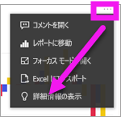
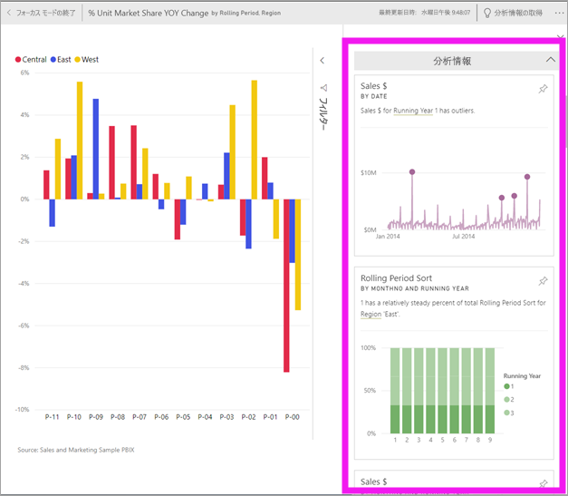

# Power BI を使用してダッシュボード タイルに関するデータの分析情報を表示する

[!INCLUDE[consumer-appliesto-yyny](../includes/consumer-appliesto-yyny.md)]

ダッシュボード上の各ビジュアル [タイル](end-user-tiles.md)からデータの探索を開始できます。 タイルを選択すると、レポートまたは [Q&A](end-user-q-and-a.md) が開き、レポートの背後でデータセットをフィルター処理し、並べ替えて掘り下げることができます。 また、インサイトを実行すると、Power BI でデータの探索が自動的に実行されます。

分析を実行して、データに基づいて、興味を引く対話型のビジュアルを生成します。 特定のダッシュボード タイルで分析を実行することができます。分析情報に対して分析を実行することもできます。

分析機能の基となっているのは、Microsoft Research と共同開発して拡大を続けている[高度な分析アルゴリズムのセット](end-user-insight-types.md)です。引き続きこれを使って、より多くの人が新しい直感的な方法でデータから分析情報を見つけられるようにしていきます。

## ダッシュボード タイルへのインサイトの実行
ダッシュボード タイルでインサイトを実行すると、Power BI ではその 1 つのダッシュボード タイルを作成するために使用されたデータのみが検索されます。 

1. [ダッシュボードを開きます](end-user-dashboards.md)。
2. タイルの上にマウスを置きます。 **その他のオプション** (...) を選択し、 **[詳細情報の表示]** を選択します。 

    

3. タイルが[フォーカス モード](end-user-focus.md)で開き、インサイト カードが右側に表示されます。    
   
        
4. 興味をそそる情報がありましたか? 詳細に確認するには、その分析情報カードを選択します。 選択した分析情報が左側に表示され、右側には、その単一の分析情報に含まれるデータのみに基づく新しい分析情報カードが表示されます。    

 ## インサイト カードとの対話
分析情報を開いたら、引き続き探索してください。

   * キャンバス上のビジュアルをフィルター処理します。  フィルターを表示するには、右上の矢印を選択し、[フィルター] ウィンドウを展開します。

      ![[フィルター] メニューが展開された分析情報](./media/end-user-insights/power-bi-filters.png)
   
   * インサイト カード自体に対してインサイトを実行します。 これは**関連する分析情報**と呼ばれることがよくあります。 分析情報カードを選択してアクティブにします。 これは、レポート キャンバスに表示されます。
   
      ![[フィルター] メニューが展開された分析情報](./media/end-user-insights/power-bi-insight-card.png)
   
   * 右上にある電球アイコン ![[分析情報の取得] アイコン](./media/end-user-insights/power-bi-bulb-icon.png) または **[分析情報の取得]** を選択します。 インサイトが左側に表示され、右側には、その単一の情報に含まれるデータのみに基づく新しいカードが表示されます。
     
     ![[詳細情報の取得] アイコンが表示されたメニュー バー](./media/end-user-insights/power-bi-related.png)
     
レポートに戻るには、左上にある **[フォーカス モードの終了]** を選択します。

## 考慮事項とトラブルシューティング
- **[分析情報の表示]** を使用できない種類のダッシュボード タイルもあります。 たとえば、Power BI カスタム視覚化では使用できません。<!--[Power BI visuals](end-user-custom-visuals.md)-->

## 次の手順

[分析機能を使用](end-user-analyze-visuals.md)してレポートの視覚化に対して分析情報を実行する    
使用できるクイック分析情報の種類については[こちら](end-user-insight-types.md)を参照してください。

