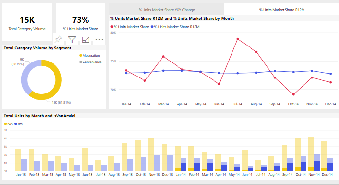

# Power BI のレポート内でビジュアルがどのように相互作用するか
Power BI の優れた機能の 1 つは、レポート ページ上のすべてのビジュアルが相互接続される方法です。 ビジュアルのいずれかのデータ ポイントを選択すると、そのデータを含むページ上の他のすべてのビジュアルが選択に基づいて変化します。 

既定では、レポート ページ上の 1 つの視覚エフェクトでデータ ポイントを選択すると、そのページ上の他の視覚エフェクトに対してクロスフィルター処理、クロス強調表示、ドリルが行われます。 

データに含まれる 1 つの値が他の値にどのように貢献しているかを確認する際に役立つことがあります。 たとえば、ドーナツ グラフで [Moderation] セグメントを選択すると、[Total units by Month] グラフにおけるそのセグメントの各列に対する貢献が強調表示されます。また、右側で折れ線グラフにフィルターが適用されます。

「[フィルター処理と強調表示について](../power-bi-reports-filters-and-highlighting.md)」を参照してください。 

ページ上のビジュアルがどのように相互作用するかは、レポート *デザイナー*によって設定されます。 デザイナーには、視覚的な相互作用のオンとオフを切り替えるオプションと、既定のクロスフィルター処理、クロス強調表示、およびドリルの動作を変更するオプションがあります。 
  
> [!NOTE]
> *クロスフィルター処理* と *クロス強調表示* という用語は、ここで説明する動作を、 **[フィルター]** ウィンドウを使って視覚化のフィルター処理と強調表示を行う場合の動作と区別するために使っています。  

## 考慮事項とトラブルシューティング
- [詳細表示](../power-bi-visualization-drill-down.md)に対応している視覚エフェクトがレポートに含まれる場合、既定では、ある視覚エフェクトに詳細表示を適用してもレポート ページの他の視覚エフェクトは変更されません。     
- visualA を使用して visualB とやりとりすると、visualA のビジュアルレベル フィルターが visualB にも適用されます。

## 次の手順
[レポート フィルターの使用方法](../power-bi-how-to-report-filter.md)
