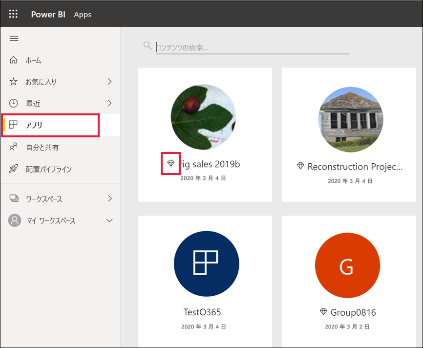
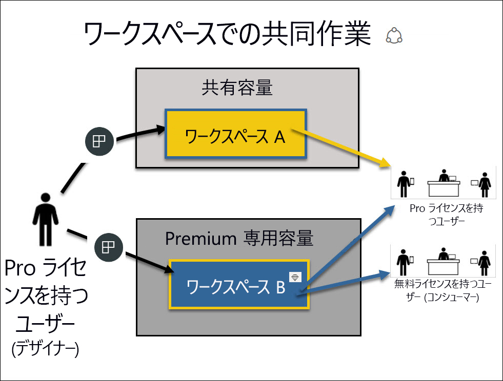
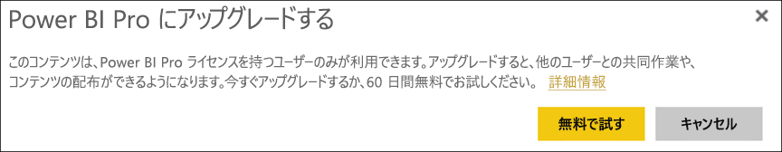

# "*コンシューマー*" のライセンスとサブスクリプション

[!INCLUDE[consumer-appliesto-ynnn](../includes/consumer-appliesto-ynnn.md)]

"[*コンシューマー*](end-user-consumer.md)" は、Power BI サービスを使用して、データに裏付けられたビジネス上の決定を行うために、レポートやダッシュボードを調べます。 Power BI をしばらく使用しているか、または "*デザイナー*" の同僚とチャットしていると、特定の種類のライセンス、サブスクリプション、またはアクセス許可がある場合にのみ使用できる機能があることに気づくでしょう。 

Power BI サービスで何ができるかは、次の 3 つのことによって決まります。
-    使用しているライセンスとサブスクリプションの種類
-    コンテンツが格納されている場所
-    割り当てられているロールとアクセス許可

この記事では、各ライセンスの種類の機能と、"*コンテンツが格納されている場所*" が "*実行できること*" に与える影響について説明します。 また、ライセンスとサブスクリプションを調べる方法、およびコンテンツが格納されている場所を確認する方法についても説明します。 ロールとアクセス許可について詳しくは、[ワークスペースのロール](end-user-workspaces.md)に関する記事をご覧ください。

## ライセンス

Power BI サービスの各ユーザーは、*Free* ライセンスまたは *Pro* ライセンスのいずれかを使用しています。 Power BI "*コンシューマー*" の場合は、おそらく、Power BI テナント管理者によって管理されているライセンスを使用しています。 

複数のライセンスを同時に所有している可能性もあります。  サービスでは、常に、ユーザーが現在所有している最良のライセンスと同じエクスペリエンスが提供されます。 

## Power BI Premium 容量

Premium は組織のサブスクリプションであり、コンテンツの格納方法が異なります (専用容量)。 Premium を使用すれば、アクセス許可を持つ組織内または組織外いずれのユーザーも、個別の Power BI Pro ライセンスを購入することなく、Power BI のコンテンツを見ることができます。 

Premium では、コンテンツを表示する受信者に Pro ライセンスを要求することなく、Pro ユーザーによるコンテンツの広範囲な配信が可能になります。 コンテンツ デザイナーの場合は Pro ライセンスが必要です。 デザイナーは、データ ソースに接続し、データをモデル化し、ワークスペースのアプリとしてパッケージ化されるレポートおよびダッシュボードを作成できます。 Pro ライセンスを持たないユーザーは、[そのワークスペースでのロール](end-user-workspaces.md)を割り当てられている限り、Power BI Premium 容量内のワークスペースにアクセスできます。

それらのワークスペース内では、デザイナーによって、**ビューアー**、**共同作成者**、**メンバー**、**管理者**などのロールが割り当てられ、これにより、同僚がコンテンツを操作できる範囲が決まります。 詳細については、[ワークスペースのアクセス許可とロール](end-user-workspaces.md)に関する記事をご覧ください。 

Premium 容量の詳細については、「[Power BI Premium とは](../admin/service-premium-what-is.md)」をご覧ください。

## 使用しているライセンスを確認する

自分に割り当てられているライセンスを確認するには、[自分の Microsoft **マイ アカウント** ページ](https://portal.office.com/account)にアクセスします。  **[サブスクリプション]** タブをクリックします。

この最初のユーザー Pradtanna は Office 365 E5 を使用しています。これには、Power BI Pro ライセンスが含まれています。

![Office ポータルの [サブスクリプション] タブ](media/end-user-license/power-bi-license-office.png)

この 2 番目のユーザー Zalan は、Power BI Free ライセンスを持っています。 

![Office ポータルの [サブスクリプション] タブ](media/end-user-license/power-bi-license-free.png)

## Premium 容量にアクセスできるかどうかを確認する

次に、自分が Premium 容量を持つ組織に属しているかどうかを確認します。 上記のいずれかのユーザー (Pro または Free) は、Premium 容量を持っている組織に属すことができます。  2 番目のユーザー Zalan について確認してみましょう。  

使用可能なストレージの量を調べることで、Zalan の組織が Premium 容量を使用しているかどうかを確認できます。 

- Power BI サービスで、 **[マイ ワークスペース]** を選択して、右上隅の歯車アイコンを選択します。 **[パーソナル ストレージの管理]** を選択します。

    ![歯車アイコンで [設定] メニューを表示する](media/end-user-license/power-bi-license-personal.png)

    10 GB より大きい値が表示される場合は、Premium サブスクリプションを持つ組織のメンバーです。 次の図では、Zalan の組織に最大 100 GB のストレージがあることが示されています。  

    ![100 GB を示す [ストレージの管理] 画面](media/end-user-license/power-bi-free-capacity.png)

Pro ユーザーは既に Zalan とワークスペースを共有していることに注目します。 ダイヤモンド形のアイコンは、このワークスペースが Premium 容量内に格納されていることを示します。 

## Premium 容量でホストされているコンテンツを識別する

組織が Premium 容量かどうかを確認するもう 1 つの方法は、ダイヤモンド型のアイコンが付いたアプリとアプリ ワークスペースを探すことです。 ダイヤモンドは、コンテンツが Premium 容量内に格納されていることを示します。 

次の図では、3 つのアプリが Premium 容量に格納されています。

    
"*デザイナー*" がワークスペースを Premium 専用容量に配置している場合、Free ライセンスを持つユーザーは、**そのワークスペース内で**、共有コンテンツの表示、同僚との共同作業、アプリのダッシュボードやレポートの使用などを行うことができます。 ユーザーのアクセス許可の範囲は、Power BI 管理者およびコンテンツ デザイナーによって設定されます。 

   

## まとめ

組織が Premium サブスクリプションを購入すると、管理者は、通常、Premium 容量内で作業してコンテンツを作成および共有する従業員に、Pro ライセンスを割り当てます。 Pro ユーザーは、[ワークスペース](end-user-workspaces.md)を作成し、それらのワークスペースにコンテンツ (ダッシュボード、レポート、アプリ) を追加します。 それらのワークスペース内で Free ユーザーが共同作業できるようにするには、管理者または Pro ユーザーは、"*専用容量*" にワークスペースを割り当てます。    
 

|ライセンスの種類  |共有容量  |専用容量  |
|---------|---------|---------|
|**Free**     |  自分用のコンテンツを作成し、そのコンテンツを使用する、個人用サンドボックスとして使用する場合。 これは、Power BI サービスを試すのに適した方法です。 他のユーザーのコンテンツを使用したり、他のユーザーとコンテンツを共有したりすることはできません 1     |   専用容量に割り当てられているコンテンツ、および他のユーザーから共有されているコンテンツを使用します。 Free ユーザーと Pro ユーザーは、Free ユーザーが Pro アカウントを持っていなくても共同作業を行うことができます。      |
|**Pro**     |  コンテンツを作成して共有することで、他の Pro ユーザーと共同作業します。        |  コンテンツを作成して共有することで、Free および Pro ユーザーと共同作業します。       |

1 「[考慮事項とトラブルシューティング](#considerations-and-troubleshooting)」をご覧ください。 

次の図の左側は、アプリ ワークスペース内でコンテンツを作成および共有する Pro ユーザーを表しています。 

- **ワークスペース A** は、Premium 容量を持たない組織で作成されました。 

- **ワークスペース B** は、Premium サブスクリプションを持つ組織で作成され、ワークスペースは専用容量に保存されました。 このワークスペースには、ダイヤモンド アイコンが付いています。  

    

Power BI Pro "*デザイナー*" は、いずれかのワークスペースで、他の Pro ユーザーと共有および共同作業できます。 ただし、Power BI Pro ユーザーが Free ユーザーと共有および共同作業できる唯一の方法は、Premium 専用容量であるワークスペース B を使用することです。  ワークスペース内で、デザイナーが共同作業者にロールを割り当てます。 自分のロールによって、ワークスペース内で実行できるアクションが決まります。 通常、Power BI "*コンシューマー*" には、"*ビューアー*" ロールが割り当てられています。 ロールの詳細については、[Power BI コンシューマー向けのワークスペース](end-user-workspaces.md)に関する記事をご覧ください。

## 考慮事項とトラブルシューティング
- 複数の Power BI ライセンスを所有している場合があります。 Power BI サービスでは、常に、現在所有している最もよいライセンスと同じエクスペリエンスが提供されます。 たとえば、Pro ライセンスと Free ライセンスの両方がある場合、Power BI サービスでは Pro ライセンスが使用されます。

- コンテンツ (ダッシュボード、レポート、アプリ) を共有および作成する必要がある場合に、Power BI の "*コンシューマー*" ではなく、"*デザイナー*" である可能性があります。 Pro ユーザー ライセンスを持っていることを確認してください。 Pro 機能を使用しようとするたびに Power BI サービスに表示されるアップグレード ダイアログを選択することにより、Power BI Pro の 60 日間の無料試用版にサインアップできます。

    

  60 日の試用期間が終わると、ライセンスは Power BI Free ライセンスに戻されます。 その後は、Power BI Pro ライセンスを必要とする機能にアクセスできなくなります。 Pro ライセンスを使い続けたい場合は、Power BI Pro ライセンスの購入について管理者または IT ヘルプ デスクにお問い合わせください。 管理者または IT ヘルプ デスクが存在しない場合は、[Power BI の価格ページ](https://powerbi.microsoft.com/pricing/)をご覧ください。     

- "*無料で試す*" 種類のボタンを選択してご自分で Free ライセンスにサインアップした場合、有効期限はありません。 そのため、Pro 試用版にアップグレードした後、または組織から Pro ライセンスを提供された後で、試用版が終了した場合、または組織によって Pro ライセンスが削除された場合でも、自分でライセンスをキャンセルしない限り、Free ライセンスに戻ることができます。 

- 1 Power BI サービスの Free ユーザー ライセンスは、**マイ ワークスペース**を用いた個人データの分析や視覚化を調べたり使用したりする場合に最適です。 スタンドアロンの Free ユーザーは同僚との共同作業に Power BI を使用していません。 Free ライセンスを持つスタンドアロンのユーザーは、他のユーザーから共有されているコンテンツを表示することも、自分のコンテンツを他の Power BI ユーザーと共有することもできません。 

    

## 次の手順
- [自分が Power BI の "*コンシューマー*" か確認する](end-user-consumer.md)    
- [ワークスペースについて学習する](end-user-workspaces.md)    
- [ライセンスの種類別の Power BI コンシューマー機能を確認する](end-user-features.md)
