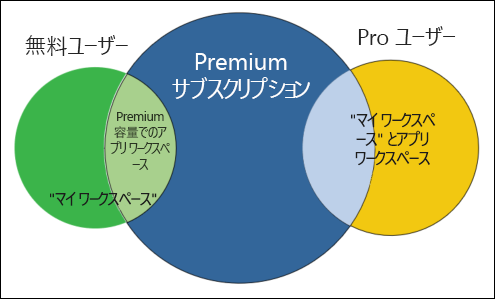
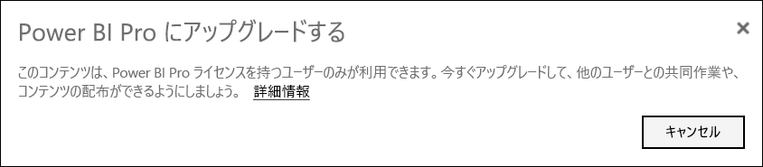
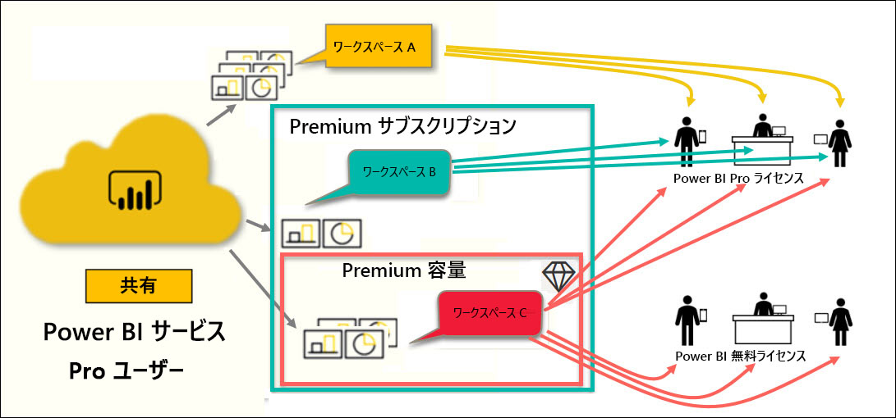

# Power BI ライセンスの種類

[!INCLUDE[consumer-appliesto-ynnn](../includes/consumer-appliesto-ynnn.md)]

"*コンシューマー*" の場合、Power BI サービスを使用して、意思決定を行うためにレポートやダッシュボードを調べます。 Power BI をしばらく使用していると、または "*デザイナー*" の同僚とチャットしていると、特定の種類のライセンスまたはサブスクリプションを所有している場合にのみ使用できる機能があることに気づくでしょう。 

この記事では、ユーザー ライセンスと組織サブスクリプションの相違点、およびそれらの組み合わせのしくみ (Free、Pro、Premium、Premium 容量) について説明します。 また、使用しているライセンスとサブスクリプションの組み合わせを判別する方法についても説明します。  

最初に、ライセンスの 2 つのカテゴリ (ユーザー単位のサブスクリプションと組織サブスクリプション) について説明します。 開始点は、それぞれで使用できる既定の機能です。 次に、Power BI 管理者とコンテンツ所有者が、ロールとアクセス許可を使用して既定のライセンスとサブスクリプションの機能を変更する方法を確認します。 

たとえば、ライセンスで許可されている場合でも、管理者はデータのエクスポート、Q&A 自然言語クエリの使用、Web への公開などの操作を制限できます。 また、レポート "*デザイナー*" がコンテンツを[ワークスペース](end-user-workspaces.md)に割り当てるときに、ユーザーをワークスペース ロールに割り当てることができます。 自分のロールによって、そのワークスペース内で実行できる操作と実行できない操作が決まります。 "*デザイナー*" は、アクセス許可設定を使用してユーザーのライセンスの制限をさらに調整することができます。 つまり、複雑なのです。 この記事は、すべてではないにしても、ほとんどの混乱を解消することを目的としています。

## ユーザー単位のライセンス
ライセンスの 1 つ目の種類は、**ユーザー単位**のライセンスです。 各 Power BI サービス ユーザーは、Free ライセンスまたは Pro ライセンスのいずれかを持っています。 特定の機能は、Pro ライセンスを持つユーザー用に予約されています。  

- **Power BI Pro ライセンス (Premium サブスクリプションを使用しない)** があれば、ユーザーはコンテンツを作成して共有することで、他の Pro ユーザーとの共同作業を行うことができます。 Pro ライセンスを持つユーザーのみが、レポートの発行、ダッシュボードおよびレポートのサブスクライブ、ワークスペース内の同僚との共同作業を行うことができます。 

    

    Power BI Pro は、他のユーザーが Power BI サービスに発行したレポートやダッシュボードの読み取りと操作を行うことができるようにする個別のユーザー ライセンスです。 このライセンスの種類が割り当てられたユーザーは、他の Power BI Pro ユーザーとコンテンツを共有して共同作業を行うことができます。 Power BI Pro ユーザーだけが、コンテンツを発行したり他のユーザーと共有したり、他のユーザーが作成したコンテンツを利用したりできます。 この例外は、[Power BI Premium 容量](#understanding-premium-and-premium-capacity)でホストされているコンテンツです。 (詳細については、後述の [Power BI Premium の容量](#understanding-premium-and-premium-capacity)に関するセクションを参照してください。)通常、Pro ライセンスは、レポート "*デザイナー*" と開発者が使用します。 

- **スタンドアロンの Power BI Free ライセンス (Premium サブスクリプションを使用しない)** も強力ではありますが、Power BI を使い始めたばかりのユーザーや自分用のコンテンツを作成するユーザーが対象です。 [個人として Power BI サービスにサインアップする](../service-self-service-signup-for-power-bi.md)方法に関するページを参照してください。   

    スタンドアロンの Free ユーザー ライセンスは、Microsoft のサンプルを使用して Power BI を学習するユーザーに最適です。 スタンドアロンの Free ライセンスを持つユーザーは、他のユーザーから共有されているコンテンツを表示することも、自分のコンテンツを他の Power BI ユーザーと共有することもできません。 

    

    スタンドアロンの Free ライセンスを持つすべてのユーザーは、[Power BI Pro ライセンス無料試用版](../service-self-service-signup-for-power-bi.md)にアップグレードできます。 試用版では、Power BI Pro ユーザーのすべての権限と機能が提供されます。

    

- **Premium サブスクリプションを使用する Power BI Free ライセンス**: 組織が Premium サブスクリプションを使用している場合、管理者と Pro ユーザーは、"*Premium 容量*" にワークスペースを割り当てて、そのワークスペースへのアクセス権を Free ユーザーに付与することができます。 Premium 容量内のワークスペースは、Pro ユーザーが Free ユーザーと共有して共同作業を行うことができる場所です。Free ユーザーに Pro アカウントを割り当てる必要はありません。 それらのワークスペース内では、Free ユーザーは昇格されたアクセス許可を持ち、共同作業と共有、データのエクスポート、サブスクライブ、フィルターの操作などを行うことができます。 

ここまでは理解できましたか?  OK。 **Premium 容量**について詳しく見てみましょう。

## Premium および Premium 容量について
Premium は、**組織**のサブスクリプションです。 これは、組織内の**ユーザー単位**のすべての Power BI ライセンスの上に機能の層を追加することだと考えることができます。 

組織が Premium ライセンスを購入すると、管理者は、通常、コンテンツを作成および共有する従業員に Pro ライセンスを割り当てます。 また、そのコンテンツを使用するすべてのユーザーに Free ライセンスを割り当てます。 Pro ユーザーは、[アプリ ワークスペース](end-user-workspaces.md)を作成し、それらのワークスペースにコンテンツ (ダッシュボード、レポート、アプリ) を追加します。 それらのワークスペース内で Free ユーザーが共同作業できるようにするには、管理者または Pro ユーザーは、"*Premium 容量*" にワークスペースを保存します。 

組織が Premium ライセンスを購入すると、Power BI サービス内でその組織専用に割り当てられた容量が提供されます。 それは他の組織と共有されません。 この容量は、Microsoft が完全に管理している専用ハードウェアでサポートされています。 組織は、専用の容量を広範囲に適用するか、特定のワークスペースに割り当てるかを選択できます。 組織のすべてのワークスペースが容量内に含まれる場合もあれば、一部だけが含まれる場合もあります。 Premium 容量内のワークスペースは、ダイヤモンド形のアイコンによって識別できます .  Premium 容量内のワークスペースは、Pro ユーザーが Free ユーザーと共有して共同作業を行うことができる場所です。Free ユーザーに Pro アカウントを割り当てる必要はありません。 

Premium 容量では、コンテンツ デザイナーに Pro ライセンスが引き続き必要です。 デザイナーは、アプリ ワークスペースの作成、データ ソースへの接続、データのモデル化を行い、直接共有されるかアプリとしてパッケージ化されて共有される、レポートとダッシュボードを作成します。 Pro ライセンスを持たないユーザーであっても、Power BI Premium 内にあるワークスペースにアクセスできます。ただし、そのワークスペースが Premium "*容量*" 内にあり、ワークスペースの所有者からアクセス許可が付与されている場合に限ります。

次の図の左側は、アプリ ワークスペース内でコンテンツを作成および共有する Pro ユーザーを表しています。 

- **ワークスペース A** は、Premium サブスクリプションを使用していない組織で作成されました。 

- **ワークスペース B** は、Premium サブスクリプションを使用している組織で作成されましたが、この特定のワークスペースは Premium 容量内に保存されませんでした。 このワークスペースには、ダイヤモンド形のアイコンがありません。

- **ワークスペース C** は、Premium サブスクリプションを使用している組織で作成され、Premium 容量内に保存されました。 このワークスペースには、ダイヤモンド形のアイコンが付いています。  

Power BI Pro "*デザイナー*" は、3 つのうちどのワークスペース内でも、他の Pro ユーザーとの共有および共同作業を行うことができます。 ただし、デザイナーが、そのワークスペースを組織全体で共有しているか、ワークスペース ロールを Pro ユーザーに割り当てている必要があります。 

Power BI Pro ユーザーは、ワークスペース C を使用して、Free ユーザーとのみ共有および共同作業を行うことができます。Free ユーザーがワークスペースにアクセスできるようにするには、ワークスペースが Premium 容量に割り当てられている必要があります。 ワークスペース内で、デザイナーが次のロールをコラボレーターに割り当てます:"*管理者*"、"*メンバー*"、"*共同作成者*"、または "*ビューアー*" です。 自分のロールによって、ワークスペース内で実行できるアクションが決まります。 通常、Power BI "*コンシューマー*" には、"*ビューアー*" ロールが割り当てられています。 詳細については、「[Workspaces for Power BI consumers](end-user-workspaces.md)」 (Power BI コンシューマー向けのワークスペース) を参照してください。

## 所有しているライセンスとサブスクリプションを確認する
Power BI ライセンスとサブスクリプションの情報を調べるには、いくつかの方法があります。 

まず、使用している **ユーザー** ライセンスを判別します。

- Microsoft Office の特定のバージョンには、Power BI Pro ライセンスが含まれています。  使用している Office のバージョンに Power BI が含まれているかどうかを確認するには、[Office ポータル](https://portal.office.com/account)にアクセスして、 **[サブスクリプション]** を選択します。

    この最初のユーザー Pradtanna は Office 365 E5 を使用しています。これには、Power BI Pro ライセンスが含まれています。

    ![Office ポータルの [サブスクリプション] タブ](media/end-user-license/power-bi-license-office.png)

    この 2 番目のユーザー Zalan は、Power BI Free ライセンスを持っています。 

    ![Office ポータルの [サブスクリプション] タブ](media/end-user-license/power-bi-license-free.png)

次に、ご自分のアカウントが Premium サブスクリプションに含まれてもいるかどうかを確認します。 上記のユーザーのいずれか (Pro または Free) が、Premium ライセンスを持っている組織に属すことができます。  2 番目のユーザー Zalan について確認してみましょう。  

- Power BI サービスで、 **[マイ ワークスペース]** を選択して、右上隅の歯車アイコンを選択します。 **[パーソナル ストレージの管理]** を選択します。

    ![歯車アイコンで [設定] メニューを表示する](media/end-user-license/power-bi-license-personal.png)

    **ユーザー単位**のライセンス (Pro または Free) により、クラウド内の 10 GB のストレージが提供されます。これは、Power BI レポートまたは Excel ブックのホスティングに使用できます。 10 GB より大きい値が表示されるユーザーは、Premium ライセンスを持つ組織アカウントのメンバーです。

    ![100 GB を示す [ストレージの管理] 画面](media/end-user-license/power-bi-free-capacity.png)

    Office ポータル ページでは、Zalan のユーザー ライセンスは Power BI Free 用だったことを思い出してください。 しかしながら、所属する組織が Premium サブスクリプションを購入したため、Power BI サービスでは、Zalan は 10 GB のストレージの制限を受けず、100 GB を使用できます。 Premium ライセンスを持つ組織の "*コンシューマー*" として、"*デザイナー*" が Premium 容量内にワークスペースを配置する場合に限り、Zalan は、共有コンテンツの表示、仕事仲間との共同作業、アプリの操作などを行うことができます。 彼のアクセス許可の範囲は、彼の Power BI 管理者およびコンテンツ デザイナーが設定します。 Pro ユーザーは既に Zalan とワークスペースを共有していることに注目します。 ダイヤモンド形のアイコンから、このワークスペースが Premium 容量内に格納されていることがわかります。 

   
## ワークスペースのロールについて
ここまで、ユーザー単位のライセンス、Premium サブスクリプション、アプリ ワークスペース、Premium 容量について確認しました。 次に、ワークスペースの "*ロール*" を見てみましょう。

これは Power BI "*コンシューマー*" 向けの記事であるため、次のようなシナリオを用意しました。

-  あなたは、Power BI Premium サブスクリプションを使用している組織内の "*Free*" ユーザーです。 
- Power BI Pro ユーザーがダッシュボードとレポートのコレクションを作成し、このコレクションを "*アプリ*" として組織全体に発行しました。  
- アプリは "*ワークスペース*" 内に存在し、このワークスペースは Premium 容量内にあります。    
- このアプリ ワークスペースには、1 つのダッシュボードと 2 つのレポートがあります。
- Pro ユーザーから **ビューアー** ロールが割り当てられました。

### ビューアー ロール
ロールを使用すると、Power BI "*デザイナー*" は、チームが共同作業を行うことができるように、ワークスペースで誰が何を行うことができるかを管理できます。 これらのロールの 1 つが**ビューアー**です。 

ワークスペースが Power BI Premium 容量にある場合、ユーザーにビューアー ロールがあれば、Power BI Pro ライセンスがなくても、そのワークスペースにアクセスできます。 さらに、ビューアー ロールでは、基になるデータにアクセスしたりエクスポートしたりすることができないため、ダッシュボード、レポート、アプリを安全に操作することができます。

> [!TIP]
> 他のロール (管理者、メンバー、および共同作成者) の詳細については、[新しいワークスペースの作成](../service-new-workspaces.md)に関するページを参照してください。

## 次の手順
[Power BI の "*コンシューマー*" かどうかの確認](end-user-consumer.md)    
[ワークスペースの詳細](end-user-workspaces.md)    
<!--[View Power BI features by license type](end-user-features.md) -->

