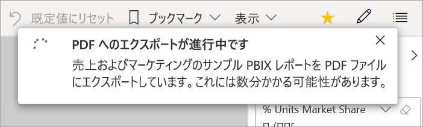
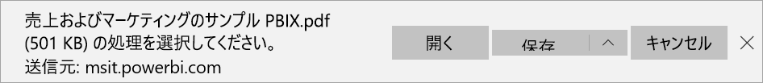

# Power BI から PDF にレポートをエクスポートする
Power BI では、レポートを PDF 形式に発行すると、Power BI レポートに基づくドキュメントを容易に作成することができます。 PDF にエクスポートすると、Power BI レポートの各ページが PDF ドキュメントの個々のページになります。

## Power BI レポートを PDF にエクスポートする
Power BI サービスで、レポートを選択してそれをキャンバス上に表示します。 また、 **[ホーム]** ページ、 **[アプリ]** 、または左側のナビゲーション ウィンドウの他のコンテナーから、レポートを選択することもできます。

1. メニュー バーから **[エクスポート]**  >  **[PDF]** を選択します。

    ![メニュー バーから [エクスポート] を選択する](media/end-user-pdf/power-bi-export.png)

    表示されるポップアップには、 **[現在の値]** または **[既定値]** を選択するオプションがあります。 **[現在の値]** では現在の状態でレポートがエクスポートされ、スライサーとフィルターの値に対して行ったアクティブな変更が含まれます。 ほとんどのユーザーは、このオプションを選択します。 または、 **[既定値]** を選択すると、レポートは "*設計者*" が共有したときの元の状態でエクスポートされ、元の状態に対して行った変更は反映されません。
    
    さらに、レポートの非表示のタブをエクスポートするかどうかを選択するチェック ボックスがあります。 ブラウザーに表示されるレポートのタブのみをエクスポートしたい場合は、このチェック ボックスをオンにします。 すべての非表示タブをエクスポートに含めたい場合は、このチェック ボックスをオフのままにします。 チェック ボックスがグレー表示になっている場合は、レポートには非表示タブはありません。 選択を行った後、 **[エクスポート]** を選択して続行します。
    
    右上隅に進行状況バーが表示されます。 エクスポートには数分かかる場合があります。 レポートのエクスポート中も Power BI で作業を進めることができます。

    

    Power BI サービスでエクスポート処理が完了すると、通知バナーに示されます。

2. ファイルは、ブラウザーがダウンロードしたファイルを表示する場所から使用できます。 次の図では、ブラウザー ウィンドウ下部のダウンロード バナーとして表示されています。

    

これで完了です。 ファイルをダウンロードすると、それを PDF ビューアー (Microsoft Edge で利用できる PDF ビューアーなど) を使用して開くことができます。

## 制限事項と考慮事項
"**PDF へのエクスポート**" 機能を使用する場合は、留意すべき注意事項と制限事項がいくつかあります。

* 現在、R ビジュアルはサポートされていません。 PDF では、これらのビジュアルは空白となり、エラー メッセージが表示されます。 
* 認定を受けたカスタム ビジュアルはサポートされます。 カスタム ビジュアルの認定を受ける方法など、認定を受けたカスタム ビジュアルの詳細については、[カスタム ビジュアルの認定](../power-bi-custom-visuals-certified.md)に関する記事を参照してください。 認定を受けていないカスタム ビジュアルはサポートされません。 PDF では、それらはエラー メッセージを伴って表示されます。 
* 現在、レポート ページが 30 ページを超えるレポートはエクスポートできません。
* レポートを PDF にエクスポートする処理が完了するまで数分かかる場合がありますので、しばらくお待ちください。 必要な時間に影響する要因としては、レポートの構造や、Power BI サービスの現在の負荷などがあります。
* Power BI サービスで **[PDF にエクスポート]** メニュー項目を使用できない場合は、テナント管理者が機能を無効にしている可能性があります。 詳細については、テナント管理者に問い合わせてください。
* 背景画像はグラフの境界領域でトリミングされます。 PDF にエクスポートする前に背景画像を削除することをお勧めします。
* 組織外のユーザーが所有していて、そのユーザーから共有されているレポートなど、Power BI テナント ドメイン外のユーザーによって所有されているレポートは、PDF に発行できません。
* 組織外の人、つまり、Power BI テナント内にいないユーザーとダッシュボードを共有している場合、そのユーザーは共有されたダッシュ ボードに関連付けられているレポートを PDF にエクスポートできません。 たとえば、ユーザー aaron@contoso.com は cassie@cohowinery.com と共有することができます。 しかし、cassie@cohowinery.com は関連付けられたレポートを PDF にエクスポートできません。
* 背景画像を含むレポートを使って PDF にエクスポートするとき、 **[ページの背景]** に対して **[標準]** または **[画面サイズに合わせる]** オプションを使用していると、歪んだ画像がエクスポートされる場合があります。 最適な結果を得るために、 **[描画に合わせる]** オプションを使って、エクスポートされたドキュメントに関する問題を回避します。
* Power BI サービスでは、Power BI の言語設定を PDF のエクスポート用の言語として使用します。 言語の優先順位を表示または設定するには、歯車アイコン  >  **[設定]**  >  **[全般]**  >  **[言語]** の順に選択します。
* 現在、エクスポートに **[現在の値]** を選択した場合、URL フィルターは適用されません。

## 次の手順
[レポートの印刷](end-user-print.md)
