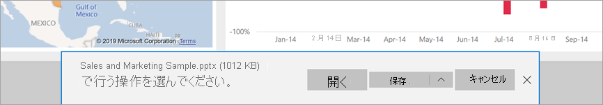
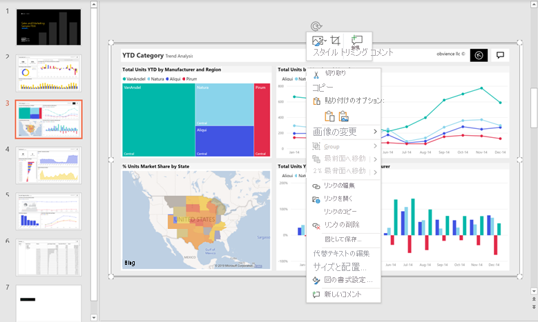

# レポートを PowerPoint にエクスポートする

[!INCLUDE[consumer-appliesto-yyny](../includes/consumer-appliesto-yyny.md)]

Power BI サービス (app.powerbi.com) では、レポートを Microsoft PowerPoint に発行して、Power BI レポートに基づくスライド デッキを簡単に作成できます。 PowerPoint にエクスポートすると、次のようになります。

* Power BI レポートの各ページは、PowerPoint の個々のスライドになります。
* Power BI レポートの各ページは、単一の高解像度のイメージとして PowerPoint にエクスポートされます。
* レポートに追加したフィルターとスライサーの設定は保持されます。
* PowerPoint に、Power BI レポートへのリンクが作成されます。

**Power BI レポート**は、**PowerPoint** に短時間でエクスポートできます。 次のセクションで説明する手順に従います。

Power BI サービスから一度に 1 つのビジュアルをコピーし、PowerPoint (または貼り付けをサポートする他の任意のプログラム) に貼り付けることもできます。 **[イメージとしてコピー]** アイコンを選択して、ビジュアルをクリップボードにコピーします。 次に、PowerPoint を開き、ビジュアルを貼り付けます。 詳細については、[静的画像としてのビジュアルのコピー](../visuals/power-bi-visualization-copy-paste.md)に関するページをご覧ください。

![[イメージとしてコピー] アイコンを選択する](media/end-user-powerpoint/power-bi-copy.png)

## Power BI レポートを PowerPoint にエクスポートする
**Power BI サービス**で、キャンバスに表示するレポートを選択します。 レポートは、 **[ホーム]** 、 **[アプリ]** 、またはナビゲーション ウィンドウの他の任意のコンテナーから選択することもできます。

[!INCLUDE [power-bi-service-new-look-include](../includes/power-bi-service-new-look-include.md)]

PowerPoint にエクスポートするレポートがキャンバスに表示されている場合は、メニュー バーから **[エクスポート]**  >  **[PowerPoint]** の順に選択します。

![メニュー バーから [エクスポート] を選択する](media/end-user-powerpoint/power-bi-export.png)

表示されるポップアップには、 **[現在の値]** または **[既定値]** を選択するオプションがあります。 **[現在の値]** では現在の状態でレポートがエクスポートされ、スライサーとフィルターの値に対して行ったアクティブな変更が含まれます。  ほとんどのユーザーは、このオプションを選択します。 スクロールしている場合、 **[現在の値]** にはビジュアルのスクロール状態は含まれず、代わりにデータの先頭部分がエクスポートされます。 または、 **[既定値]** を選択すると、レポートは*デザイナー*が共有した元の状態でエクスポートされ、元の状態に対して行った変更は反映されません。

 
さらに、レポートの非表示のタブをエクスポートするかどうかを選択するチェック ボックスがあります。 ブラウザーに表示されるレポートのタブのみをエクスポートしたい場合は、このチェック ボックスをオンにします。 すべての非表示タブをエクスポートに含めたい場合は、このチェック ボックスをオフのままにします。 チェック ボックスがグレー表示になっている場合は、レポートには非表示タブはありません。 非表示のタブの例は、[ツールヒント] タブです。[カスタム ツールヒント](../create-reports/desktop-tooltips.md)は、レポート "*デザイナー*" が作成するもので、"*コンシューマー*" 向けの Power BI サービスにはレポート タブとして表示されません。 

選択を行った後、 **[エクスポート]** を選択して続行します。 レポートが PowerPoint にエクスポートされていることを示す通知バナーが、Power BI サービス ブラウザー ウィンドウの右上隅に表示されます。 

エクスポートには数分かかる場合があります。 必要な時間に影響する要因としては、レポートの構造や、Power BI サービスの現在の負荷などがあります。 レポートのエクスポート中も Power BI で作業を進めることができます。

Power BI サービスでエクスポート処理が完了すると、通知バナーに示されます。 ファイルは、ブラウザーがダウンロードしたファイルを表示する場所から使用できます。 次の図では、ブラウザー ウィンドウ下部のダウンロード バナーとして表示されています。

これで完了です。 ファイルをダウンロードし、PowerPoint で開き、他の PowerPoint デッキと同様に変更したり拡張したりできます。

## PowerPoint ファイルを開く
Power BI でエクスポートした PowerPoint ファイルを開くと、便利な要素がいくつかあることに気付きます。 次の図を見て、番号に対応する説明で機能を確認してください。 PowerPoint のページは、Power BI レポートの元のページのサイズまたは寸法に関係なく、常に標準の 9:16 サイズで作成されます。

1. スライド デッキの最初のページには、レポートの名前と、スライド デッキの基になっているレポートを表示する **[Power BI で表示する]** リンクが含まれます。
2. レポートに関する有用な情報も表示されます。 **[前回のデータ更新]** には、エクスポートされたレポートの基になっている日付と時刻が表示されます。 **[Downloaded at]\(ダウンロード日時\)** には、Power BI レポートが PowerPoint ファイルにエクスポートされた日付と時刻が表示されます。 **[Downloaded at]\(ダウンロード日時\)** の時刻は、お使いのコンピューターのタイム ゾーンにおけるエクスポート時刻に設定されます。

3. ナビ ペインを見るとわかるように、各レポート ページは異なるスライドになっています。 
4. 公開されたレポートは Power BI の言語設定かブラウザーのロケール設定に基づいてレンダリングされます。 言語の優先順位を表示または設定するには、歯車アイコン  >  **[設定]**  >  **[全般]**  >  **[言語]** の順に選択します。 ロケール情報については、「[Power BI でサポートされる言語と国または地域](../fundamentals/supported-languages-countries-regions.md)」を参照してください。

個々のスライドを見ると、各レポート ページが独立した画像になっていることがわかります。 PowerPoint の各スライドは静的な画像であるため、スクロールはできません。

PowerPoint デッキや高解像度画像についての作業を自由に行うことができます。

## 考慮事項とトラブルシューティング
"**PowerPoint へのエクスポート**" 機能を使用する場合は、留意すべき注意事項と制限事項がいくつかあります。
 

* 現在、エクスポートに **[現在の値]** を選択した場合、[URL フィルター](../collaborate-share/service-url-filters.md)は適用されません。

* カスタム フォントが使用されているレポートを PowerPoint にエクスポートすると、そのフォントは既定のフォントで置き換えられます。

* 次のビジュアルの種類はサポートされていないため、PowerPoint にエクスポートされません。
   - [認定を受けていないカスタム ビジュアル](../developer/visuals/power-bi-custom-visuals-certified.md)はサポートされていません。 
   - [ESRI ArcGIS ビジュアル](../visuals/power-bi-visualizations-arcgis.md)はサポートされていません
   - R および Python のビジュアルはサポートされていません。
   - 背景画像はグラフの境界領域でトリミングされます。 PowerPoint にエクスポートする前に背景画像を削除することをお勧めします。

* 一部のレポートはエクスポートできません。 次のようなものが含まれます。
    - 組織外のユーザーが所有していて、そのユーザーから共有されているレポートなど、Power BI テナント ドメイン外のユーザーによって所有されているレポート。
    - 組織外の人、つまり、Power BI テナント内にいないユーザーとダッシュボードを共有している場合、そのユーザーは共有されたダッシュ ボードに関連付けられているレポートを PowerPoint にエクスポートできません。 たとえば、ユーザー aaron@contoso.com は david@cohowinery.com と共有することができます。 しかし、david@cohowinery.com は関連付けられたレポートを PowerPoint にエクスポートできません。
    - 30 を超えるレポート ページを含むレポート。 最初の 30 ページのみがエクスポートされます。
    - 以前のバージョンの PowerPoint へのレポートのエクスポート。

* Power BI サービスで **[PowerPoint へのエクスポート]** メニュー項目を使用できない場合は、テナント管理者が機能を無効にしている可能性があります。 詳細については、テナント管理者に問い合わせてください。
* Power BI サービスでは、Power BI の言語設定を PowerPoint のエクスポート用の言語として使用します。 言語の優先順位を表示または設定するには、歯車アイコン  >  **[設定]**  >  **[全般]**  >  **[言語]** の順に選択します。

## 次の手順
[ビジュアルを静的イメージとしてコピー](../visuals/power-bi-visualization-copy-paste.md)    
[レポートの印刷](end-user-print.md)
