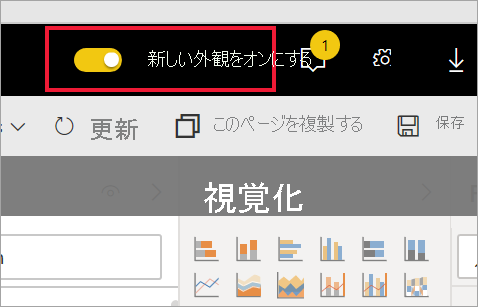

# Power BI サービスのプレビュー機能のオプトイン

[!INCLUDE[consumer-appliesto-yynn](../includes/consumer-appliesto-yynn.md)]

## *プレビュー機能* とは
Power BI サービスの機能向上を行ったときは、新しい機能を*プレビュー機能*としてリリースします。 プレビュー機能を有効および無効にして、試すことができます。

一部のプレビュー機能は、ご利用の Power BI ダッシュボード、ホーム、またはレポート自体から切り替えることができます。

   

他のプレビュー機能は、ご自分の [*設定*] メニューから利用できます。 この記事では、[設定] メニューを使用してプレビュー機能にアクセスする方法について説明します。

## プレビューを探して有効 (または無効) にする
1. Power BI 画面の右上隅にある歯車アイコンをクリックして **[設定]** を選択し、[設定] メニューを開きます。
   
   ![[設定] メニュー](./media/end-user-preview-features/power-bi-settings.png).
2. **[全般]** タブを選びます。プレビューが存在する場合、 **[プレビュー機能]** オプションが表示されるか、または左側にプレビュー機能の一覧が表示されます。  次の例では、プレビューの一覧には ArcGIS Maps が表示されています。 
   
   ![[全般] タブ](./media/end-user-preview-features/power-bi-preview-esri.png)
3. 新しいエクスペリエンスを試すには、 **[オン]** のラジオ ボタンを選ぶか、チェック ボックスをオンにします。 そして、 **[適用]** を選びます。
4. プレビュー機能を無効にするには、上記の手順 1 から 3 までを行うとき、手順 3 で、 **[オフ]** を選択するか、チェックボックスをオフにして **[適用]** を選択します。

質問やフィードバックがある場合は、 [Power BI のコミュニティ フォーラムを利用してください](https://community.powerbi.com/t5/Navigation-Preview-Forum/bd-p/NavigationPreview)。

