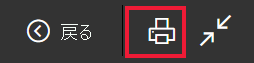
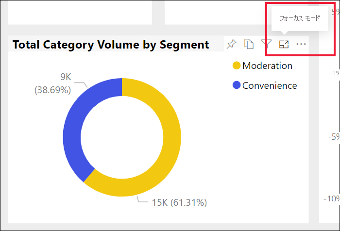

# Power BI サービスから印刷する

[!INCLUDE[consumer-appliesto-yynn](../includes/consumer-appliesto-yynn.md)]
## 印刷できる内容
[!INCLUDE [power-bi-service-new-look-include](../includes/power-bi-service-new-look-include.md)]

Power BI サービスから、ダッシュボード全体、ダッシュボード タイル、レポート ページ、またはレポートのビジュアルを印刷します。 レポートに複数のページがある場合は、各ページを個別に印刷する必要があります。 

## 印刷に関する考慮事項

ほとんどの Power BI ダッシュボードとレポートはレポート "*デザイナー*" によって作成され、オンラインで使用できます。また、さまざまなデバイスで適切に表示されます。 レポートを印刷する場合、そのコンテンツが用紙に表示される方法はブラウザーによって制御されます。 

印刷を調整するために使用できるブラウザーの設定はありますが、それでも必要な結果が得られない場合があります。 このような場合は、まず [PDF にエクスポート](end-user-pdf.md)し、その PDF を印刷することを検討します。 

## ブラウザーの印刷設定を調整する
Power BI から印刷すると、ブラウザーによって [印刷] ウィンドウが開かれます。 [印刷] ウィンドウはブラウザーによって異なります。 ただし、印刷物の外観を制御するために使用できる同様のオプションがいずれにも用意されています。 

ここでは、印刷の書式設定に使用できる簡単なヒントをいくつか紹介します。

   > 
1. ダッシュボード、レポート、またはビジュアルの幅が高さよりも広い場合は、 **[横]** レイアウトの使用を検討します。 

   ![[横] のレイアウトが表示された [印刷] ダイアログ](./media/end-user-print/power-bi-landscape-layout.png)

2. さらに印刷ページに合わせるには、余白や倍率などを調整します。 

    ![[詳細設定] が表示された [印刷] ダイアログ](./media/end-user-print/power-bi-margins.png)

目的の外観になるまで、ブラウザーの各設定を試してみましょう。 一部のブラウザーには、背景のグラフィックスを印刷するオプションも用意されています。 

## ダッシュボードの印刷
1. 印刷するダッシュボードを開きます。
2. 左上隅にある **[ファイル]** を選択し、 **[このページを印刷します]** を選択します。
   
    ![[ダッシュボードを印刷] オプション](./media/end-user-print/power-bi-dashboard-print-options.png)

3. お使いのブラウザーの [印刷] ウィンドウが開きます。 設定を選択します。 たとえば、ダッシュボードの幅が高さよりも広い場合は、レイアウトを **[横]** に変更することができます。 **[印刷]** を選択します。
   
    ![[印刷] ダイアログ](./media/end-user-print/power-bi-print-dash.png)

## ダッシュボード タイルの印刷
1. 上部メニュー バーの全画面表示アイコン  を選択すると、ダッシュボードが[全画面表示モード](end-user-focus.md)で開きます。

3. カーソルを置いて**その他のオプション** (...) を表示し、 **[フォーカス モードで開く]** かフォーカス アイコン  を選択すると、[タイルがフォーカス モードで開きます](end-user-focus.md)。
   
    

4. タイルの上にカーソルを移動して、[オプション] メニューを表示します。
   
    

    

4. [印刷] アイコンを選択します。 ![[印刷] アイコン](./media/end-user-print/print-icon.png).     

5. お使いのブラウザーの [印刷] ウィンドウが開きます。 設定を選択します。 たとえば、タイルがページに収まらない場合は、倍率を 75% に変更することができます。 **[印刷]** を選択します。

    ![[印刷] ウィンドウ](./media/end-user-print/power-bi-scale.png) 

> [!TIP]
> これらの手順をすべて実行しても、希望どおりにタイルが表示されない場合は、以下を試します。
> 1. [印刷] ウィンドウを開き、最適な印刷結果が得られるように印刷設定を変更します。 たとえば、レイアウト、余白、倍率を変更します。 
> 2. ただし、印刷せずに **[キャンセル]** を選択します。 
> 3. 手順 1 から 5 をもう一度実行します。 タイルが新しい [印刷] ウィンドウの設定に合わせて調整され、印刷されるようになります。

## レポート ページの印刷
レポートは、一度に 1 ページを印刷できます。

1. レポートを開き、 **[ファイル]**  >  **[このページを印刷します]** を選択して現在のレポート ページを印刷します。
   
    
2. お使いのブラウザーの [印刷] ウィンドウが開きます。

3. 前述の「**ダッシュボードの印刷**」の印刷手順を実行します。
   

## レポートのビジュアルの印刷
1. タイルをポイントし、右上隅のフォーカス アイコン  を選ぶことにより、[フォーカス モードでビジュアルを開きます](end-user-focus.md)。

    

2. 左上隅にある **[ファイル]**  >  **[このページを印刷します]** を選択して視覚エフェクトを印刷します。

    ![Power BI の [ファイル] メニューのスクリーンショット](./media/end-user-print/power-bi-visual-print.png)

3. 前述の「**ダッシュボードの印刷**」の印刷手順を実行します。

## 考慮事項とトラブルシューティング

* Q: すべてのレポート ページを一度に印刷できません。    
* A: これは正しい動作です。 レポートは、一度に 1 ページのみ印刷できます。
* Q: PDF に出力できません。    
* A: このオプションは、ブラウザーに PDF ドライバーを構成している場合のみ表示されます。    
* Q: **[印刷]** を選択したときに表示される画面が、ここに示されている図と一致しません。    
* A: 印刷画面は、ブラウザーとソフトウェアのバージョンによって異なります。
* Q: 印刷の拡大/縮小が正しく行われません。  ダッシュボードがページに収まりません。 印刷の向きなどに問題があります。    
* A:印刷結果が Power BI サービスでの表示と必ず同じになることは保証できません。 拡大/縮小、余白、ビジュアルの詳細、向き、サイズなどは、Power BI によって制御されません。 ブラウザーの印刷設定を調整してみてください。 前述の提案内容として、ページの向き (縦または横)、余白サイズ、倍率があります。 これらで解決しない場合は、お使いのブラウザーのドキュメントを参照してください。      
* Q:全画面表示モードから印刷する場合、ビジュアルにマウス ポインターを合わせても [印刷] オプションが表示されません。   
* A:既定のビューのダッシュボードまたはレポートに戻り、フォーカス モードでビジュアルを再び開き、全画面表示モードで開きます。 

## 次のステップ
[同僚や他のユーザーとダッシュボードやレポートを共有する](../collaborate-share/service-share-dashboards.md)

その他の質問 [Power BI コミュニティを利用してください](https://community.powerbi.com/)。
