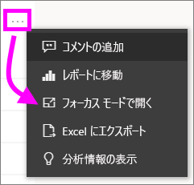
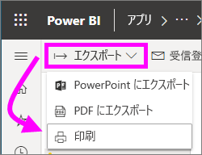

# Power BI サービスから印刷する

[!INCLUDE [power-bi-service-new-look-include](../includes/power-bi-service-new-look-include.md)]

Power BI サービスから、ダッシュボード全体、ダッシュボード タイル、レポート ページ、またはレポートのビジュアルを印刷します。 レポートは、一度に 1 ページのみを印刷できます。レポート全体を一度に印刷することはできません。

   > [!NOTE]
   > 表示される印刷ダイアログ ボックスは、お使いのブラウザーによって異なります。
   > 
## ダッシュボードの印刷
1. 印刷するダッシュボードを開きます。
2. 左上隅で [エクスポート] を選択し、 **[このページを印刷します]** を選択します。
   
    ![[ダッシュボードを印刷] オプション](./media/end-user-print/power-bi-dashboard-print.png)
3. お使いのブラウザーの [印刷] ウィンドウが開きます。 設定と出力先を選択して、 **[印刷]** を選択します。
   

   
    ![[印刷] ダイアログ](./media/end-user-print/power-bi-print-dash.png)

## ダッシュボード タイルの印刷
1. 上部メニュー バーの全画面表示アイコン  を選択すると、ダッシュボードが[全画面表示モード](end-user-focus.md)で開きます。
3. カーソルを置いて**その他のオプション** (...) を表示し、 **[フォーカス モードで開く]** かフォーカス アイコン  を選択すると、[タイルがフォーカス モードで開きます](end-user-focus.md)。
   
    
4. タイルの上にカーソルを移動して、[オプション] メニューを表示します。
   
    
4. [印刷] アイコン ![[印刷] アイコン](./media/end-user-print/print-icon.png) を選びます。     
   

## レポート ページの印刷
レポートは、一度に 1 ページを印刷できます。

1. レポートを開き、 **[エクスポート]** の **[印刷]** を選択すると、現在のレポート ページが印刷されます。
   
    
3. お使いのブラウザーの [印刷] ウィンドウが開きます。
   

## レポートのビジュアルの印刷
1. タイルをポイントし、右上隅のフォーカス アイコン  を選ぶことにより、[フォーカス モードでビジュアルを開きます](end-user-focus.md)。

2. 左上隅から **[エクスポート]** の **[印刷]** を選択するとビジュアルが印刷されます。

    

## 考慮事項とトラブルシューティング

* Q:すべてのレポート ページを一度に印刷できません。    
* A:これは正しい動作です。 レポートは、一度に 1 ページのみ印刷できます。
* Q:PDF に出力できません。    
* A:このオプションは、ブラウザーに PDF ドライバーを構成している場合のみ表示されます。    
* Q: **[印刷]** を選択したときに表示される画面が、ここに示されている図と一致しません。    
* A:印刷画面は、ブラウザーとソフトウェアのバージョンによって異なります。
* Q:印刷の拡大縮小が正しく行われません。  ダッシュボードがページに収まりません。 印刷の向きなどに問題があります。    
* A:印刷結果が Power BI サービスでの表示と必ず同じになることは保証できません。 拡大/縮小、余白、ビジュアルの詳細、向き、サイズなどは、Power BI によって制御されません。 このような問題については、お使いのブラウザーのマニュアルを参照してください。      

## 次の手順
[同僚や他のユーザーとダッシュボードやレポートを共有する](../service-share-dashboards.md)

他にわからないことがある場合は、 [Power BI コミュニティを利用してください](https://community.powerbi.com/)。

