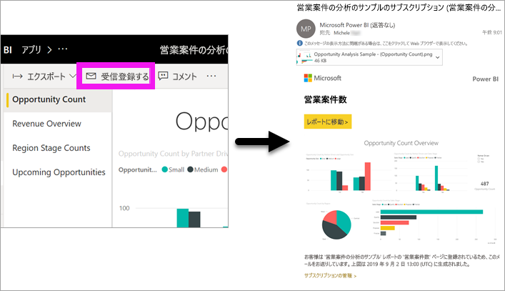
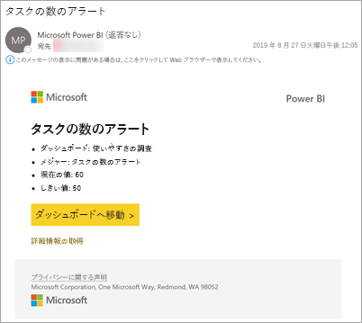
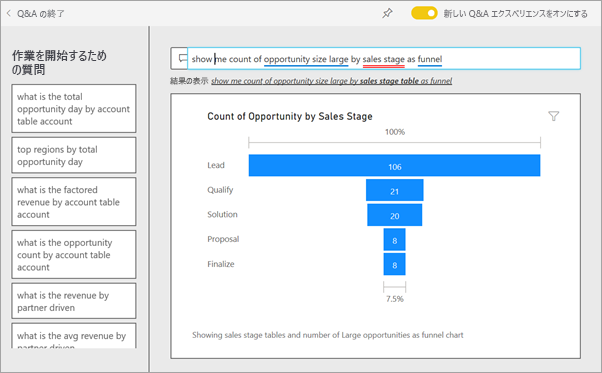
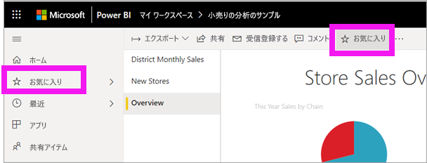
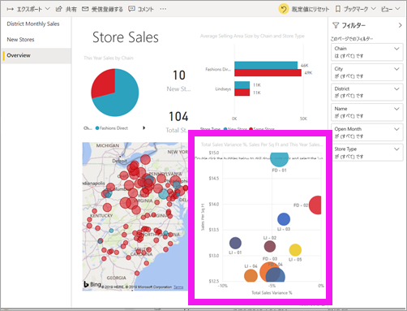
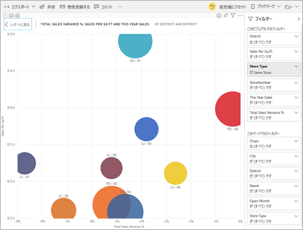
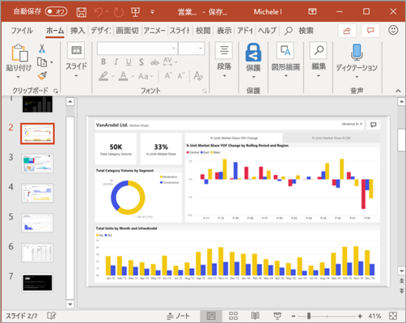

# クイック スタート: *コンシューマー*向けの Power BI の機能について学習する

[!INCLUDE[consumer-appliesto-ynny](../includes/consumer-appliesto-ynny.md)]

このクイック スタートでは、Power BI と対話してデータ駆動型のビジネスの分析情報を発見する方法について説明します。 この記事の意図は、詳細な情報を提供することではなく、Power BI の**コンシューマー**が使用できるアクションの多くを簡単に説明することです。

Power BI にサインアップしていない場合は、[無料の試用版にサインアップ](https://app.powerbi.com/signupredirect?pbi_source=web)してください。

## Power BI とは? 
Power BI はソフトウェア サービス、アプリ、コネクタのコレクションで、これらを組み合わせることで、関連性のないデータ ソースから、まとまりがあり、実体験的な対話型の分析情報を得ることができます。 簡単な Excel スプレッドシートのデータでも、さまざまなデータ ソースのデータのコレクションでも、Power BI を使用すると、データ ソースに簡単に接続し、重要なことを視覚化 (または検出) して、それを必要に応じて特定のユーザーまたはすべてのユーザーと共有することができます。 

![[アプリの取得] アイコン](./media/end-user-reading-view/power-bi-conceptual.png)

## 読み取りビュー
Power BI サービスでは、レポートの "*コンシューマー*" 用に読み取りビューを使用できます。 同僚からレポート、ダッシュボード、アプリを共有されたら、読み取りビューを使用してレポートを探索し、レポートを操作します。 

ブラウザーまたはモバイル デバイスで Power BI サービスを開くだけです。 自分も同僚も、自動的に更新されて最新の情報が表示される、信頼済みの同じアプリ、ダッシュボード、レポートから作業を行うため、常に最新のコンテンツで作業できます。   

コンテンツは静的ではないため、傾向、分析情報、およびその他のビジネス インテリジェンスを探して、より詳しく調べることができます。 コンテンツを細かく分けます。自分の言葉を使って質問することもできます。 または、自分から何もしなくても、データによって興味深い分析情報が見つかります。データが変更されるとアラートが送信され、設定したスケジュールに基づいてメールでレポートが送信されます。 任意のデバイスから、クラウドまたはオンプレミスのすべてのデータをいつでも使用できます。 

さらに読み進めて、詳しく学習しましょう。

## Power BI コンテンツ
Power BI で "コンテンツ" という用語を使用するときは、レポート、ダッシュボード、およびアプリを指しています。 これらは、データを探索し、ビジネス上の意思決定を行うために使用する構成要素です。 

> [!NOTE]
> ダッシュボード、レポート、アプリは、モバイル デバイス上で表示および共有することもできます。

###  Apps

*アプリ*とは、関連するダッシュ ボードとレポートがすべて 1 か所にまとめられた Power BI のコンテンツの種類です。 アプリでは、1 つ以上のダッシュ ボードと 1 つ以上のレポートをすべてまとめることができます。 アプリは、あなたのような*コンシューマー*に、アプリを配布するおよび共有する Power BI *デザイナー*によって作成されます。 

アプリを表示する方法の 1 つは、ナビ ペインから **[アプリ]** を選択し、開くアプリを選択することです。

![[アプリの取得] アイコン](./media/end-user-reading-view/power-bi-apps.png)

アプリの表示の詳細については、[Power BI アプリ](end-user-apps.md)に関するページを参照してください

### レポート

Power BI レポートはデータセットのマルチパースペクティブ表示です。データセットからのさまざまな結果や分析情報がビジュアルによって表されます。 レポートでは、単一のビジュアルを使用することも、各ページでさまざまなビジュアルを使用することもできます。 レポートは、あなたのような "*コンシューマー*" にレポートを配布して共有する Power BI "*デザイナー*" によって作成されます。

![[アプリの取得] アイコン](./media/end-user-reading-view/power-bi-report-phone.png)

レポートを表示する方法については、[Power BI レポート](end-user-reports.md)に関するページを参照してください

### ダッシュボード

Power BI のダッシュボードは、視覚エフェクトを使ってストーリーを伝える単一のページであり、キャンバスと呼ばれることもよくあります。 ダッシュボードは 1 ページに制限されているため、適切に設計されたダッシュボードには、そのストーリーの最も重要な要素のみが含まれます。

ダッシュボードに表示される視覚エフェクトはタイルと呼ばれ、レポートの "*デザイナー*" によってダッシュボードにピン留めされています。 通常、タイルを選択すると、その視覚エフェクトが作成されたレポート ページに移動します。 

![[アプリの取得] アイコン](./media/end-user-reading-view/power-bi-dashboard-phone.png)

ダッシュボードを表示する方法については、[Power BI ダッシュボード](end-user-dashboards.md)に関するページを参照してください
 
## Power BI サービスで操作する

### 同僚と共同作業する
メールの手間を省きます。 ダッシュボードで直接、そのダッシュボードに関する個人のコメントを追加したり、そのダッシュボードについての会話を同僚と始めたりします。 コメント機能は、他のユーザーと共同作業できる方法の 1 つにすぎません。 

詳細については、[コメント作成](end-user-comment.md)に関するページを参照してください

### 自分は何もせず Power BI に作業を任せる
自分の代わりに Power BI サービスに作業を行わせる 2 つの方法は、サブスクリプションとアラートを使用することです。 

#### ダッシュボード (またはレポート) をサブスクライブする
ダッシュボードを監視するために Power BI を開く必要はありません。  代わりにサブスクライブすることで、設定したスケジュールに従って Power BI からそのダッシュボードのスナップショットが電子メールで送信されます。 

.

 詳細については、[Power BI サブスクリプション](end-user-subscribe.md)に関するページを参照してください

#### データがしきい値に達したときにアラートを受け取る
データはライブであり、ビジュアルはこれを反映するように自動的に更新されます。 設定したしきい値を上回って、または下回ってデータが変化したときに通知を受け取る場合は、データ アラートを使用します。 アラートは、ゲージ、KPI、カードに対して動作します。    

設定した制限を超えて値が増減すると、Power BI によってメールが送信されます。  

詳細については、[Power BI アラート](end-user-alerts.md)に関するページを参照してください

### Q&A を使用して、自然言語で質問をする
自然言語を使用して質問するのが、データから回答を得る最も速い方法である場合があります。 Q&A の質問ボックスは、ダッシュボードの上部にあります。 たとえば、「show me count of large opportunities by sales stage as a funnel」 (大規模案件の数を営業段階ごとにじょうごとして表示する) と入力します。 

詳細については、[Power BI Q&A](end-user-q-and-a.md) に関するページを参照してください

### 視覚化の詳細を表示する
ビジュアルはデータポイントで構成されており、データポイントの上にカーソルを置くことによって、詳細を表示できます。

### ダッシュボードをお気に入りにする
コンテンツを "*お気に入り*" に登録すると、ナビ ペインからアクセスすることができます。 ナビ ペインは、Power BI のほぼすべての領域から表示されます。 通常、最も頻繁に利用するダッシュボード、レポート ページ、アプリをお気に入りに登録します。

Power BI サービスの右上隅にある **[お気に入り]** を選択するか、それが表示されていない場合は、**その他のオプション** (...) を選択してドロップダウンから **[お気に入り]** を選択します。 
   

ドロップダウンで利用可能な他の操作を確認します。  この記事ではすべてについては説明しませんが、他の記事で説明されています。  詳細については、Power BI の目次または**検索**フィールドを使用して参照してください。 

詳細については、[お気に入りとおすすめ](end-user-favorite.md)に関するページを参照してください

### 表示サイズを調整する
レポートは、さまざまなデバイスで表示され、その画面サイズや縦横比も異なります。  既定のレンダリングでは、ご使用のデバイスの表示サイズに合わない場合があります。  

調整するには、右上のメニュー バーから **[表示]** を選択し、表示オプションの 1 つを選択します。 

![レポートの [表示] メニュー](media/end-user-reading-view/power-bi-view-menu.png)

### ページ上のすべてのビジュアルがどのように相互接続されているのかを表示する
レポート ページ上の関連する視覚エフェクトをクロス強調表示およびクロス フィルター処理します。 同じ 1 つのレポート ページにある視覚化は、相互に「つながって」います。  つまり、1 つの視覚化で 1 つ以上の値を選択すると、同じ値を使う他の視覚化が自分の選択内容に基づいて変更されます。

> 

詳細については、[ビジュアル対話](end-user-interactions.md)に関するページを参照してください

<!-- ###  Open the **Selection** pane
Easily navigate between the visualizations on the report page. 

1. Select **View > Selection pane** to open the Selection pane. Toggle **Selection pane** to On.

    

2. The Selection pane opens on your report canvas. Select a visual from the list to make it active.

     -->

### 個々のビジュアルにズームイン
視覚化をポイントし、 **[フォーカス モード]** アイコンを選択します ![メニューから [フォーカス モード] を選択する](media/end-user-reading-view/pbi_popouticon.jpg)。 下の画像のように、フォーカス モードで視覚エフェクトを表示すると、レポート キャンバス全体を埋めるよう拡大されます。

<!-- To display that same visualization without the distraction of menubars, filter pane, and other chrome -- select the **Full Screen** icon from the top menubar    .

 -->

詳細については、[フォーカス モードと全画面表示モード](end-user-focus.md)に関するページを参照してください

### 視覚化を並べ替える
レポート ページ上のビジュアルは、並べ替えて、適用した変更と共に保存することができます。 

ビジュアルをポイントしてアクティブにし、**その他のオプション** (...) を選択して並べ替えオプションを開きます。

 

詳細については、[ビジュアルの並べ替え](end-user-search-sort.md)に関するページを参照してください

### 視覚化の作成に使用されたデータを表示する
Power BI のビジュアルは、基礎データセットからのデータを使用して作成されます。 目に見えない部分を確認する場合は、ビジュアルの作成に使用されているデータを Power BI によって*表示*することができます。 **[データの表示]** を選択すると、ビジュアルの下 (または横に) データが表示されます。

ビジュアルをアクティブにし、**その他のオプション** (...) を選択して **[データを表示します]** を選択します。
   
   ![[データの表示] の選択](./media/end-user-show-data/power-bi-explore-show-data.png)

### Excel にデータをエクスポートする
ビジュアルの作成に使われているデータを表示するだけでなく、そのデータをエクスポートして、Microsoft Excel で表示することもできます。 Excel にエクスポートすると、Power BI の一部ではないスプレッドシートが別のドキュメントとして作成されます。 Excel ファイルで変更を行っても、Power BI のデータには影響しません。 データを詳しく調べたり、別のアプリケーションや別の目的でデータを使ったりしたい場合、Power BI ではそれを柔軟に行うことができます。

<!-- Exporting isn't limited to individual visuals; you can export entire reports to PowerPoint or PDF to share with your colleagues.

 -->

ここでは、"*コンシューマー*" が Power BI サービスを使ってできることのほんの一部について、簡単にその概要を説明しました。  

## リソースをクリーンアップする
- アプリに接続した場合は、ナビ ペインから **[アプリ]** を選択して、アプリのコンテンツ リストを開きます。 削除するアプリにカーソルを合わせ、ごみ箱アイコンを選択します。

- Power BI のサンプル レポートをインポートしたか、それに接続した場合は、ナビ ペインから **[マイ ワークスペース]** を開きます。 上部にあるタブを使用して、ダッシュボード、レポート、およびデータセットを見つけ、それぞれにごみ箱アイコンを選択します。

## 次の手順
[コンシューマー向けの Power BI](end-user-consumer.md)

