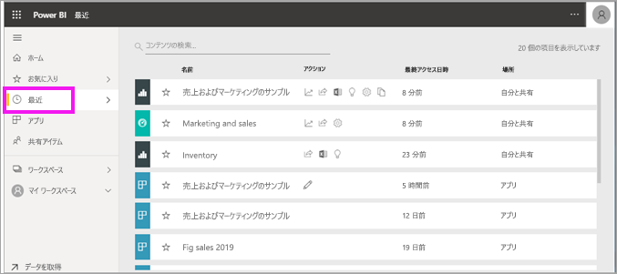
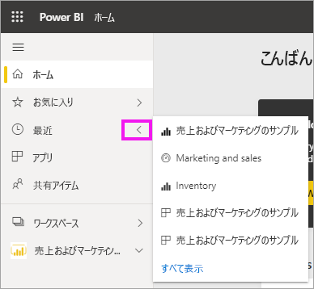
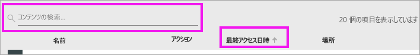

# Power BI サービスの "**最近**" のコンテンツ
最近のコンテンツとは、Power BI サービスで最近表示した最大 20 個のアイテムです。  これには、ダッシュボード、レポート、アプリ、ブックが含まれます。

Amanda による Power BI サービスの **[最近]** コンテンツの一覧の入力方法のデモンストレーションを見たら、下のビデオの手順に従ってご自分で試してください。

<iframe width="560" height="315" src="https://www.youtube.com/embed/G26dr2PsEpk" frameborder="0" allowfullscreen></iframe>

> [!NOTE]
> このビデオでは、古いバージョンの Power BI サービスを使用しています。

## 最近のコンテンツを表示する
最近アクセスした 5 つのアイテムを確認するには、ナビゲーション ウィンドウで、 **[最近]** の右にある矢印を選択します。  ここからは、最近のコンテンツを選んで開くことができます。 最近の 5 つのアイテムのみが一覧表示されます。

最近アクセスしたアイテムが 5 つを超える場合、 **[すべて表示]** を選択して [最近] 画面を開きます。 ナビゲーション ウィンドウから、 **[最近]** 、または [最近] ![[最近] アイコン](./media/end-user-recent/power-bi-icon.png) アイコンを選ぶことでもきます。

## **[最近]** コンテンツ リストから使用できるアクション
使用できるアクションは、コンテンツの*デザイナー*によって割り当てられた設定によって異なります。 オプションには次のようなものがあります。
* 星のアイコンを選択して、[ダッシュボード、レポート、またはアプリをお気に入りに追加します](end-user-favorite.md) 。
* 一部のダッシュボードとレポートを再共有することができます。  .
* [レポートを Excel で開きます](end-user-export.md)  
* Power BI によるデータの[分析情報を表示](end-user-insights.md)します 。
* また、多数ある場合、[検索フィールドと並べ替えを使用して検索することも](end-user-search-sort.md)できます。 列を並べ替えることができるかどうかを調べるには、ポイントして矢印が表示されるかどうかを確認します。 この例では、 **[最終アクセス日時]** をポイントすると、矢印が表示されます。最近のコンテンツはアクセス日時で並べ替えることができます。 

    

## 次の手順
[Power BI サービス アプリ](end-user-apps.md)

他にわからないことがある場合は、 [Power BI コミュニティを利用してください](https://community.powerbi.com/)。

