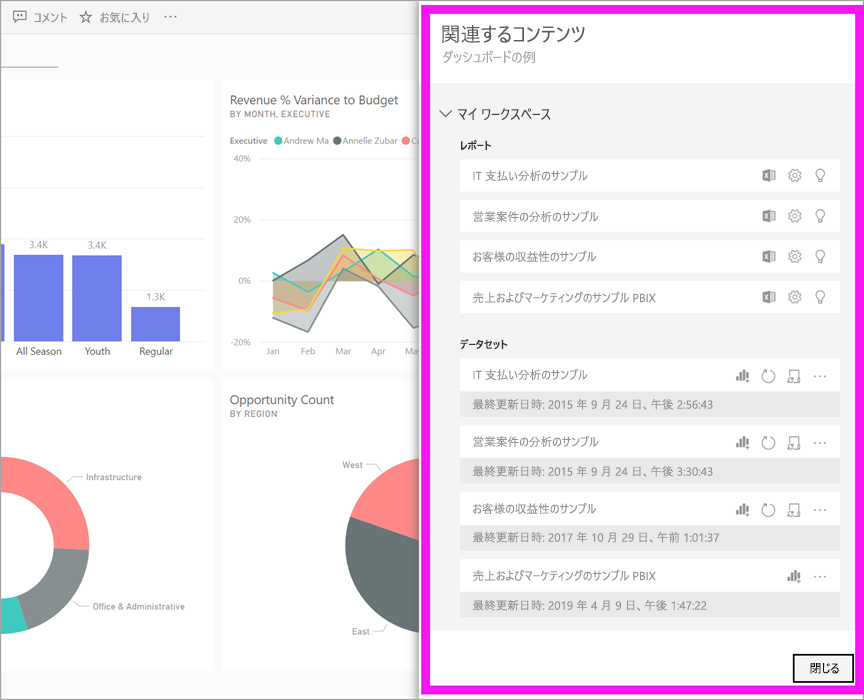
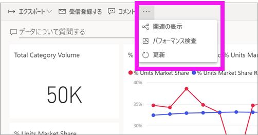
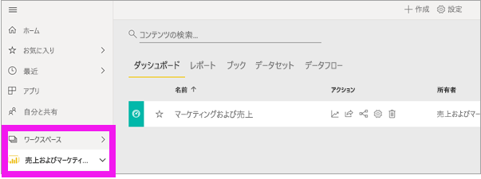
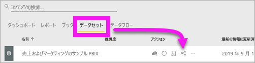

# Power BI サービスで関連するコンテンツを表示する

[!INCLUDE [power-bi-service-new-look-include](../includes/power-bi-service-new-look-include.md)]

**[関連するコンテンツ]** ペインには、Power BI サービスのコンテンツ (ダッシュボード、レポート、データセット) がどのように相互接続されているかが示されます。 **[関連するコンテンツ]** ウィンドウは、操作を実行するための起動パッドでもあります。 ここからは、ダッシュボードを開いたり、レポートを開いたり、分析情報を生成したり、Excel でデータを分析するといった操作を行うことができます。  

Power BI では、レポートはデータセットを基にして作成されていて、レポートのビジュアルはダッシュボードにピン留めされ、ダッシュボードのビジュアルはレポートにリンクしています。 しかし、マーケティング レポートのビジュアルをホストしているダッシュボードをどのようにして知りますか。 そのダッシュボードをどのようにして見つけますか。 調達ダッシュボードでは複数のデータセットからのビジュアルが使われていますか。 その場合、どのような名前が付けられていて、開いて編集するにはどうすればよいですか。 HR データセットはレポートやダッシュボードで使われていますか。 または、それはリンクを壊さずに移動できますか。 このような疑問の答えは、 **[関連するコンテンツ]** ペインでわかります。  このペインでは、関連するコンテンツが表示されるだけでなく、コンテンツに対する操作を実行し、関連するコンテンツ間を簡単に移動することもできます。

> [!NOTE]
> 関連するコンテンツの機能は、ストリーミング データセットには機能しません。
> 
> 

## ダッシュボードまたはレポートの関連するコンテンツを表示する
Watch ではダッシュボードの関連するコンテンツが表示されます。 その後、ビデオで説明されている手順に従って、ご自分でやってみてください。データセットは、調達の分析のサンプルをご利用ください。

<iframe width="560" height="315" src="https://www.youtube.com/embed/B2vd4MQrz4M#t=3m05s" frameborder="0" allowfullscreen></iframe>

ダッシュボードまたはレポートを開いた状態で、メニュー バーの**その他のオプション** (...) を選択し、ドロップダウンから **[関連の表示]** を選択します。

**[関連するコンテンツ]** ペインが開きます。 ダッシュボードの場合、ダッシュボードに視覚エフェクトがピン留めされているすべてのレポートと、それに関連付けられているデータセットが表示されます。 このダッシュボードでは、1 つのレポートからのみピン留めされた視覚エフェクトがあり、そのレポートは 1 つのデータセットのみに基づいています。 

![[関連するコンテンツ] ウィンドウ](./media/end-user-related/power-bi-view-related-dashboard.png)

ここからは、関連するコンテンツに対する操作を直接実行できます。  たとえば、レポートまたはダッシュボード名を選択して開きます。  表示されたレポートで、[Excel で分析](../service-analyze-in-excel.md)や[詳細情報の取得](end-user-insights.md)などのアイコンを選択します。 データセットの場合は、最後に更新された日時を確認し、[Excel で分析](../service-analyze-in-excel.md)し、[詳細情報を取得する](end-user-insights.md)ことができます。  

## データセットの関連するコンテンツを表示する
**[関連するコンテンツ]** ペインを開くには、データセットに対する "*表示*" アクセス許可が少なくとも必要です。 この例では、[調達の分析のサンプル](../sample-procurement.md)を使います。

ナビ ペインで **[ワークスペース]** の見出しを探し、一覧からワークスペースを選択します。 ワークスペースにコンテンツがある場合は、右側のキャンバスに表示されます。 

ワークスペースで **[データセット]** タブを選び、 **[関連の表示]** アイコン ![[関連の表示] アイコン](./media/end-user-related/power-bi-view-related-icon-new.png) を探します。

アイコンを選び、 **[関連するコンテンツ]** ペインを開きます。

![Power BI のコンテンツ ビューの上部にある [関連するコンテンツ] ペイン](media/end-user-related/power-bi-dataset.png)

ここからは、関連するコンテンツに対する操作を直接実行できます。 たとえば、ダッシュボード名またはレポート名を選んで開きます。  一覧のダッシュボードで、[ダッシュボードを他のユーザーと共有する](../service-share-dashboards.md)アイコンや、ダッシュボードの **[設定]** ウィンドウを開くアイコンを選びます。 レポートで、[Excel での分析](../service-analyze-in-excel.md)、[名前の変更](../service-rename.md)、[詳細情報の取得](end-user-insights.md)などのアイコンを選びます。  

## 制限事項とトラブルシューティング
* "関連の表示" が表示されない場合は、代わりにそのアイコンを探します ![[関連の表示] アイコン](./media/end-user-related/power-bi-view-related-icon-new.png)。 アイコンを選び、 **[関連するコンテンツ]** ペインを開きます。
* レポートの関連するコンテンツを開くには、[[読み取りビュー]](end-user-reading-view.md) を表示している必要があります。
* 関連するコンテンツの機能は、ストリーミング データセットには機能しません。

## 次の手順
* [Power BI サービスの概要](../service-get-started.md)
* 他にわからないことがある場合は、 [Power BI コミュニティを利用してください](https://community.powerbi.com/)。

