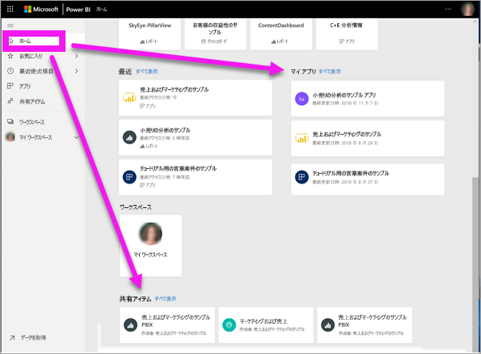
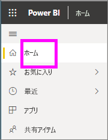
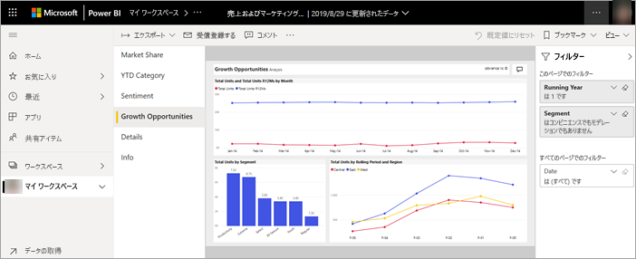
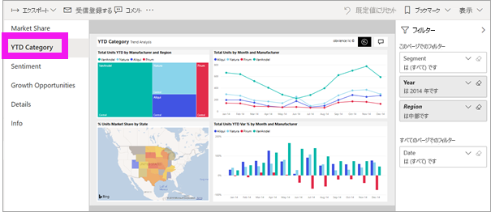
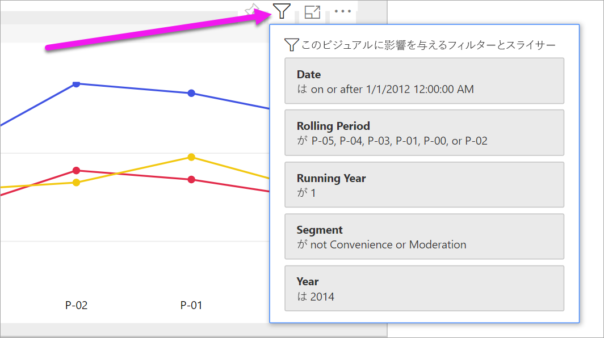
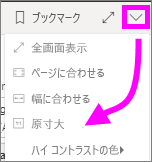
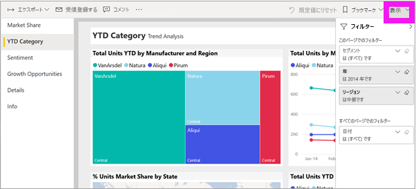
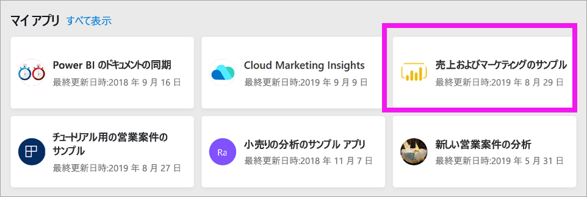
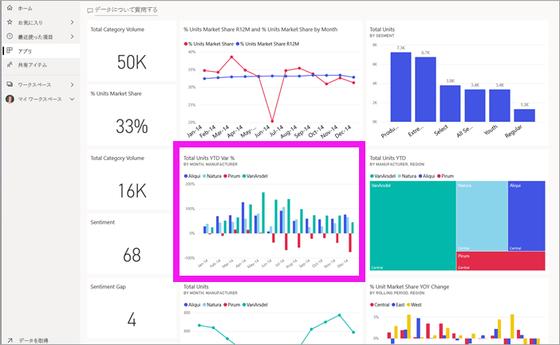

# *コンシューマー*向け Power BI サービスでレポートを表示する

[!INCLUDE[consumer-appliesto-yyny](../includes/consumer-appliesto-yyny.md)]

[!INCLUDE [power-bi-service-new-look-include](../includes/power-bi-service-new-look-include.md)]

レポートは、ビジュアルで構成される 1 つまたは複数のページです。 レポートは Power BI "*デザイナー*" によって作成され、["*コンシューマー*" と直接](end-user-shared-with-me.md)、または[アプリ](end-user-apps.md)の一部として共有されます。 

レポートはさまざまな方法で開くことができますが、そのうちの [ホーム] から開く方法とダッシュボードから開く方法の 2 つを説明します。 

<!-- add art-->

## Power BI ホームからレポートを開く
それでは、ユーザーと直接共有されているレポートを開いてみましょう。その後で、アプリの一部として共有されたレポートを開いてみましょう。

   

### ユーザーと共有されているレポートを開く
Power BI "*デザイナー*" では、メールのリンクを介して、または Power BI コンテンツに自動的に追加することにより、個々のレポートを直接共有できます。 この方法で共有されたレポートは、ナビゲーション ペインの **[自分と共有]** コンテナーとホーム キャンバスの **[自分と共有]** セクションに表示されます。

1. Power BI サービス (app.powerbi.com) を開きます。

2. ナビ ペインで、 **[ホーム]** を選択して自分のホーム キャンバスを表示します。  

   
   
3. **[共有アイテム]** が表示されるまで下方向にスクロールします。 レポート アイコン  を見つけます。 このスクリーンショットには、1 つのダッシュボードと 1 つのレポートがあります。 このレポートには "*売上およびマーケティングのサンプル*" という名前が付けられています。 
   
   ![ホーム ページの [共有アイテム] セクション](./media/end-user-report-open/power-bi-shared-new.png)

4. レポートを開くには、レポート "*カード*" を選択するだけです。

   

5. 左側にタブが並んでいます。  各タブはレポート *ページ*を表します。 現在、"*成長の機会*" ページが開いています。 "*YTD カテゴリ*" タブを選択して、代わりにそのレポート ページを開きます。 

   

6. 右側に **[フィルター]** ウィンドウが表示されることに注意してください。 このレポート ページまたはレポート全体に適用されているフィルターが、ここに表示されます。

7. レポートのビジュアルの上にカーソルを置くと、いくつかのアイコンと**その他のオプション** (...) が表示されます。特定のビジュアルに適用されているフィルターを確認するには、[フィルター] アイコンを選択します。 ここでは、*Rolling Period および Region による Total Units* の折れ線グラフのフィルター アイコンを選択しています。

   

6. これで、レポート ページ全体が表示されます。 ページの表示 (ズーム) を変更するには、右上隅にある [表示] ドロップダウンを選択し、 **[実際のサイズ]** を選択します。

   

   

さまざまな方法でレポートを操作して分析情報を得て、ビジネス上の意思決定を行うことができます。  左側の目次を使用して、Power BI レポートに関するその他の記事を読むことができます。 

### アプリの一部となっているレポートを開く
仕事仲間や AppSource からアプリを受け取っている場合、そのアプリは [ホーム] とナビ ペインの **[アプリ]** コンテナーから利用できます。 [アプリ](end-user-apps.md)は、Power BI "*デザイナー*" によってまとめられたダッシュボードとレポートのコレクションです。

### 前提条件
先に進むには、売上およびマーケティング アプリをダウンロードしてください。
1. ブラウザーで、appsource.microsoft.com に移動します。
1. "Sales and Marketing" を検索し、**Microsoft sample - Sales & Marketing** を選択します。
1. **[今すぐ入手する]**  >  **[続行]**  >  **[インストール]** を選択して、アプリ コンテナーにアプリをインストールします。 

アプリ コンテナーまたはホームからアプリを開くことができます。
1. ナビ ペインから **[ホーム]** を選択して、[ホーム] に戻ります。

7. **[マイ アプリ]** が表示されるまで下方向にスクロールします。

   

8. 新しい "*営業およびマーケティング*" アプリを選択して開きます。 アプリでは、アプリ *デザイナー*によって設定されたオプションに基づき、ダッシュボードまたはレポートが開きます。 このアプリはダッシュボードに開かれます。  

## ダッシュボードからレポートを開く
レポートはダッシュボードから開くことができます。 ほとんどのダッシュボード [タイル](end-user-tiles.md)はレポートから "*ピン留め*" されています。 タイルを選択すると、タイルの作成に使用されたレポートが開きます。 

1. ダッシュボードからタイルを選択します。 この例では、"*年度累計ユニット数...* " という縦棒グラフ タイルを選択しています。

    

2.  関連付けられているレポートが開きます。 "*YTD カテゴリ*" ページが表示されていることがわかります。 これは、ダッシュボードから選択した縦棒グラフを含むレポート ページです。

    

> [!NOTE]
> 一部のタイルはレポートに関連付けられていません。 [Q&A を使用して作成](end-user-q-and-a.md)されたタイルを選択すると、Q&A 画面が開きます。 [ダッシュボードの **[タイルの追加]** ウィジェットを使用して作成](../service-dashboard-add-widget.md)されたタイルを選択すると、ビデオが再生されたり、Web サイトが開いたりなど、さまざまなことが起こる場合があります。  

##  レポートを開く他の方法
Power BI サービスのナビゲーションに慣れてくると、最適なワークフローを見つけ出すことができます。 レポートにアクセスする他の方法をいくつか以下に示します。
- ナビ ペインで [[お気に入り]](end-user-favorite.md) と [[最近]](end-user-recent.md) を使用する    
- [[関連の表示]](end-user-related.md) を使用する    
- メールで (他のユーザーに[共有してもらう](../service-share-reports.md)場合、または自分で[アラートを設定する](end-user-alerts.md)場合)    
- [通知センター](end-user-notification-center.md)から    
- ワークスペースから
- その他

## 次の手順
[ダッシュボードを開いて表示する](end-user-dashboard-open.md)    
[レポートのフィルター](end-user-report-filter.md)

