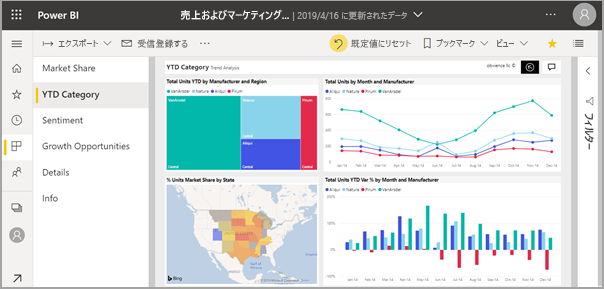
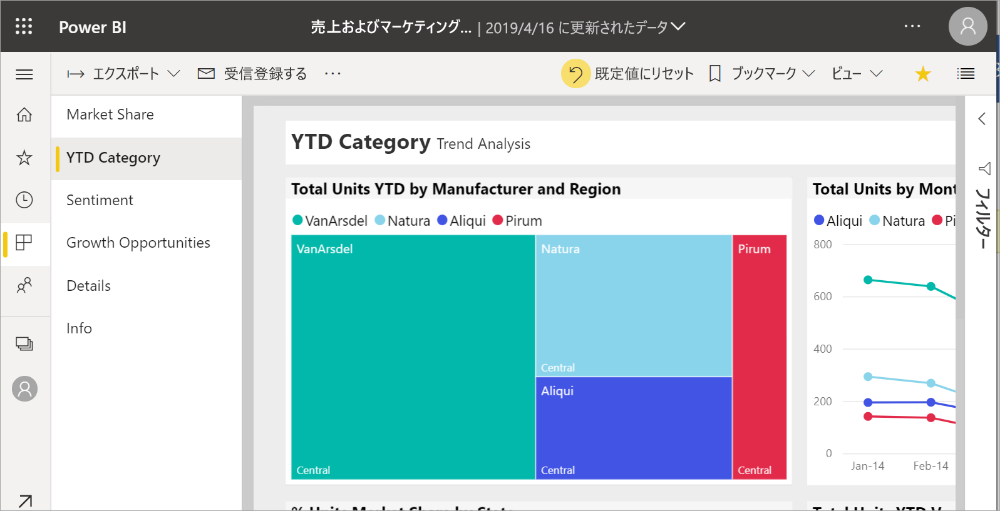
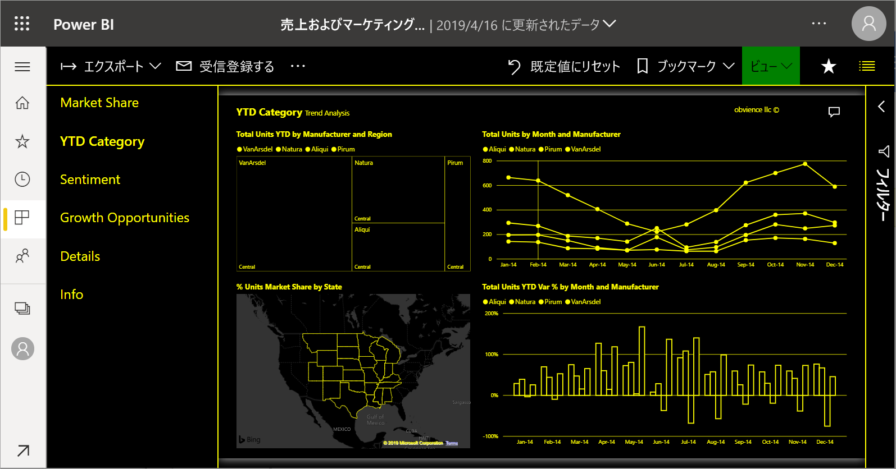
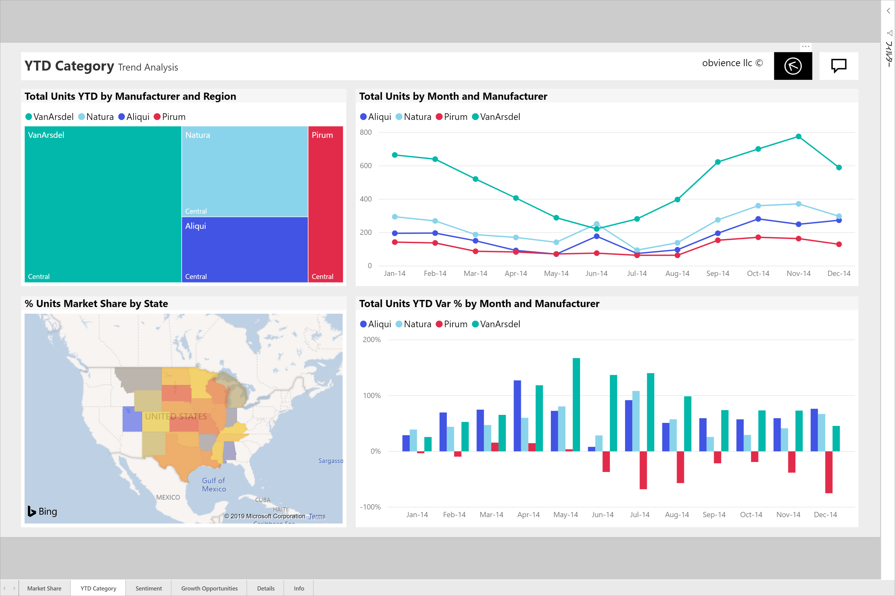

# レポート ページの表示の変更

[!INCLUDE [power-bi-service-new-look-include](../includes/power-bi-service-new-look-include.md)]

レポートは、さまざまなデバイスで表示され、画面サイズや縦横比も異なります。 レポート ページの表示方法をニーズに合わせて変更します。

## [表示] メニューの探索

![[表示] のドロップダウン オプションのスクリーンショット。](media/end-user-report-view/power-bi-viewmenu.png)

**[表示]** メニューのオプションで、サイズや幅を柔軟に選択してレポート ページを表示できます。

- たとえば、小型デバイスでレポートを表示したものの、タイトルや凡例が見づらいとします。  **[表示]**  >  **[原寸大]** を選択し、レポート ページのサイズを大きくします。 レポートを移動するには、スクロール バーを使用します。

    

- 別のオプションでは、 **[幅に合わせる]** を選択して、ご覧の画面の幅にレポートを合わせます。 これは幅のみであり高さではないため、垂直スクロール バーを使う必要があります。

  ![垂直スクロール バーが呼び出されている、[幅に合わせる] で設定されたレポートのスクリーンショット。](media/end-user-report-view/power-bi-view-width.png)

- スクロール バーを表示したくないもののスクリーン サイズを最大限に活用したい場合は、 **[ページに合わせる]** を選択します。

   ![[ページに合わせる] で設定されたレポートのスクリーンショット。](media/end-user-report-view/power-bi-view-fit.png)

- 4 つの **[ハイ コントラストの色]** から選択することもできます。ハイ コントラスト 1、ハイ コントラスト 2、ハイ コントラスト黒、ハイ コントラスト白があります。 これは、視覚障碍を持つユーザーがレポートを見やすくなるように使用することができるアクセシビリティ機能です。 以下の例は、ハイ コントラスト 1 です。 

    

- 最後のオプションは、 **[全画面表示]** です。メニュー バーやヘッダーなしのレポート ページが表示されます。 画面が小さく、詳細が見づらい場合は、全画面表示を選択するのが良いでしょう。  見るだけで操作をしないユーザーに対して大きな画面にレポート ページを射影する場合にも、全画面表示は良い選択です。  

    

レポートを終了すると、 **[表示]** の設定は保存されず、デフォルトに戻ります。 これらの設定が重要であるため保存する場合は、[ブックマーク](end-user-bookmarks.md)を使用します。

## 次の手順

* [レポート フィルター ウィンドウの使用方法](end-user-report-filter.md)