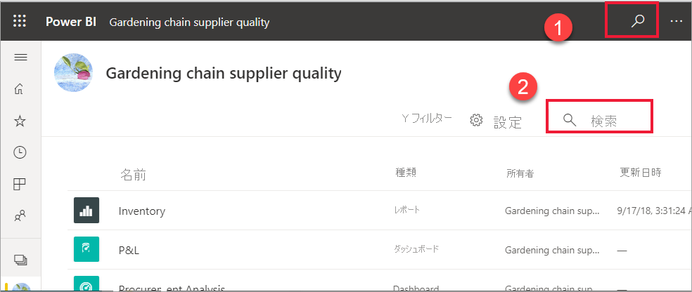
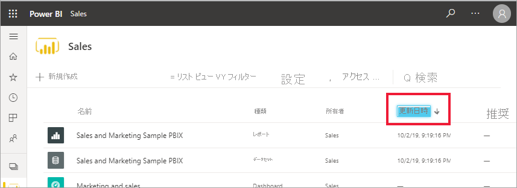

# Power BI コンシューマー向けのナビゲーション: グローバル検索

[!INCLUDE[consumer-appliesto-yyny](../includes/consumer-appliesto-yyny.md)]

[!INCLUDE [power-bi-service-new-look-include](../includes/power-bi-service-new-look-include.md)]

Power BI サービスを初めて使用する場合は、いくつかのコンテンツ (ダッシュボード、レポート、アプリ) のみが表示されます。 ただし、同僚があなたとコンテンツの共有を始めて、あなたがアプリのダウンロードを始めると、コンテンツの一覧が長くなる可能性があります。 このような場合は、検索と並べ替えが非常に役に立ちます。

## コンテンツの検索
 検索は、Power BI サービスのほぼすべての部分から使用できます。 検索ボックスまたは検索アイコンを見てください .

 検索フィールドに、ダッシュボード、レポート、ブック、アプリ、または所有者の名前のすべてまたは一部を入力します。 Power BI によってすべてのコンテンツが検索されます。 

  

 ワークスペースなど、Power BI の一部の領域には、2 つの異なる検索フィールドが表示されます。 メニュー バーの検索フィールドを使うと、すべてのコンテンツを検索できます。一方、ワークスペース キャンバスの検索フィールドを使うと、そのワークスペースのみを検索できます。

  

## コンテンツ一覧の並べ替え

わずかの数のコンテンツしかない場合は、並べ替えが不要な可能性があります。  ただし、ダッシュボードとレポートの一覧が長い場合は、並べ替えを使うと必要なものを見つけやすくなります。 たとえば、この **[自分と共有]** のコンテンツ一覧の項目数は 257 個です。 

![[自分と共有] のコンテンツ一覧](./media/end-user-search-sort/power-bi-all-shared.png)

現在、このコンテンツ一覧は名前のアルファベット順 (A から Z) に並べ替えられています。並べ替え条件を変更するには、 **[名前 (A-Z)]** の右側にある矢印を選択します。

並べ替えは、ワークスペースでも使用できます。 この例では、コンテンツは、 **[更新]** 日順に並べ替えられています。 ワークスペースの並べ替え条件を設定するには、列ヘッダーを選択します。1 度選択してそのヘッダーを選択し、もう一度選択すると、並べ替えの方向が変わります。 

並べ替えることができるのは一部の列に限られます。 列見出しの上にカーソルを合わせると、並べ替えることができる列を確認できます。

## 考慮事項とトラブルシューティング
* データセットでは、所有者は **[並べ替え]** を使用できません。

## 次の手順
[レポートでビジュアルを並べ替える](end-user-change-sort.md)

[視覚エフェクト内のデータを並べ替える](end-user-change-sort.md)

他にわからないことがある場合は、 [Power BI コミュニティを利用してください](https://community.powerbi.com/)。
