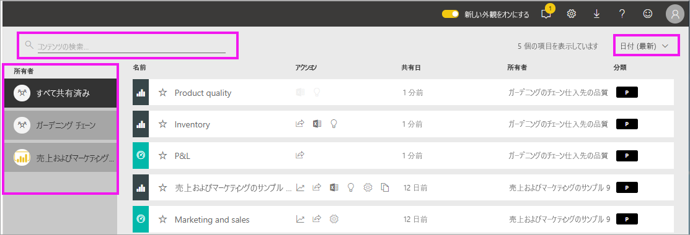

# 自分と共有されているダッシュボードとレポートを表示する

[!INCLUDE[consumer-appliesto-yyny](../includes/consumer-appliesto-yyny.md)]

[!INCLUDE [power-bi-service-new-look-include](../includes/power-bi-service-new-look-include.md)]

同僚が **[共有]** ボタンを使用して自分とコンテンツを共有した場合、 **[自分と共有]** コンテナーに表示されます。 このダッシュボードまたはレポートは、 **[自分と共有]** からのみ使用でき、 **[アプリ]** からは使用できません。

![[共有] アイコン](./media/end-user-shared-with-me/power-bi-share-dashboard.png)

Amanda による**自分と共有**コンテンツの一覧の説明と、一覧を移動およびフィルター処理する方法のデモンストレーションをご覧ください。 その後、ビデオで説明されている手順に従って、ご自分でやってみてください。 共有されたダッシュボードを表示するには、Power BI Pro ライセンスが必要です。 詳しくは、[Power BI Premium](../service-premium-what-is.md) に関するページをご覧ください。
    

> [!NOTE]
> このビデオでは、古いバージョンの Power BI サービスを使用しています。
    

<iframe width="560" height="315" src="https://www.youtube.com/embed/G26dr2PsEpk" frameborder="0" allowfullscreen></iframe>

## 共有コンテンツとの対話

*デザイナー*より付与されたアクセス許可に応じて、共有のダッシュボードやレポートと対話するオプションがあります。 これらには、ダッシュボードのコピーの作成、レポートの[読み取りビュー](end-user-reading-view.md)での表示、他の同僚と再共有があります。

![[自分と共有] コンテナー](./media/end-user-shared-with-me/power-bi-shared.png)

### **[自分と共有]** コンテナーから使用できるアクション
使用できるアクションは、コンテンツの*デザイナー*によって割り当てられた設定によって異なります。 オプションには次のようなものがあります。
* 星のアイコンを選択して、[ダッシュボードまたはレポートをお気に入りに追加します](end-user-favorite.md) 。
* ダッシュボードまたはレポートを削除する  .
* 一部のダッシュボードとレポートを再共有することができます。  .
* [レポートを Excel で開きます](end-user-export.md)  
* Power BI によるデータの[分析情報を表示](end-user-insights.md)します 。
  
  > [!NOTE]
  > EGRC の分類の詳細については、 **[分類]** ボタンを選択するか、「[ダッシュボードのデータの分類](../service-data-classification.md)」を参照してください。
  > 

## 共有ダッシュボードの検索と並べ替え
コンテンツ リストが長い場合は、必要なものを検索するためのオプションがいくつかあります。 検索フィールドを使用するか、日付で並べ替えます。または、 **[所有者]** 列から選択できます。    

