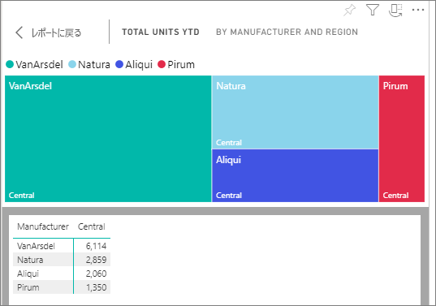
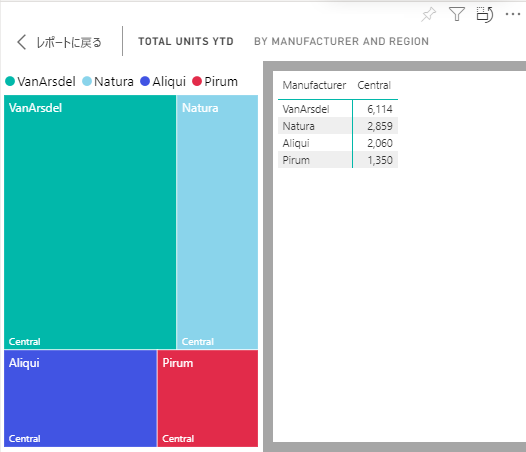

# ビジュアルの作成に使用されたデータを表示する

Power BI のビジュアルは、基礎データセットからのデータを使用して作成されます。 目に見えない部分を確認する場合は、ビジュアルの作成に使用されているデータを Power BI によって*表示*することができます。 **[データの表示]** を選択すると、Power BI によりビジュアルの下 (または横に) データが表示されます。

1. Power BI サービスで、[レポートを開き](end-user-report-open.md)、ビジュアルを選択します。  
2. ビジュアルの背後にあるデータを表示するには、省略記号 (...) を選択し、 **[データの表示]** を選択します。
   
   ![[データの表示] を選択する](./media/end-user-show-data/power-bi-explore-show-data-newer.png)
3. 既定では、データはビジュアルの下に表示されます。
   
   

4. 方向を変更するには、ビジュアルの右上隅にある縦方向のレイアウト  を選択します。
   
   

## 次の手順
[Power BI レポートのビジュアル](../visuals/power-bi-report-visualizations.md)    
[Power BI レポート](end-user-reports.md)    
