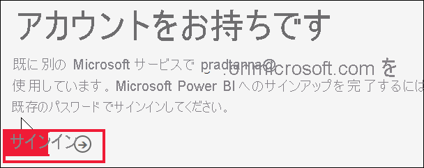
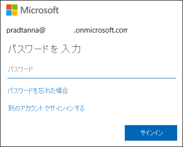
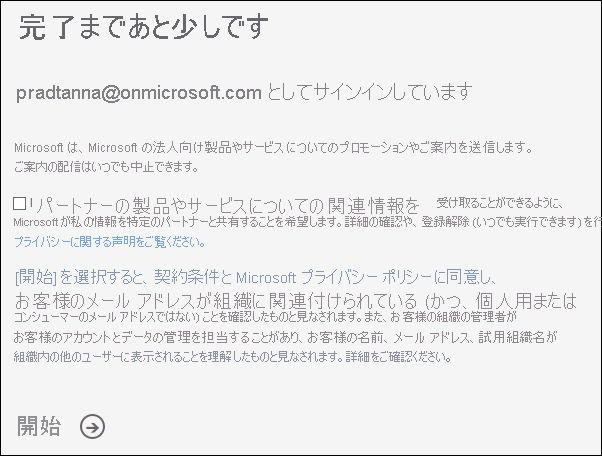
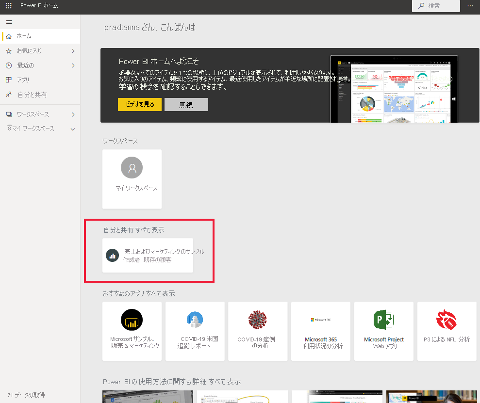

# Power BI サービスにサインインする

[!INCLUDE[consumer-appliesto-yynn](../includes/consumer-appliesto-yynn.md)]

## Power BI アカウント
Power BI にサインインするには、アカウントが必要です。 Power BI アカウントを入手するには 2 つの方法があります。 1 つ目は、組織が従業員向けに Power BI ライセンスを購入する方法です。 2 つ目は、[個人で無料試用版または個人ライセンスにサインアップする](../fundamentals/service-self-service-signup-for-power-bi.md)方法です。 この記事では 1 つ目のシナリオについて説明します。

## 初めてサインインする

### 手順 1: Power BI サービスを開く
Power BI サービスがブラウザーで実行されます。 

- 同僚から、ダッシュボードまたはレポートへのリンクを含む電子メールを受信した場合は、 **[Open this report]\(このレポートを開く\)** または **[Open this dashboard]\(このダッシュボードを開く\)** のリンクを選択します。

        

- それ以外の場合は、お気に入りのブラウザーを開き、「**app.powerbi.com**」と入力します。

        

### 手順 2: メール アドレスを入力する
初めてサインインするときに、Microsoft によって、Microsoft 365 アカウントを既にお持ちであるかどうかが確認されます。 次の例では、Pradtanna は他の Microsoft サービスのライセンスを既に持っています。 

パスワードを入力します。 これはご自分の Microsoft 365 アカウントのパスワードです。 これは、Outlook や Office などの他の Microsoft 製品で使用するのと同じ電子メールとパスワードです。  アカウントの設定方法によっては、電子メールまたはモバイル デバイスに送信されたコードを入力するように求められる場合もあります。   

場合によっては、全体管理者がお客様にライセンスを割り当て、この情報を含む電子メールを送信することがあります。 ご自分の受信トレイでウェルカム メールを探し、その指示に従って最初のサインインを行ってください。 サインインにはこの同じ電子メール アカウントを使用します。 
 
### 手順 3:使用条件を確認する
使用条件を確認し、同意する場合はチェックボックスをオンにして **[開始]** を選択します。

### 手順 4: ホーム ランディング ページを確認する
初回のアクセス時には、Power BI で **[ホーム]** ランディング ページが開きます。 **[ホーム]** が開かない場合は、ナビゲーション ウィンドウから選択します。 

![選択された [ホーム] を示すスクリーンショット](media/end-user-sign-in/power-bi-home-selected.png)

[ホーム] には、自分が使用するアクセス許可を持っているすべてのコンテンツが表示されます。 最初はあまりコンテンツが表示されないかもしれませんが、心配しないでください。同僚と Power BI を使い始めれば変わります。 同僚が自分に電子メールで共有したレポートがあるでしょうか? それは、ホーム ランディング ページの見出し **[自分と共有]** の下に表示されます。

Power BI でホームを開きたくない場合は、代わりに[**おすすめ**ダッシュボードまたはレポートを設定](end-user-featured.md)して開くことができます。 

## コンテンツを安全に操作する
***コンシューマー***として、他のユーザーから共有されたコンテンツを操作し、データを探索して、ビジネスに関する決定を行います。  フィルター、スライス、サブスクライブ、エクスポート、サイズ変更などの操作を行っても、基になっているデータセットや元の共有コンテンツ (ダッシュボードとレポート) が影響を受けることはありません。 Power BI は、探索や実験のための安全な場所です。 それは変更を保存できないという意味ではありません。保存できます。 ただし、それらの変更が反映されるのはコンテンツの**自分の**表示だけです。 また、ボタンをクリックするだけで、簡単に元の既定のビューに戻すことができます。

![[既定値にリセット] ボタン](media/end-user-sign-in/power-bi-reset.png)

## Power BI サービスからサインアウトする
Power BI を閉じたりサインアウトしたりするときに変更が保存されるので、中断したところから作業を再開できます。

Power BI を閉じるには、作業しているブラウザー タブを閉じます。 

![[x] を選択してタブを閉じる](media/end-user-sign-in/power-bi-close.png) 

コンピューターを共有している場合は、Power BI を閉じるたびにサインアウトすることをお勧めします。  サインアウトするには、右上隅にあるプロファイルの画像を選択して、 **[サインアウト]** を選択します。  

 

## トラブルシューティングと考慮事項
- 個人として Power BI にサインアップした場合は、サインアップに使用したメール アドレスでサインインします。

- 複数のアカウントで Power BI を使用する人もいます。 その場合、サインインすると、一覧からアカウントを選択するように求められます。 

## 次の手順
[Power BI アプリを表示する](end-user-app-view.md)
