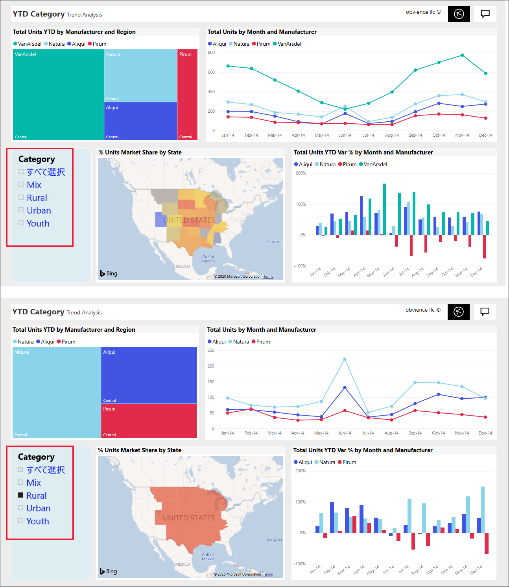
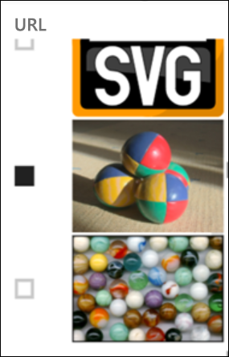
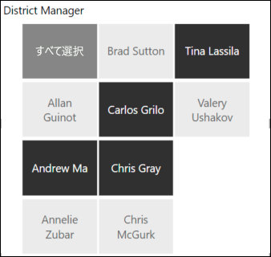
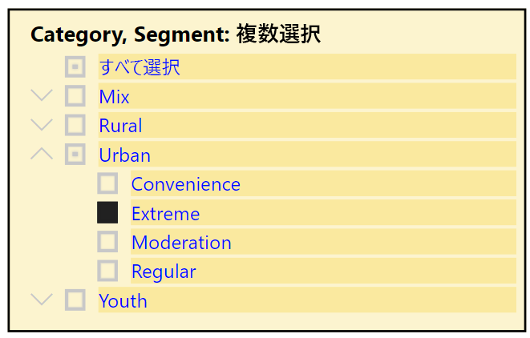
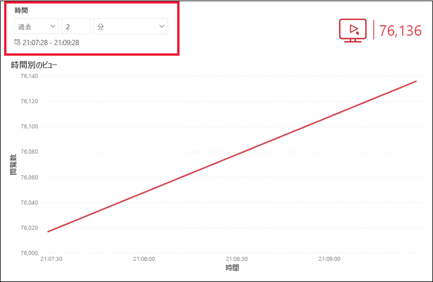
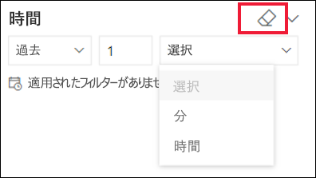

# Power BI サービスのスライサー

[!INCLUDE[consumer-appliesto-ynnn](../includes/consumer-appliesto-yynn.md)]

スライサーは、レポート ページ上の他のビジュアルをフィルター処理する一種のビジュアルです。 Power BI レポートを使用すると、さまざまな種類のスライサーが検出されます。 上の画像に示しているのは、同じスライサーですが、選択が異なります。 各選択によってページ上の他のビジュアルがどのようにフィルター処理されているかに注目してください。  

## スライサーの使用方法
レポートを作成するときに、"*デザイナー*" はスライサーを追加します。これによりストーリーを伝え易くなり、データを探索するためのツールが提供されます。

### 数値範囲のスライサー
 上記の数値範囲のスライサーは、地理、在庫数、および注文日ごとの売上合計を調べるのに役立ちます。 範囲を選択するには、ハンドルを使用します。 

### 基本的な垂直チェックボックス スライサー

基本的なチェックボックス スライサーで、1 つまたは複数のチェックボックスをオンにすると、ページ上の他のビジュアルへの影響が表示されます。 複数選択するには、CTRL キーを押しながら選択します。 レポート "*デザイナー*" は、一度に 1 つの値しか選択できないようにスライサーを設定する場合があります。 

### 画像および図形のスライサー
スライサー オプションが画像または図形の場合、選択方法はチェックボックスを使用する場合と同様です。 1 または複数の画像または図形を選択して、ページ上の他のビジュアルにスライサーを適用することができます。 

    

    

### 階層スライサー

階層があるスライサーでは、シェブロンを使用して階層を展開したり折りたたんだりします。 ヘッダーが更新され、選択内容が表示されます。

### 相対時間スライサー
新しい高速更新シナリオでは、より小さな時間枠をフィルター処理する機能が非常に便利です。
相対時間スライサーを使用すると、レポート内の任意の日付または時刻のデータにフィルターを適用できます。 たとえば、相対時間スライサーを使用すると、過去の 2 日、数時間、または数分以内のビデオ ビューのみを表示できます。 

## スライサーを非アクティブにする
スライサーを非アクティブにするには、消しゴム アイコンを選択します。

## 次の手順
詳細については、次の記事を参照してください。

[Power BI での視覚化の種類](end-user-visualizations.md)

