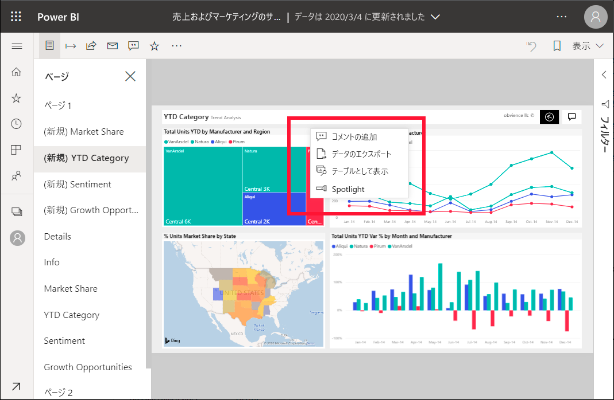
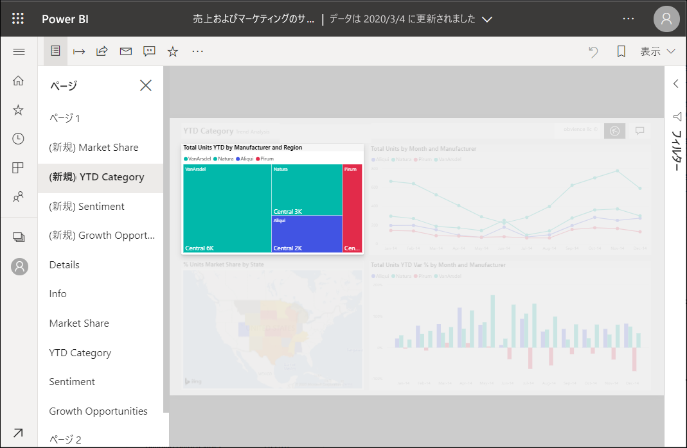

# Power BI レポートに Spotlight を追加する

[!INCLUDE[consumer-appliesto-yyny](../includes/consumer-appliesto-yyny.md)]

Spotlight を使用すると、レポート ページ上の特定のビジュアルに注意を引くことができます。  ブックマークを追加するときに、Spotlight モードが選択されていた場合、ブックマークでそのモードが保持されます。

## Spotlight を追加する

1. Power BI サービスで、[レポートを開きます](end-user-report-open.md)。

2. レポート ページで強調表示するビジュアルを決定します。 **[その他のアクション]** (...) ドロップダウンを選択します。  

    

3. **Spotlight** のオプションを選択します。 選択したビジュアルが強調表示されます。これにより、ページ上の他のビジュアルがすべてフェードされ、透明に近くなります。 

    

## 次のステップ

* [フォーカス モードでダッシュボード タイルまたはレポート ビジュアルを表示する](end-user-focus.md)

