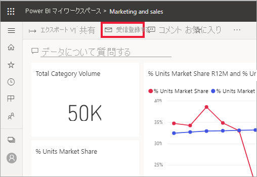
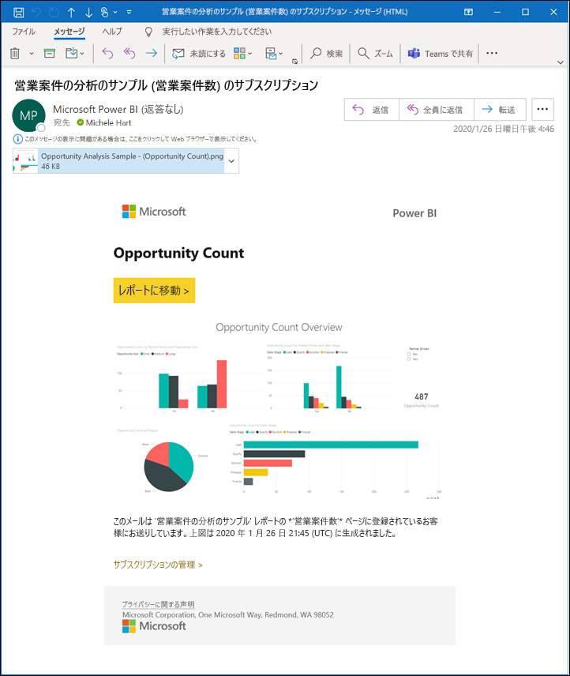
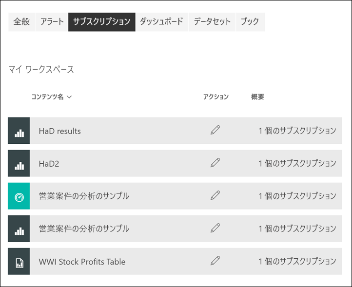

# Power BI サービスでレポートまたはダッシュボードをサブスクライブする 

[!INCLUDE[consumer-appliesto-ynny](../includes/consumer-appliesto-ynny.md)]

[!INCLUDE [power-bi-service-new-look-include](../includes/power-bi-service-new-look-include.md)]

最も重要なダッシュボードとレポートを簡単に最新の状態に維持できます。 最も重要なレポート ページとダッシュボードを購読すると、Power BI はスナップショットを電子メールでユーザーの受信トレイに送信します。 メールを受信する頻度 (毎日、毎週、データ更新時) を Power BI に指示します。 特定の日時に Power BI でメールが送信されるように設定することも、今すぐ実行することもできます。  いずれの場合も、レポートまたはダッシュボードあたり最大 24 個の異なるサブスクリプションを設定できます。

メールとスナップショットでは、Power BI 設定で指定されている言語が使用されます (「[Power BI でサポートされる言語と国/地域](../fundamentals/supported-languages-countries-regions.md)」参照)。 言語が定義されていない場合、Power BI では現在のブラウザーのロケール設定に基づいて言語を使用します。 言語の優先順位を表示または設定するには、歯車アイコン  >  **> [設定] > [全般] > [言語]** の順に選択します。 

受信するメールには、"レポートまたはダッシュボードに移動する" ためのリンクが含まれます。 Power BI アプリがインストールされたモバイル デバイスでこのリンクを選ぶと、アプリが起動します (Power BI Web サイトでレポートまたはダッシュボードを開く既定の操作とは異なります)。

## 要件
ご自身のサブスクリプションを**作成**するには、特定の種類の[ライセンス](end-user-license.md)が必要です。 サブスクリプションを作成できない場合は、Power BI 管理者に問い合わせてください。 **他のユーザーをサブスクライブ**する機能は、ダッシュボードまたはレポートの所有者のみが使用できます。 ページ分割されたレポートのサブスクライブの場合、若干異なります。 詳細については、「[Subscribe yourself and others to a paginated report in the Power BI service](paginated-reports-subscriptions.md)」(Power BI サービスのページ分割されたレポートを自分および他のユーザーがサブスクライブする) を参照してください。 

## ダッシュボードまたはレポート ページをサブスクライブする
ダッシュボードとレポートのどちらをサブスクライブする場合でも、そのプロセスは似ています。 同じボタンで、Power BI サービスのダッシュボードとレポートをサブスクライブすることができます。
 
.

1. ダッシュボードまたはレポートを開きます。
2. 上部のメニュー バーで **[受信登録する]** または封筒アイコン ![[受信登録する] アイコン](./media/end-user-subscribe/power-bi-icon-envelope.png) を選択します。
   

   
    
    ダッシュボードで **[受信登録する]** を選択すると、左側の画面が表示されます。 レポート ページで **[受信登録する]** を選択すると、右側の画面が表示されます。 
    
    a. レポートの複数のページをサブスクライブするには、 **[別のサブスクリプションを追加]** を選択し、上部近くにあるドロップダウンから別のページを選択します。

    b. 黄色のスライダーを使うと、サブスクリプションのオン/オフを切り替えることができます。  スライダーを [オフ] にしても、サブスクリプションは削除されません。 サブスクリプションを削除するには、ごみ箱アイコンを選択します。

    c. 必要に応じて、件名とメール メッセージの詳細を追加します。 

    d. サブスクリプションの **[頻度]** を選択します。  [毎日]、[毎週]、または [データ更新後 (毎日)] を選択できます。  特定の曜日にだけサブスクリプション メールを受け取るには、 **[毎週]** を選択して、受け取る曜日を選択します。  たとえば、平日にのみサブスクリプション メールを受け取る場合は、頻度で **[毎週]** を選択し、[土] と [日] のチェック ボックスをオフにします。 **[毎月]** を選択した場合は、サブスクリプション メールを受信する日付を入力します。   

    e. [毎日]、[毎時間]、[毎月]、[毎週] を選択する場合は、サブスクリプションに対して [スケジュールされた時間] を選ぶこともできます。 毎時 0 分、15 分、30 分、または 45 分に実行するようにします。 午前 (AM) または午後/夜間 (PM) を選択します。 タイム ゾーンも指定できます。 [毎時間] を選択する場合、サブスクリプションの開始に [スケジュールされた時間] を選択すると、その後、1 時間ごとに実行されます。  

    f. 日付フィールドに日付を入力して、開始日と終了日をスケジュールします。 既定では、サブスクリプションの開始日はその作成日、終了日は 1 年後になります。 サブスクリプションが終了する前に、(9999 年までの) 将来の任意の日付に変更することができます。 サブスクリプションは、終了日に達すると、再度有効にするまで停止します。  スケジュールされた終了日の前に、延長するかどうかを確認する通知が届きます。     

    例:  サブスクリプションを確認してテストするには、 **[今すぐ実行]** を選択します。  これにより、すぐにメールが送信されます。 

3. 何も問題がなければ、 **[保存して閉じる]** を選択してサブスクリプションを保存します。 設定したスケジュールで、メールとレポートまたはダッシュボードのスナップショットを受け取ります。 頻度が **[データ更新後]** に設定されているすべてのサブスクリプションについては、その日にスケジュールされている最初の更新の後でのみメールが送信されます。
   
   
   
    レポート ページを更新しても、データセットは更新されません。 データセットの所有者のみが、データセットを手動で更新できます。 基になるデータセットの所有者の名前を検索するには、メニュー バーからドロップダウンを選択するか、元のサブスクリプション メールを検索します。
   
    

## サブスクリプションを管理する
自分で作成したサブスクリプションのみを管理できます。 再び **[受信登録する]** を選択し、左下隅の **[すべてのサブスクリプションを管理]** を選択します (上のスクリーンショットを参照)。 表示される特定のサブスクリプションは、現在アクティブになっているワークスペースによって変わります。 すべてのワークスペースのすべてのサブスクリプションを一度に表示するには、 **[マイ ワークスペース]** をアクティブにします。 ワークスペースの概要については、「[Workspaces in Power BI](end-user-workspaces.md)」 (Power BI のワークスペース) を参照してください。 

Pro ライセンスの有効期限が切れた場合、所有者がダッシュボードまたはレポートを削除した場合、またはサブスクリプションの作成に使われたユーザー アカウントが削除された場合、サブスクリプションは終了します。

## 考慮事項とトラブルシューティング
* サブスクリプション メールが迷惑メール フォルダーに移動されないようにするには、Power BI の電子メール エイリアス (no-reply-powerbi@microsoft.com) を自分の連絡先に追加します。 Microsoft Outlook を使用している場合は、エイリアスを右クリックし、 **[Outlook の連絡先に追加]** を選択します。 
* ダッシュボードに含まれるピン留めされたタイルが 25 個より多い場合、またはピン留めされたライブ レポート ページが 4 個より多い場合は、ユーザーに送信されたサブスクリプション電子メールで完全にレンダリングされない可能性があります。 確実に電子メールが正しくレンダリングされるように、ダッシュボードのデザイナーに連絡し、ピン留めされたタイルを 25 個未満、ピン留めされたライブ レポート ページを 4 個未満にするように依頼することをお勧めします。  
* ダッシュボード メールのサブスクリプションについては、行レベルのセキュリティ (RLS) が適用されているタイルがある場合、そのタイルは表示されません。  
* メール内の (コンテンツへの) リンクが機能しなくなった場合は、コンテンツが削除された可能性があります。 メール内のスクリーンショットの下で、自分自身をサブスクライブしたかどうか、または他の人が自分をサブスクライブしたかどうかを確認できます。 他の人の場合は、同僚に電子メールをキャンセルするか、再度自分をサブスクライブするよう依頼してください。
* ダッシュボードのサブスクリプションについては、特定の種類のタイルはまだサポートされていません。 ストリーミング タイル、ビデオ タイル、カスタム Web コンテンツ タイルなどです。 
* レポート ページのサブスクリプションは、レポート ページの名前に関連付けられています。 レポート ページにサブスクライブしたときに、その名前が変更されている場合は、サブスクリプションを再作成する必要があります。
* サブスクリプション機能を使用できない場合は、システム管理者に問い合わせてください。 組織によって、この機能が無効にされている可能性があります。  
* メール サブスクリプションは、ほとんどの[カスタム ビジュアル](../developer/visuals/power-bi-custom-visuals.md)をサポートしていません。  例外は[認定](../developer/visuals/power-bi-custom-visuals-certified.md)されている Power BI カスタム ビジュアルです。    
* メール サブスクリプションは、レポートの既定のフィルターとスライサーの状態で送信されます。 サブスクライブした後に既定値を変更しても、メールには反映されません。 ページ分割されたレポートではこの機能がサポートされており、サブスクリプションごとに特定のパラメーター値を設定できます。  
* メール サブスクリプションでは、この時点では、R を利用した Power BI ビジュアルはサポートされていません。  
* ダッシュボードのサブスクリプションに限り、特定の種類のタイルはまだサポートされていません。  ストリーミング タイル、ビデオ タイル、カスタム Web コンテンツ タイルなどです。     
* メールのサイズ制限のため、ダッシュボードまたはレポートに非常に大きい画像が含まれると、サブスクリプションが失敗する場合があります。    
* Power BI では、2 か月より長くアクセスされていないダッシュボードおよびレポートに関連付けられているデータセットの更新を自動的に一時停止します。  しかしながら、ダッシュボードまたはレポートにサブスクリプションを追加した場合は、アクセスがなくても一時停止されません。
* まれに、電子メール サブスクリプションが受信者に配信されるのに 15 分以上かかる場合があります。  これが発生した場合、データ更新と電子メール サブスクリプションを別のタイミングで実行し、確実にタイムリーに配信されるようにすることをお勧めします。  問題が解決しない場合は、Power BI サポートにお問い合わせください。

## 次の手順

[コンテンツの検索と並べ替え](end-user-search-sort.md)
