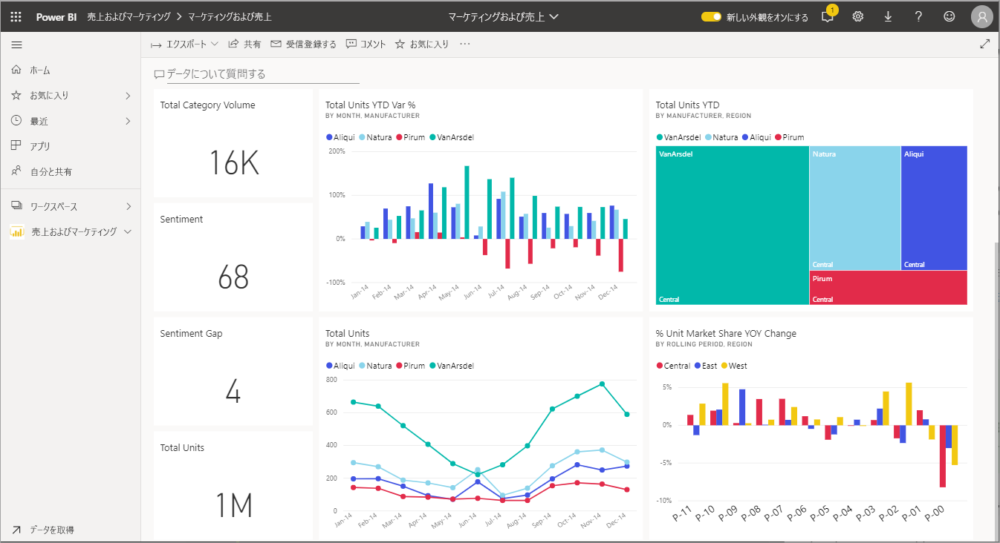
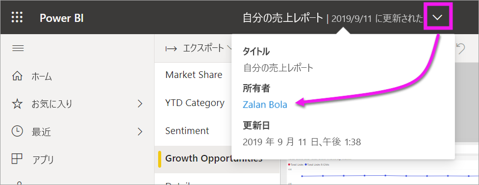

# レポート、ダッシュボード、アプリでビジュアルを操作する

基本的に、***視覚化*** (または*ビジュアル*) は、レポートとデータセットのデータを使用して、Power BI *デザイナー*によってビルドされたグラフの種類です。 

ビジュアルはダッシュボードとレポートに表示され、Power BI Q&A を使用してその場で作成できます。 レポートのデザイナーでビジュアルを作成した場合は、そのビジュアルをダッシュボードに*ピン留め*できます。 [ダッシュボード上のビジュアルは*タイル*と呼ばれます](end-user-tiles.md)。 次のダッシュボードには、8 つのタイルがあります。 

> [!TIP]
> この詳細な内容を読む前に、[*コンシューマー*向けの Power BI の基本的な概念](end-user-basic-concepts.md)に関する概要トピックを先に読むことをお勧めします。

## ビジュアルで実行できること

ビジュアルは、レポートとダッシュボードの "*デザイナー*" によって作成され、"*コンシューマー*" と共有されます。 コンシューマーの場合、ビジュアルと対話するさまざまなオプションがあり、分析情報を明らかにして、データ駆動型のビジネス上の意思決定を行います。 次の表では、このようなオプションを網羅した一覧と、詳細な手順へのリンクを示します。

これらのオプションの多くに対して、管理者または*デザイナー*は、ユーザーがこれらの機能を表示または使用する許可を無効にできます。 また、これらの機能の一部は、特定のビジュアルでのみ機能します。  ご不明な点がある場合は、管理者、またはレポート/ダッシュボードの所有者にお問い合わせください。 所有者を見つけるには、ダッシュボードまたはレポートのドロップダウンを選択します。 

> [!IMPORTANT]
> まず始めに Q&A について説明します。 Q&A は Power BI の自然言語検索ツールです。 自然言語を使用して質問を入力すると、Q&A はビジュアルの形でその質問に答えます。 コンシューマーは、Q&A を使用して、独自のビジュアルを即座に作成できます。 ただし、Q&A を使用して作成したビジュアルは保存できません。 データから学びたい具体的な何かがあり、デザイナーがそれをレポートやダッシュボードに含めなかった場合、Q&A がお勧めです。 Q&A の詳細については、[コンシューマー向けの Q&A](end-user-q-and-a.md) に関するページを参照してください。

|タスク  |ダッシュボード上  |レポート内  | Q&A 内
|---------|---------|---------|--------|
|[自分用にビジュアルにコメントを追加するか、ビジュアルについて同僚と会話を開始します](end-user-comment.md)。     |  はい       |   はい      |  いいえ  |
|[ビジュアルが作成されたレポートを開いて探索します](end-user-tiles.md)。     |    はい     |   na      |  いいえ |
|[ビジュアルに影響を与えるフィルターとスライサーの一覧を表示します](end-user-report-filter.md)。     |    フォーカス モードで開く場合     |   はい      |  いいえ |
|[Q&A でビジュアルを開いて探索します (*デザイナー*が Q&A を使用してビジュアルを作成した場合)](end-user-q-and-a.md)。     |   はい      |   na      |  na  |
|[Q&A でビジュアルを作成します (探索の場合は、ビジュアルを保存できません)](end-user-q-and-a.md)。     |   はい      |   デザイナーが Q&A をレポートに追加した場合      |  はい  |
|ビジュアルのデータから[興味深い事実や傾向を探すように Power BI に要求します](end-user-insights.md)。  これらの自動的に生成されたビジュアルは、*分析情報*と呼ばれます。     |    はい (タイルに対して)    |  いいえ       | いいえ   |
|["*フォーカス*" モードを使用して一度に 1 つずつビジュアルを表示します](end-user-focus.md)。     | はい (タイルに対して)        |   はい (ビジュアルに対して)      | na  |
|[ビジュアルが最後に更新された時刻を検索します](end-user-fresh.md)。     |  はい       |    はい     | na  |
|["*全画面表示*" モードを使用して、罫線またはナビ ペインなしで、ビジュアルを一度に 1 つずつ表示します](end-user-focus.md)。     |   はい      |  はい       | 既定による  |
|[印刷します](end-user-print.md)。     |  はい       |   はい      | いいえ  |
|[ビジュアル フィルターを追加および変更して、ビジュアルを詳しく調べます。](end-user-report-filter.md)     |    いいえ     |   はい      | いいえ  |
|ビジュアルにマウス カーソルを移動して、詳細情報とツールヒントを表示します。     |    はい     |   はい      | はい  |
|[ページ上の他のビジュアルをクロスフィルターおよびクロス強調表示します。](end-user-interactions.md)    |   いいえ      |   はい      | na  |
|[ビジュアルの作成に使用されたデータを表示します](end-user-show-data.md)。     |  いいえ       |   はい      | いいえ  |
| [ビジュアルの並べ替え方法を変更します](end-user-change-sort.md)。 | いいえ  | はい  | 質問の言い換えで並べ替えを変更できます  |
| ビジュアルにスポット ライトを追加します。 | いいえ  | はい  |  いいえ |
| [Excel にエクスポートします。](end-user-export.md) | はい | はい | いいえ|
| [アラートを作成して](end-user-alerts.md)、値が設定されたしきい値を超えた場合に通知します。  | はい  | いいえ  | いいえ |
| [ページの他のビジュアルをクロス フィルター処理およびクロス強調表示します](end-user-report-filter.md)。  | いいえ      | はい  | na |
| [階層を持つビジュアルをドリルします](end-user-drill.md)。  | いいえ  | はい   | いいえ |

## 次の手順
[コンシューマーの基本的な概念](end-user-basic-concepts.md)  に戻る  
[ビジュアルを選択してレポートを開く](end-user-report-open.md)    
[Power BI で利用可能なビジュアルの種類](end-user-visual-type.md)