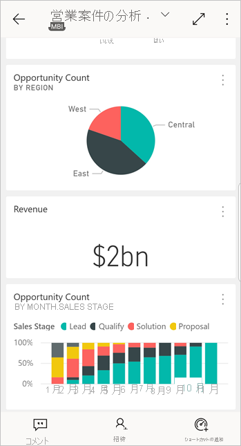
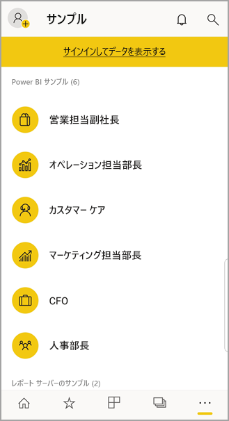

# Android デバイスでの Power BI モバイル アプリの概要
Microsoft Power BI 用 Android アプリは、Power BI、Power BI レポート サーバー、および Reporting Services のモバイル BI エクスペリエンスを提供します。 タッチ入力対応のモバイル アクセスでどこからでもオンプレミスやクラウド内の自社のダッシュボードを簡単に表示したり、そこでやり取りしたりできます。 ダッシュボードでデータを探索し、電子メールやテキスト メッセージで同僚と共有できます。 

Power BI Desktop で Power BI レポートを作成して、それらを公開します。

* [それらを Power BI サービスに公開し](../../fundamentals/power-bi-overview.md)、ダッシュボードを作成します。
* [それらをオンプレミスから Power BI Report Server に公開します](../../report-server/quickstart-create-powerbi-report.md)。

Android の Power BI アプリで、オンプレミスまたはクラウドのダッシュボードやレポートを操作します。

「[Power BI 用モバイル アプリの新機能](mobile-whats-new-in-the-mobile-apps.md)」をご覧ください。

## 前提条件

### アプリの入手

Google Play ストアから [Power BI for Android アプリをダウンロードします](https://go.microsoft.com/fwlink/?LinkID=544867)。
  
Power BI は、Android 5.0 以降のオペレーティング システムを搭載するさまざまな Android デバイスで実行できます。 お使いのデバイスでバージョンを確認するには、 **[設定]**  >  **[端末情報]**  >  **[Android バージョン]** の順に移動します。 

**アプリを開いたときに開始**    
Android デバイスでアプリを開くと、サインアップやサインインを行わなくてもサインインのページを閲覧し、Power BI アプリで実行できることを概観できます。 **[スキップ]** をタップするとサンプルを見たり、アプリを実際に体験したりできます。 ダッシュボードのホーム ページから、いつでも好きなときに[サンプルに戻る](mobile-android-app-get-started.md#try-the-power-bi-and-reporting-services-samples)ことができます。

「[Power BI 用モバイル アプリの新機能](mobile-whats-new-in-the-mobile-apps.md)」をご覧ください。

## Web 上で Power BI サービスにサインアップする
まだサインアップしていない場合は、[Power BI サービス](https://powerbi.com/)に移動して自分のアカウントでサインアップしてください。そのアカウントで、ダッシュボードやレポートを作成および保存し、データをまとめます。 これで、Android デバイスから Power BI にサインインし、どこからでも自分のダッシュボードを表示できるようになります。

1. Power BI サービスで [[サインアップ]](https://go.microsoft.com/fwlink/?LinkID=513879) をタップし、Power BI アカウントを作成します。
2. [独自のダッシュボードとレポートの作成](../../fundamentals/service-get-started.md)を開始します。

## デバイスで Power BI アプリを使用する
1. Android デバイスで、スタート画面から Power BI for Android アプリを開きます。
   
   
2. Power BI にサインインするには、 **[Power BI]** タブをタップし、サインインの詳細を入力します。

    Power BI にサインインできないというメッセージが表示される場合の問題解決方法について詳しくは、["お使いの企業 SSL 証明書が信頼されていないため、認証できませんでした"](mobile-android-app-error-corporate-ssl-account-is-untrusted.md) をご覧ください。

   Reporting Services のモバイル レポートと KPI にサインインするには、 **[レポート サーバー]** タブをタップし、サインインの詳細を入力します。
   
   

## Power BI と Reporting Services のサンプルをお試しください。
サインアップしなくても、Power BI と Reporting Services のサンプルを表示したり、操作したりできます。

サンプルにアクセスするには、ナビゲーション バーの **[その他のオプション]** (...) をタップし、 **[サンプル]** を選択します。

さまざまな Power BI サンプルの後にレポート サーバーのサンプルが続きます。
   
   

   
   > [!NOTE]
   > サンプルではすべての機能を使用できるわけではありません。 たとえば、ダッシュボードの基礎となるサンプル レポートは表示できません。サンプルは他のユーザーと共有できません。サンプルはお気に入りに設定することができません。 
   > 
   >

## Power BI モバイル アプリでコンテンツを見つける

Power BI コンテンツの検索を始めるにはヘッダーの虫眼鏡をタップします。

## お気に入りのダッシュボードとレポートを表示する
ナビゲーション バーの **[お気に入り]** () をタップし、[お気に入り] ページを表示します。 

[Power BI モバイル アプリでのお気に入り](mobile-apps-favorites.md)の詳細については、こちらをご覧ください。

## Power BI モバイル アプリのエンタープライズ サポート
Microsoft Intune を使用すると、Android 用や iOS 用の Power BI モバイル アプリなど、デバイスとアプリを管理できます。

Microsoft Intune では、アクセスに暗証番号 (PIN) を必要とする項目を管理したり、アプリケーションでデータを処理する方法を制御したり、さらには、アプリが使用されていないときにアプリのデータを暗号化したりできます。

> [!NOTE]
> ユーザーが Android デバイスで Power BI モバイル アプリを使っていて、組織で Microsoft Intune MAM が構成されている場合は、バックグラウンド データ更新がオフになります。 次にアプリを起動したときは、Web 上の Power BI サービスからデータが更新されます。
> 
> 

詳細については、「[Power BI モバイル アプリを Microsoft Intune で構成する](../../admin/service-admin-mobile-intune.md)」をご覧ください。 

## 次の手順
Power BI 用の Android デバイス アプリ、Power BI のダッシュボードとレポート、Power BI Report Server または Reporting Services Web ポータルのレポートと KPI では、次のことが可能です。

### Power BI のダッシュボードとレポート
* [アプリ](../../collaborate-share/service-create-distribute-apps.md)を表示する。
* [ダッシュボード](mobile-apps-view-dashboard.md)を表示する。
* [ダッシュボード上のタイル](mobile-tiles-in-the-mobile-apps.md)を探索する。
* [Power BI レポート](mobile-reports-in-the-mobile-apps.md)を開く。
* [アプリ](../../collaborate-share/service-create-distribute-apps.md)を表示する。
* [タイルに注釈を付け、共有](mobile-annotate-and-share-a-tile-from-the-mobile-apps.md)する。
* [ダッシュボード](mobile-share-dashboard-from-the-mobile-apps.md)を共有する。
* Android フォンで [Power BI QR コードをスキャン](mobile-apps-qr-code.md)して、関連するダッシュボードのタイルまたはレポートを開く。 
* 同僚と共有するダッシュボードなど、[Power BI アカウントの更新に関する通知](mobile-apps-notification-center.md)をご覧ください。

### Power BI レポート サーバーおよび Reporting Services Web ポータルのレポートと KPI
* Android デバイス用 Power BI モバイル アプリで、[Web ポータルのレポートと KPI を表示](mobile-app-ssrs-kpis-mobile-on-premises-reports.md)する。
* [Web ポータルで KPI ](https://docs.microsoft.com/sql/reporting-services/working-with-kpis-in-reporting-services)を作成する。
* Power BI Desktop で[レポートを作成し、Power BI レポート サーバー](../../report-server/quickstart-create-powerbi-report.md) Web ポータルでそれらを公開します。

### 関連項目
* Android アプリ ストアから [Android アプリをダウンロード](https://go.microsoft.com/fwlink/?LinkID=544867)する。
* [Power BI とは?](../../fundamentals/power-bi-overview.md)
* わからないことがある場合は、 [Power BI コミュニティで質問してみてください](https://community.powerbi.com/)。
