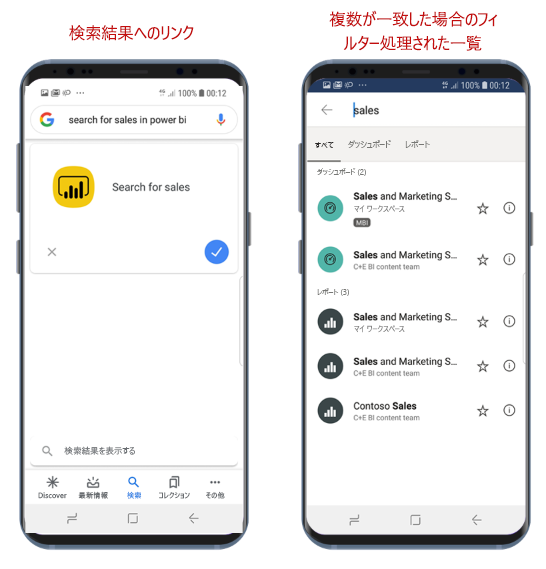

# Google Search でコンテンツを検索してアクセスする

適用対象:

|  |  |
|:--- |:--- |
| Android フォン |Android タブレット |

Google Search を使用して、Power BI モバイル アプリを検索して開き、探しているレポートまたはダッシュボードにすぐにアクセスすることができます。 アプリ内を移動する必要はありません。

特定の項目を開く必要があり、探す場所がわからない場合は、Google Search を使用して項目を見つけることができます。

## Google Search を使用して検索する

Google 検索ボックスでは、***search for &lt;検索項目&gt; in power bi*** という形式を使用して検索します。 たとえば、**search for sales in power bi** のようにします。

* 一致するものが 1 つだけ見つかった場合、Power BI モバイル アプリで、探していた項目が開かれます。
* 一致するものが複数見つかった場合、Power BI では、要求に応じてフィルター処理された検索画面が開かれます。

## 次のステップ
* [Power BI Android アプリで Android アプリのショートカットを使用する](mobile-app-quick-access-shortcuts.md)
* [iOS デバイスの検索 (Spotlight) と Power BI Mobile iOS アプリとの統合](mobile-apps-ios-search-integration.md)
* [Power BI モバイル アプリのお気に入り](mobile-apps-favorites.md)
